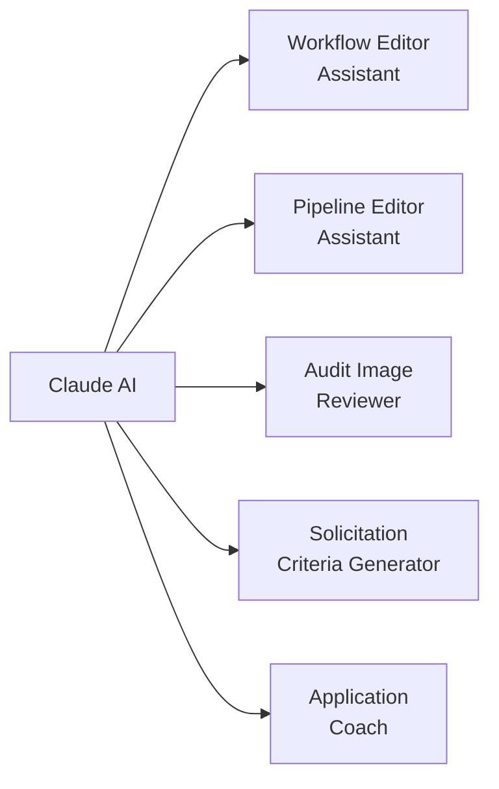

# AI Features

Connect Labs has AI assistants embedded throughout the application. They help program managers and administrators make changes, understand data, and get things done faster — without needing to write code.

---

## Where AI Appears

### Workflow & Pipeline Editor Assistant

When editing a workflow or pipeline in the Workflow Engine, an AI assistant is available to help make changes. You can describe what you want in plain English:

- _"Add a column showing the average weight from the last 3 visits"_
- _"Change the status labels from Active/Inactive to Enrolled/Graduated"_
- _"Remove the RUTF field from the table — it's not relevant for this program"_

The AI understands the current workflow's structure and makes targeted changes. After each change, you can preview the result and either keep it or ask for a revision. More advanced edits can be done using [Connect MCP & Safe Mode](connect-mcp-safe-mode.md) from the command line.

---

### Audit Image Reviewer

In the Audit module, you can trigger an AI pre-screen before doing a manual image review. The AI checks each image for:

- **Image quality** — blur, poor lighting, or incomplete framing
- **Measurement validity** — scale or MUAC readings that are outside expected ranges
- **Required elements** — whether the required items are clearly visible in the photo

The AI flags images it thinks need attention, but you always make the final Pass/Fail decision. See [Audit & QA Review](audit.md) for the full workflow.

---

### Solicitation Criteria Generator

When creating a solicitation (RFP or EOI), you can paste in a program description or upload a document and ask the AI to suggest:

- A structured set of evaluation criteria
- Recommended scoring weights for each criterion
- Sample questions for the response template

Review and edit these suggestions before saving. See [Solicitations](solicitations.md) for the full process.

---

### Application Coach

When filling out a response to a solicitation, the **AI Application Coach** is available on the response form to help applicants strengthen their submissions. It can:

- Review draft answers and suggest improvements
- Flag sections that may be incomplete or unclear
- Offer guidance on how to address specific evaluation criteria

See [Solicitations](solicitations.md) for the full process.

---

## What the AI Can and Can't Do

| Can do                                      | Can't do                                    |
| ------------------------------------------- | ------------------------------------------- |
| Edit workflow display logic                 | Submit CommCare forms                       |
| Update pipeline data fields                 | Change CommCare HQ settings                 |
| Pre-screen audit images                     | Access individual patient health records    |
| Suggest solicitation criteria               | Submit responses on behalf of organizations |
| Coach applicants on response quality        | Make changes in the main CommCare platform  |
| Answer questions about the current workflow |                                             |

---

## Data Privacy

AI features in Labs route through a **governed endpoint** — content that passes through AI processing is handled under Dimagi's Zero Data Retention (ZDR) agreement with Anthropic. This means prompt content is not stored by the AI provider after processing.

!!! info "Safe Mode for sensitive workflows"
If you're working with programs that have stricter data handling requirements, use [Connect MCP & Safe Mode](connect-mcp-safe-mode.md) — a locked-down AI editing environment with additional safeguards.

---

## Common Questions

**The AI made a change I don't like. Can I undo it?**
Yes. In the workflow editor, use the **Undo** button or ask the AI to revert its last change. The workflow version history also lets you restore any previous version.

**Can the AI see patient data?**
The AI used for workflow and pipeline editing does not have access to individual patient records. For audit image review, images are sent to the AI for analysis but processed under ZDR terms — they are not retained by the AI provider.

**Which AI is being used?**
Labs uses Claude (made by Anthropic) as the AI for workflow editing, pipeline assistance, solicitation criteria generation, and the Application Coach. Audit image review also uses Claude's vision capability.
