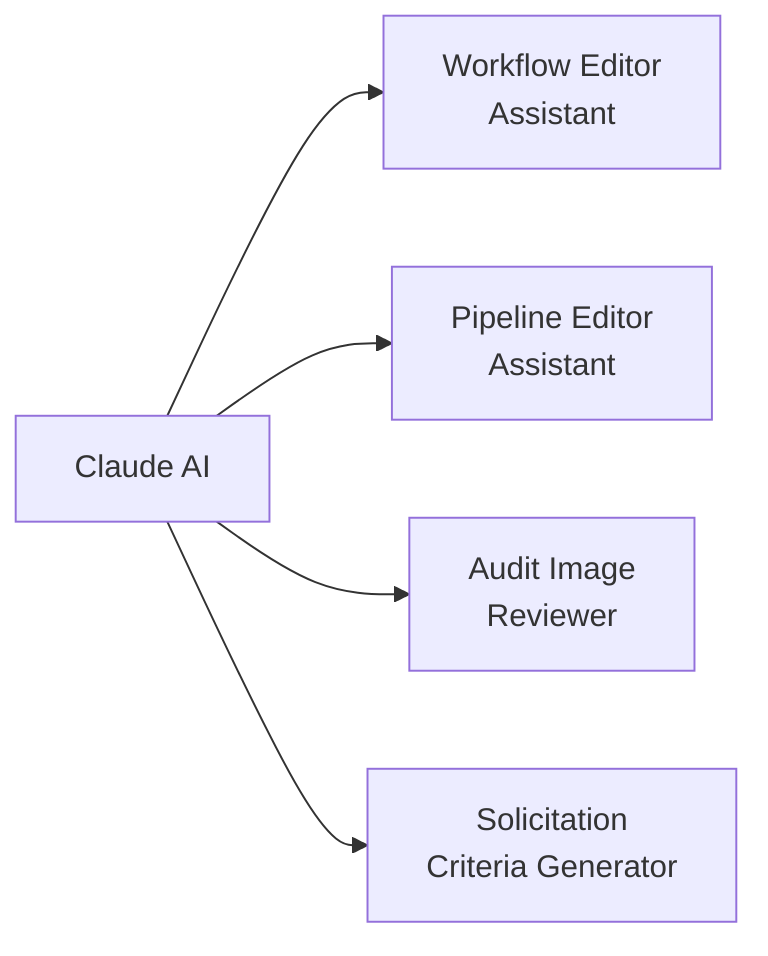

# AI Features

Connect Labs has AI assistants embedded throughout the application. They help program managers and administrators make changes, understand data, and get things done faster — without needing to write code.

---

## Where AI Appears

### Workflow Editor Assistant

When editing a workflow in the Workflow Engine, an AI chat panel appears on the right side. You can ask it to:

- _"Add a column showing the average weight from the last 3 visits"_
- _"Change the status labels from Active/Inactive to Enrolled/Graduated"_
- _"Make the table sortable by visit count"_

The AI understands the current workflow's structure and makes targeted changes. After each change, you can preview the result and either keep it or ask for a revision.

---

### Pipeline Editor Assistant

When editing a pipeline (the data extraction layer behind a workflow), the AI can help you:

- Add new fields from CommCare forms
- Change how data is aggregated (count, sum, most recent, percentage)
- Debug why a column isn't returning expected results
- Rename or reorganize fields

---

### Audit Image Reviewer

In the Audit module, you can trigger an AI pre-screen before doing a manual image review. The AI checks each image for:

- **Image quality** — blur, poor lighting, incomplete framing
- **Measurement validity** — scale readings that are out of expected range
- **Required elements** — whether the required items are visible in the photo

The AI flags images it thinks need attention, but you always make the final pass/fail decision.

---

### Solicitation Criteria Generator

When creating a solicitation (RFP or EOI), you can upload a program description document and ask the AI to suggest:

- A structured set of evaluation criteria
- Recommended scoring weights for each criterion
- Sample questions for the response template

Review and edit these suggestions before saving.

---

## What the AI Can and Can't Do

| Can do                               | Can't do                                    |
| ------------------------------------ | ------------------------------------------- |
| Edit workflow display logic          | Submit CommCare forms                       |
| Update pipeline data fields          | Change CommCare HQ settings                 |
| Pre-screen audit images              | Access patient health records directly      |
| Suggest solicitation criteria        | Submit responses on behalf of organizations |
| Answer questions about Labs features | Make changes in the main CommCare platform  |

---

## Data Privacy

AI features in Labs route through a **governed endpoint** — patient data and form content that passes through AI processing is handled under Dimagi's Zero Data Retention (ZDR) agreement with the AI provider. This means prompt content is not stored by the AI provider after processing.

!!! info "Safe Mode for sensitive workflows"
If you're working with programs that have stricter data handling requirements, use [Connect MCP & Safe Mode](connect-mcp-safe-mode.md) — a locked-down AI editing environment with additional safeguards.

---

## Common Questions

**The AI made a change I don't like. Can I undo it?**
Yes. In the workflow editor, use the **Undo** button or ask the AI to revert its last change. The workflow version history also lets you restore any previous version.

**Can the AI see patient data?**
The AI used for workflow/pipeline editing and solicitation assistance does not have access to individual patient records. For audit image review, images are sent to the AI for analysis but are processed under ZDR terms.

**Which AI model is being used?**
Labs uses Claude (Anthropic) as the primary AI for workflow editing and pipeline assistance. Audit image review uses a specialized vision model.
