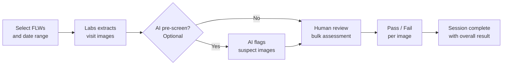

# Audit & QA Review

The Audit module lets program managers and supervisors review field worker (FLW) visit images for quality assurance. You can sample visits from CommCare, assess images against program standards, and optionally use AI to pre-screen before human review.

---

## How It Works

---

## Creating an Audit Session

Navigate to **Audit** in the top menu, then click **Create Audit Session**.

**Step 1 — Choose your scope:**

- Select the **opportunity** and a **date range** for visits to review
- Choose which **image questions** from the CommCare form to include (for example, a weight scale photo or a MUAC measurement photo)
- Set how many visits to sample — either a fixed number or a percentage of total visits

**Step 2 — Preview and confirm:**

- Labs shows how many visits match your criteria before you commit
- Adjust filters if needed, then click **Create**

!!! tip "Large audits"
Creating a session with many visits runs in the background. You'll see a progress indicator — come back in a few minutes for large samples.

---

## Reviewing Images

Once a session is created, open it to start the bulk assessment.

=== "Standard Review"

    Images are shown one at a time alongside the related visit data — FLW name, visit date, and patient name.

    - Mark each image **Pass** or **Fail**
    - Add optional notes
    - Your progress saves automatically

=== "AI-Assisted Review"

    Before you start, click **Run AI Review** to have AI pre-screen all images in the session.

    The AI checks each image for:

    - **Image quality** — blur, poor lighting, or incomplete framing
    - **Measurement validity** — scale or MUAC readings outside expected ranges
    - **Required elements** — whether the required items are clearly visible in the photo

    AI results appear alongside each image as suggestions — you make the final Pass/Fail call. Images flagged by the AI are highlighted so you can prioritize reviewing them first.

**Keyboard shortcuts** (work in both review modes):

| Key | Action         |
| --- | -------------- |
| `P` | Mark Pass      |
| `F` | Mark Fail      |
| `→` | Next image     |
| `←` | Previous image |

---

## Session Results

After reviewing all images, click **Complete Session** to record the overall result.

The session list shows:

- Number of images reviewed
- Pass rate for the session
- Session status (In Progress / Complete)
- Link to any tasks created from this session

!!! tip "Creating follow-up tasks"
After completing a session, click **Create Task** next to any flagged visit to open a follow-up task pre-filled with the worker's details. See [Task Management](task-management.md) for how tasks work.

---

## Common Questions

**Why are some visits missing?**
Visits only appear if they have images attached to the question types you selected. If a FLW didn't upload a photo for that question, their visits won't be included.

**Can I pause and come back?**
Yes — your progress saves automatically. Open the session anytime to continue where you left off.

**What does the AI check for?**
The AI looks at image quality (blur, brightness, framing), whether the measurement shown is within expected ranges, and whether required items are visible. It does not access patient health records — only the images themselves.

**Can I review the same set of visits twice?**
Yes — create a new session with the same filters. Each session is independent.
