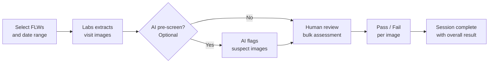

# Audit & QA Review

The Audit module lets program managers and supervisors review field worker (FLW) visit images for quality assurance. You can sample visits from CommCare, assess images against program standards, and optionally use AI to pre-screen before human review.

---

## How It Works

---

## Creating an Audit Session

Navigate to **Audit** in the top menu, then click **Create Audit Session**.

**Step 1 — Choose your scope:**

- Select the **opportunity** and a **date range** for visits to review
- Choose which **image questions** from the CommCare form to include (for example, a weight scale photo or a MUAC measurement photo)
- Set how many visits to sample — either a fixed number or a percentage of total visits

**Step 2 — Preview and confirm:**

- Labs shows how many visits match your criteria before you commit
- Adjust filters if needed, then click **Create**

!!! tip "Large audits"
Creating a session with many visits runs in the background. You'll see a progress indicator — come back in a few minutes for large samples.

---

## Reviewing Images

Once a session is created, open it to start the bulk assessment.

=== "Standard Review"

    Images are shown one at a time alongside the related visit data — FLW name, visit date, and patient name.

    - Mark each image **Pass** or **Fail**
    - Add optional notes
    - Your progress saves automatically

=== "AI-Assisted Review"

    Before you start, click **Run AI Review** to have AI pre-screen all images in the session.

    When your session includes weight or MUAC image types, an **AI Review Agent** dropdown appears. Select the agent that matches your image type:

    | Agent | When it appears | What it does |
    | --- | --- | --- |
    | **Scale Image Validation** | A weight-related image type is selected | Compares scale photos against the reading entered by the FLW and flags mismatches |
    | **MUAC OverZoom** | A MUAC image type is selected | Classifies photos for excessive zoom; images flagged as overzoomed are automatically pre-tagged **Fail** before you open the session |

    If no agent is selected, the workflow behaves exactly as before — the AI checks each image for:

    - **Image quality** — blur, poor lighting, or incomplete framing
    - **Measurement validity** — scale or MUAC readings outside expected ranges
    - **Required elements** — whether the required items are clearly visible in the photo

    AI results appear alongside each image as suggestions — you make the final Pass/Fail call. Images flagged by the AI are highlighted so you can prioritize reviewing them first.

    !!! tip "MUAC OverZoom pre-tagging"
    When the MUAC OverZoom agent is used, images it flags as overzoomed arrive in your review queue already marked **Fail**. You can confirm each one quickly or override the tag if you disagree.

**Keyboard shortcuts** (work in both review modes):

| Key | Action         |
| --- | -------------- |
| `P` | Mark Pass      |
| `F` | Mark Fail      |
| `→` | Next image     |
| `←` | Previous image |

---

## Session Results

After reviewing all images, click **Complete Session** to record the overall result.

The session list shows:

- Number of images reviewed
- Pass rate for the session
- Session status (In Progress / Complete)
- Link to any tasks created from this session

!!! tip "Creating follow-up tasks"
After completing a session, click **Create Task** next to any flagged visit to open a follow-up task pre-filled with the worker's details. See [Task Management](task-management.md) for how tasks work.

---

## Demoing Audit Without Real Patient Data

Synthetic opportunities include fully populated audit content — MUAC photos, pre-reviewed sessions with pass/fail results, linked follow-up tasks, and OCS coaching transcripts — so you can walk stakeholders or funders through the complete program management loop without using any real patient data.

To access a demo audit session, select a **synthetic opportunity** from the opportunity list (for example, **CHC Nutrition — Northern Cluster (demo)** or **CHC Nutrition — Southern Cluster (demo)**). Audit sessions, tasks, and coaching transcripts within synthetic opportunities are pre-filled with realistic sample data and behave exactly like live sessions, but no real FLW or patient information is involved.

Synthetic audit sessions are built to tell a coherent story out of the box:

- **Audit notes** carry in-story context (for example, "Weekly SOP audit — MUAC photo review for a flagged screening pattern…") rather than any production or recording instructions.
- **Timelines are realistic** — an "Audit Last 7 days" session spans seven separate household visits across seven workdays, each with its own timestamp. Completed sessions show an accurate "Completed on" date, and closed tasks show a closing message that matches the date in the task history.
- **The Program Admin Report grid covers four completed weeks.** Northern Cluster reads **4/4 runs, SOP MET** and Southern Cluster reads **3/4, BELOW**. The report window ends at the current date and slides forward automatically, so the grid stays current-dated without any manual updates.
- **AI coaching transcripts** unfold with varied reply gaps for a natural conversation feel.

!!! note "Synthetic data is read-only for demo purposes"
You can navigate and explore all audit drill-downs in a synthetic opportunity, but changes you make (such as overriding Pass/Fail results) do not affect any real program data.

---

## Common Questions

**Why are some visits missing?**
Visits only appear if they have images attached to the question types you selected. If a FLW didn't upload a photo for that question, their visits won't be included.

**Can I pause and come back?**
Yes — your progress saves automatically. Open the session anytime to continue where you left off.

**What does the AI check for?**
The AI looks at image quality (blur, brightness, framing), whether the measurement shown is within expected ranges, and whether required items are visible. It does not access patient health records — only the images themselves.

**What is the MUAC OverZoom agent?**
When a MUAC image type is selected, you can choose the **MUAC OverZoom** agent from the AI Review Agent dropdown. It automatically identifies photos taken with excessive zoom and pre-tags them as **Fail** before your review begins. You can confirm or override each tag during your normal review.

**Can I review the same set of visits twice?**
Yes — create a new session with the same filters. Each session is independent.

**Can I use audit sessions to demonstrate the system to funders?**
Yes — synthetic opportunities include realistic MUAC photos, completed audit sessions, follow-up tasks, and OCS coaching transcripts. This lets you show the full program management workflow without any real patient data. See the [Demoing Audit Without Real Patient Data](#demoing-audit-without-real-patient-data) section above.
