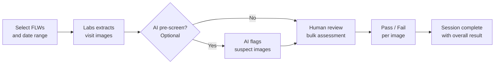

# Audit & QA Review

The Audit module lets program managers and supervisors review field worker (FLW) visit images for quality assurance. You can sample visits from CommCare, assess images against program standards, and optionally use AI to pre-screen before human review.

---

## How It Works

---

## Creating an Audit Session

Navigate to **Audit** in the top menu, then click **Create Audit Session**.

**Step 1 — Choose your scope:**

- Select the **opportunity** from the search table — the table shows the opportunity name, its **Program**, and other details so you can confirm you are selecting the right one
- Set a **date range** for visits to review
- Choose which **image questions** from the CommCare form to include (for example, a weight scale photo or a MUAC measurement photo)
- Set how many visits to sample — either a fixed number or a percentage of total visits
- If your image types support AI review, an **AI Review Agent** dropdown appears as soon as you select an opportunity — you do not need to run a preview first. Select an agent if you want AI assistance, or leave it blank to skip AI review entirely.

**Step 2 — Preview and confirm:**

- Labs shows how many visits match your criteria before you commit, including a list of matched field workers shown by their **real display names** (not internal ID codes)
- Adjust filters if needed, then click **Create**

!!! tip "Large audits"
Creating a session with many visits runs in the background. You'll see a progress indicator — come back in a few minutes for large samples.

---

## Reviewing Images

Once a session is created, open it to start the bulk assessment.

=== "Standard Review"

    Images are shown one at a time alongside the related visit data — FLW name, visit date, and patient name.

    - Mark each image **Pass** or **Fail**
    - Add optional notes
    - Your progress saves automatically

=== "AI-Assisted Review"

    Before you start, click **Run AI Review** to have AI pre-screen all images in the session. AI review processes multiple images at the same time, so a session of around 30 images typically completes in about 2 minutes.

    When your session includes weight or MUAC image types, an **AI Review Agent** dropdown appears. Select the agent that matches your image type:

    | Agent | When it appears | What it does |
    | --- | --- | --- |
    | **Scale Image Validation** | A weight-related image type is selected | Compares scale photos against the reading entered by the FLW and flags mismatches |
    | **MUAC OverZoom** | A MUAC image type is selected | Classifies photos for excessive zoom and flags images the agent identifies as hyperzoomed |

    If no agent is selected, the workflow behaves exactly as before — the AI checks each image for:

    - **Image quality** — blur, poor lighting, or incomplete framing
    - **Measurement validity** — scale or MUAC readings outside expected ranges
    - **Required elements** — whether the required items are clearly visible in the photo

    AI results appear alongside each image as suggestions — you make the final Pass/Fail call. Images flagged by the AI are highlighted so you can prioritize reviewing them first.

    ### Choosing how the AI applies its verdicts

    Next to the AI Review Agent dropdown, each possible AI verdict has a checkbox — for example, "Automatically pre-tag photos flagged as hyperzoomed as Fail" or "Automatically pre-tag readings that match the scale as Pass". You can tick any combination of these:

    - **Ticked** — the AI pre-tags matching images with that result before you open the review queue.
    - **Unticked** — the AI still badges every image with its classification, but leaves the Pass/Fail decision to you.

    The default is **flag-only** (all checkboxes unticked), so nothing is pre-tagged unless you opt in. This means the AI's assessments are always visible, but automated pre-tagging only happens when you have explicitly chosen it.

    Regardless of your checkbox settings, you can always bulk-apply any verdict with one click — for example, **Fail all Hyperzoomed (N)** — directly from the review queue.

    !!! tip "Not sure whether to pre-tag?"
    Start with the default flag-only setting. Review a session to see how well the AI's classifications match your program standards, then enable pre-tagging for the verdicts you consistently agree with.

    **AI classification labels** appear at the bottom of each image tile (below the **Add Note** field) once the AI has reviewed the photo. The label shows the agent name and its classification for that image:

    | Agent | Possible label |
    | --- | --- |
    | **MUAC OverZoom** | "MUAC OverZoom: Hyperzoomed" or "MUAC OverZoom: Not Hyperzoomed" |
    | **Scale Image Validation** | "Scale Validation: Passed" or "Scale Validation: Failed" |

    If the AI encountered a problem reviewing a specific image, the label turns red and shows the error message. Images that have not yet been reviewed by the AI show no label.

    These labels let you see at a glance what the AI classified every image as — not just the ones that were flagged — without relying solely on any pre-tag badge.

    !!! tip "MUAC OverZoom pre-tagging"
    When the MUAC OverZoom agent is used and the pre-tag checkbox for hyperzoomed images is ticked, images it identifies as hyperzoomed arrive in your review queue already marked **Fail** with a red **Hyperzoomed** badge. If the checkbox is unticked, those images are still badged with the AI classification label but appear as normal pending photos for your human review. In both cases, you can confirm each result or override it if you disagree.

**Keyboard shortcuts** (work in both review modes):

| Key | Action         |
| --- | -------------- |
| `P` | Mark Pass      |
| `F` | Mark Fail      |
| `→` | Next image     |
| `←` | Previous image |

---

## Session Results

After reviewing all images, click **Complete Session** to record the overall result.

The session list shows:

- Number of images reviewed
- Pass rate for the session
- Session status (In Progress / Complete)
- Link to any tasks created from this session

!!! tip "Creating follow-up tasks"
After completing a session, click **Create Task** next to any flagged visit to open a follow-up task pre-filled with the worker's details. See [Task Management](task-management.md) for how tasks work.

---

## Demoing Audit Without Real Patient Data

Synthetic opportunities include fully populated audit content — MUAC photos, pre-reviewed sessions with pass/fail results, linked follow-up tasks, and OCS coaching transcripts — so you can walk stakeholders or funders through the complete program management loop without using any real patient data.

To access a demo audit session, select a **synthetic opportunity** from the opportunity list (for example, **CHC Nutrition — Northern Cluster (demo)** or **CHC Nutrition — Southern Cluster (demo)**). Audit sessions, tasks, and coaching transcripts within synthetic opportunities are pre-filled with realistic sample data and behave exactly like live sessions, but no real FLW or patient information is involved.

Synthetic audit sessions are built to tell a coherent story out of the box:

- **Audit notes** carry in-story context (for example, "Weekly SOP audit — MUAC photo review for a flagged screening pattern…") rather than any production or recording instructions.
- **Timelines are realistic** — an "Audit Last 7 days" session spans seven separate household visits across seven workdays, each with its own timestamp. Completed sessions show an accurate "Completed on" date, and closed tasks show a closing message that matches the date in the task history.
- **The Program Admin Report grid covers four completed weeks.** Northern Cluster reads **4/4 runs, SOP MET** and Southern Cluster reads **3/4, BELOW**. The report window ends at the current date and slides forward automatically, so the grid stays current-dated without any manual updates.
- **AI coaching transcripts** unfold with varied reply gaps for a natural conversation feel.

!!! note "Synthetic data is read-only for demo purposes"
You can navigate and explore all audit drill-downs in a synthetic opportunity, but changes you make (such as overriding Pass/Fail results) do not affect any real program data.

---

## Common Questions

**Why are some visits missing?**
Visits only appear if they have images attached to the question types you selected. If a FLW didn't upload a photo for that question, their visits won't be included.

**Can I pause and come back?**
Yes — your progress saves automatically. Open the session anytime to continue where you left off.

**What does the AI check for?**
The AI looks at image quality (blur, brightness, framing), whether the measurement shown is within expected ranges, and whether required items are visible. It does not access patient health records — only the images themselves.

**What is the MUAC OverZoom agent?**
When a MUAC image type is selected, you can choose the **MUAC OverZoom** agent from the AI Review Agent dropdown. It automatically identifies photos taken with excessive zoom and badges them with its classification. If you have ticked the pre-tag checkbox for hyperzoomed images, those images are also pre-tagged **Fail** with a red **Hyperzoomed** badge before your review begins. If the checkbox is unticked, the badge still shows the AI's classification but no Pass/Fail is applied automatically. You can confirm or override each result during your normal review.

**Can I control which AI verdicts are applied automatically?**
Yes. Next to the AI Review Agent dropdown, each possible verdict has a checkbox. Tick it to have the AI pre-tag matching images with that result; leave it unticked so the AI flags and badges the image but leaves the Pass/Fail decision to you. The default is flag-only — nothing is pre-tagged unless you opt in. You can also bulk-apply any verdict with one click from the review queue (for example, **Fail all Hyperzoomed (N)**).

**Where does the AI Review Agent dropdown appear?**
The dropdown appears as soon as you select an opportunity in the audit-creation wizard — you do not need to run "Update Preview" first.

**What are the AI classification labels on each image tile?**
Once the AI agent has reviewed an image, a small label appears at the bottom of the tile (below the **Add Note** field) showing the agent name and its classification — for example, "MUAC OverZoom: Not Hyperzoomed" or "Scale Validation: Passed". If the AI encountered a problem with a specific image, the label turns red and shows the error message. This gives you a clear record of what the AI decided for every image, not just the ones that were flagged.

**How long does AI review take?**
For a typical session of around 30 images, AI review completes in about 2 minutes. Larger sessions will take a little longer, but the progress indicator on the session page updates as images are processed.

**Can I review the same set of visits twice?**
Yes — create a new session with the same filters. Each session is independent.

**Can I use audit sessions to demonstrate the system to funders?**
Yes — synthetic opportunities include realistic MUAC photos, completed audit sessions, follow-up tasks, and OCS coaching transcripts. This lets you show the full program management workflow without any real patient data. See the [Demoing Audit Without Real Patient Data](#demoing-audit-without-real-patient-data) section above.

**Why did the opportunity table previously show a dash where the Program name should be?**
This was a display bug — the Program column now correctly shows the program name for every opportunity in the search table, making it easier to confirm you are creating a session against the right opportunity.

**Why did the FLW preview show unfamiliar codes instead of names?**
The preview was previously showing internal Connect ID codes instead of field worker names. It now shows each worker's real display name, so you can confirm the right people are included in your sample before creating the session.
