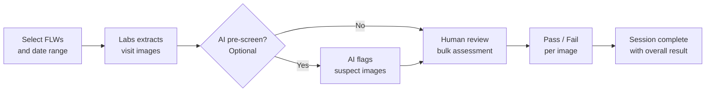

# Audit & QA Review

The Audit module lets program managers and supervisors review field worker (FLW) visits for quality assurance. You can extract images from CommCare forms, assess them against standards, and optionally use AI to pre-screen before human review.

---

## How It Works

---

## Creating an Audit Session

Navigate to **Audit** in the top menu, then click **Create Audit Session**.

**Step 1 — Choose your scope:**

- Select the **opportunity** and a **date range** for visits to review
- Choose which **image questions** from the CommCare form to extract (e.g., weight scale photo, MUAC measurement photo)
- Set how many visits to sample — either a fixed number or a percentage of total visits

**Step 2 — Preview:**

- Labs shows how many visits match your criteria before you commit
- Adjust filters if needed, then click **Create**

!!! tip "Large audits"
Creating a session with many visits runs in the background. You'll see a progress indicator — come back in a few minutes for large samples.

---

## Reviewing Images (Bulk Assessment)

Once a session is created, open it to start the bulk assessment:

=== "Standard Review" - Images are shown one at a time alongside the related form data (FLW name, visit date, patient name) - Mark each image **Pass** or **Fail** - Add optional notes - Your progress is saved automatically

=== "AI-Assisted Review" - Before you start, click **Run AI Review** to have AI pre-screen all images - AI checks for issues like blurry photos, out-of-range measurements, or missing data - AI results appear alongside each image as suggestions — you make the final call - Images flagged by AI are highlighted so you can review them first

**Keyboard shortcuts:**

| Key | Action         |
| --- | -------------- |
| `P` | Mark Pass      |
| `F` | Mark Fail      |
| `→` | Next image     |
| `←` | Previous image |

---

## Session Results

After reviewing all images, click **Complete Session** to record the overall result.

The session list shows:

- Number of images reviewed
- Pass rate
- Session status (In Progress / Complete)
- Link to any tasks created from this session

---

## Common Questions

**Why are some visits missing?**
Visits only appear if they have images attached to the question types you selected. If a FLW didn't upload a photo for that question, their visits won't be included.

**Can I pause and come back?**
Yes — your progress saves automatically. Open the session anytime to continue where you left off.

**What does the AI check for?**
The AI looks at image quality (blur, brightness), whether the measurement shown is within expected ranges, and whether required items are visible in the frame. It doesn't access patient health records.
