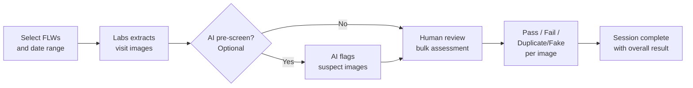

# Audit & QA Review

The Audit module lets program managers and supervisors review field worker (FLW) visit images for quality assurance. You can sample visits from CommCare, assess images against program standards, and optionally use AI to pre-screen before human review.

---

## How It Works

```mermaid
flowchart LR
    A[Select FLWs\nand date range] --> B[Labs extracts\nvisit images]
    B --> C{AI pre-screen?\nOptional}
    C -->|Yes| D[AI flags\nsuspect images]
    C -->|No| E[Human review\nbulk assessment]
    D --> E
    E --> F[Pass / Fail /\nDuplicate/Fake\nper image]
    F --> G[Session complete\nwith overall result]
```

---

## Creating an Audit Session

Navigate to **Audit** in the top menu, then click **Create Audit Session**.

**Step 1 — Choose your scope:**

- Select the **opportunity** from the search table — the table shows the opportunity name, its **Program**, and other details so you can confirm you are selecting the right one
- Set a **date range** for visits to review
- Set how many visits to sample — either a fixed number or a percentage of total visits

**Step 2 — Preview and confirm:**

- Labs shows how many visits match your criteria before you commit, including a list of matched field workers shown by their **real display names** (not internal ID codes)
- Adjust filters if needed, then click **Create**

!!! warning "Creating a second session on the same run"
    If a run already has an audit session and you click **Create** again — for example, after reverting and adjusting parameters — Labs will ask you to confirm: *"This run already has 1 audit session. Create another one anyway?"* This prevents accidentally ending up with a duplicate session you did not intend to create.

**Step 3 — Sampling and filters:**

After setting your date range and sample size, two additional filter sections appear below the sampling configuration:

- **Deliver Unit Type** — a checkbox list of the form names used to submit visits. Tick one or more to include only visits submitted with those forms. Leave all unticked to include all forms.
- **Visit Type** — a checkbox list of visit statuses (for example, Pending, Approved, Rejected, Over Limit). Tick one or more to include only visits with those statuses. Leave all unticked to include all statuses.

Both filters are applied when you click **Update Preview**, so you can see exactly how many visits match before you proceed.

**Step 5 — Audit Field Configuration:**

This step appears once you have selected your opportunities. It has two sections:

- **Select the image types to audit** — an auto-detected picker lists the image question types available for the selected opportunity. Each image type is shown by its full question path (for example, `household_visit/child_screening/muac_photo`) so you can confirm exactly which form field you are including. Select one or more types to include in this session.
- **AI reviewer per image type** — when you tick an image type, an AI reviewer dropdown appears directly beneath it. You can select a different reviewer for each image type, or leave the dropdown blank to skip AI review for that type. Each reviewer only appears for the image types it is designed for. This replaces the previous single-reviewer dropdown — each photo type now runs only the reviewer you choose for it.
- **Reviewer settings** — some reviewers require one extra setting, which appears immediately under the reviewer dropdown when that reviewer is selected:
    - **Scale Image Validation** asks you to choose a **Manual Scale Value** field — a dropdown of your opportunity's form fields that tells the reviewer which recorded weight to compare against the scale photo.
    - **MUAC Reading Match** asks you to choose a **Manual MUAC Value** field — a dropdown of your opportunity's form fields that tells the reviewer which recorded MUAC measurement (in cm) to compare against the tape photo.
    - **MUAC OverZoom** requires no extra settings.
    If a reviewer needs a setting and you leave it blank, the wizard will stop you before creating the session.
- **Image De-duplication** — a checkbox option that runs a duplication check across all images in the session. When enabled, Labs compares images submitted by the same field worker on the same day and flags any that appear to be duplicates of each other. Flagged images receive a **Duplicate** tag on their image tile. In the bulk assessment view, images are automatically sorted so that suspected duplicates appear together in groups, making it easier to compare them side by side and confirm or reject each flag. Leave this option unticked if you do not need de-duplication checking for the session.
- **Context fields** (collapsed by default) — optionally associate any supporting form fields (such as a recorded measurement value) with an image type so that human reviewers can see the relevant data alongside each photo. These associations have no effect on AI review.
- **Exclude already-audited images** — a checkbox option that controls whether photos previously judged in a completed audit session are included in this new session. Leave it **unchecked** (the default) to include all matching images as normal. **Check it** and the new session will skip any photo that has already received a verdict in an earlier completed audit — so reviewers only assess images that have never been audited before. The number of images skipped is recorded in the creation log.
- **Visit Clustering** — an optional filter available in the Weekly Dual-Track Image Audit workflow, shown alongside the existing Audit Window and Sampling rate settings. When enabled, it groups consecutive visits by the same field worker that are close together in time and/or GPS location. This is useful for spotting likely duplicate or re-photographed measurements. Visit Clustering never changes which images are included in the audit — it only adds a **N Duplicate Groupings** button next to each row in the session. Clicking that button expands a panel below the audit tile showing, on a single row, the group summary, a text list of image IDs in that group (for example, `[1667955, 1667962, ...]`), and a **Download CSV** link for each grouping. The exported CSV includes the **Visit ID** (the number shown on the bulk assessment page, such as #1677989) for each image — Beneficiary Name is not included. When the bulk assessment page opens, any image whose visit fell into a duplicate grouping has **Duplicate/Fake** pre-selected automatically, saving you a step. This pre-tagging never overrides an image that has already been reviewed by a human or AI — only images with no verdict yet are pre-tagged. If both Visit Clustering checkboxes are left unticked, nothing changes from the standard workflow.

**Pass Threshold:**

Also on the metadata step of the wizard, you can set a **Pass Threshold** using a slider. The slider ranges from **75% to 100%** and defaults to **100%**.

The threshold controls how the overall audit result is calculated when a reviewer completes the session:

- If the percentage of assessments that passed meets or exceeds the threshold, the audit is marked **Pass**.
- If it falls below the threshold, the audit is marked **Fail**.

The pass percentage is calculated by dividing the number of images marked Pass by the FLW's **total image count** for the session — not just the images assessed so far. This means the percentage shown in the FLW Summary table accurately reflects progress against the full sample at all times.

At the default of 100%, any single failed assessment will fail the entire audit — the same behaviour as before this option was introduced. Lowering the threshold allows a small number of failures without failing the whole audit.

The configured threshold is shown as small italic text — *Pass Threshold : x%* — underneath the FLW Summary table on the review page, so reviewers can see the standard that applies to the session they are working in.

!!! tip "Quick-create links"
    If you regularly audit the same image types, you can pre-select them by adding `?image_paths=<full/path1>,<full/path2>` to the audit-creation URL. The picker will open with those types already selected, saving setup time.

**Choosing AI assistance (within Step 5):**

Once you select an image type, an **AI Review Agent** dropdown appears beneath it. Select an agent for that image type if you want AI assistance, or leave it blank to skip AI review for that type. Because each image type has its own dropdown, you can — for example — run **MUAC OverZoom** on MUAC photos and **Scale Image Validation** on weight photos in the same session, with no risk of the wrong reviewer running on the wrong photo type.

When an agent is selected, you will also see per-verdict **"Auto-tag results before I review"** checkboxes — one for each possible verdict the agent can produce. These work the same way as in the review queue:

- **Ticked** — the AI pre-tags matching images with that result before you open the review queue.
- **Unticked** — the AI still badges every image with its classification, but leaves the Pass/Fail decision to you.

The default is **flag-only** (all checkboxes unticked), so nothing is pre-tagged unless you opt in.

!!! tip "Not sure whether to pre-tag?"
    Start with the default flag-only setting. Review a session to see how well the AI's classifications match your program standards, then enable pre-tagging for the verdicts you consistently agree with.

!!! tip "Large audits"
    Creating a session with many visits runs in the background. You'll see a progress indicator — come back in a few minutes for large samples. If you cancel while the session is still being built, the background job will stop before creating the session, so no partial or orphaned session is left behind.

---

## Guided Audit Workflows

In addition to the standard audit creation page, Labs includes purpose-built guided workflows for common audit patterns. These workflows walk through the same steps as the standard page but pre-configure certain options and add extra filtering tools suited to specific program needs.

### Weekly Dual-Track Image Audit

This workflow is available to programs that run parallel audit tracks across multiple opportunities. It covers opportunity selection, sampling, field configuration, and metadata in the same order as the standard wizard, and adds **Visit Clustering** (see Step 5 above) to help spot duplicate or re-photographed measurements.

**Configuring tracks in the workflow:**

Instead of tracks being set up in advance, you can now configure them directly in the workflow's own UI:

- For each opportunity, tick checkboxes to select which CommCare image fields belong to that track — the same image-type picker used in the standard wizard.
- Each track is labelled **Track A** and **Track B** by default. You can rename these to whatever is meaningful for your program — for example, **MUAC** and **Other** — and the labels will carry through to the session and any exported CSVs.
- The **MUAC OverZoom** AI reviewer automatically follows whichever track contains an image path with "muac" in the name, regardless of how you have named the tracks or which track that path ends up in. You do not need to manually reassign it if you reorganise your tracks.
- The **MUAC Reading Match** AI reviewer is also available for MUAC tape photos in this workflow. It compares each photo against the manually-entered MUAC value (in cm) using the same ML vision service used for KMC scale readings. You can run both **MUAC OverZoom** and **MUAC Reading Match** on the same image type in the same session — each check produces its own distinct badge on the image tile ("Hyperzoomed" or "MUAC Mismatch (strict tolerance)"), so it is clear at a glance which check flagged an image. The manually-entered MUAC reading is shown on the tile the same way the KMC scale reading already is.

**Stopping a run in progress:**

While audit creation or AI review is running, a **Stop** button appears on the run screen. Clicking it halts the remaining work immediately. Any sessions that have already been created and any images that have already been reviewed are kept — only the work that had not yet started is cancelled. This is useful if you realise you have selected a sample that is larger than intended and want to stop before it completes.

**Viewing clustering parameters for a saved run:**

When you reopen a run that used Visit Clustering, the run screen now shows the exact time-gap and distance-grouping values that were used when that run was created. This reflects the settings that were actually applied, rather than the current template defaults, so you have an accurate record of how visits were grouped.

!!! note "Program-owned runs"
    Program-owned instances of this workflow — those that span multiple opportunities under one program — work end-to-end. Earlier issues that caused a generic error or a "Failed to update state" error when clicking **Create Audits** have been resolved.

### Muac Picture Audit

The **Muac Picture Audit** workflow is a full audit-creation tool scoped to the CHC PRE-RCT opportunities in program 176. It covers the same ground as the standard audit creation page — opportunity selection, granularity, criteria, FLW preview and selection, field configuration, and metadata — with two differences from the standard workflow:

- **Date and day-of-week filter** — in the criteria step you can combine a date range with a specific day of the week. For example, you can target *every Friday in January 2026* rather than selecting a plain date range. This is useful when your program collects MUAC measurements on a fixed schedule.
- **MUAC images only** — the workflow restricts image type selection to MUAC image types. No other photo types appear, matching the focused purpose of this audit.

All other steps — AI reviewer selection, pass threshold, exclude already-audited images, and so on — work the same way as described in the sections above.

---

## Reviewing Images

Once a session is created, open it to start the bulk assessment.

The bulk assessment page header identifies the field worker being reviewed. For a **combined session** — a bulk image audit covering every field worker at once — the header shows **"All FLWs (N)"**, where N is the total number of field workers included, so it is clear the review spans the full group. For a session scoped to an individual field worker, the header shows that person's real display name as **FLW Name : `<name>`**.

=== "Standard Review"

    Images are shown one at a time alongside the related visit data — FLW name, visit date, and patient name.

    Each image tile also shows the **entity ID** for the visit — for example, the specific child a home visit was recorded for. This appears below the question tag on the tile, marked with a child icon. The same information is shown next to the question tag when you open an image in the full-screen lightbox view. The entity ID is displayed in full (it wraps to a second line rather than being cut off with "..."), so you always see the complete identifier.

    !!! tip "Older audit sessions"
        Entity IDs are shown for all sessions, including those created before this feature was introduced. The page fetches any missing IDs automatically the first time you open an older session.

    Each image has three assessment options:

    - **Pass** and **Fail** appear side by side as before.
    - **Duplicate/Fake** appears as a full-width button below Pass and Fail (shown in orange with an exclamation icon). Use this when an image appears to be a duplicate submission or a fabricated photo rather than a genuine field visit. The image card border, corner badge, and lightbox all use the same orange treatment when this option is selected.

    If an image was flagged by the **Image De-duplication** check, it receives a **Duplicate** tag on its tile. Images are sorted in the bulk assessment view so that suspected duplicates appear together in groups, making it straightforward to compare them and confirm or reject each flag. You can still assess flagged images normally using Pass, Fail, or Duplicate/Fake — the tag is informational and does not lock in a verdict.

    If an image's visit was flagged by Visit Clustering as part of a duplicate grouping, **Duplicate/Fake** is pre-selected automatically when the bulk assessment page opens. This only applies to images with no verdict yet — any image already reviewed by a human or AI keeps its existing verdict.

    If a photo was already given a verdict in an earlier completed audit session, it shows an **Audited** badge on the image tile — for example, **Audited: Passed**, **Audited: Failed**, or **Audited: Dup·Fake**. Hover over the badge to see the date of the earlier audit. This badge only reflects *other* completed audits, not the current session. You can still assess the image normally — the badge is informational only.

    Add optional notes to any image, then move to the next. Your progress saves automatically.

    !!! warning "Resuming a session across multiple sittings"
        It is safe to review images, save, and come back later to continue. Assessments and notes made in an earlier sitting are preserved when you save again — nothing is overwritten. If you encounter a session where earlier verdicts appear to have reverted to Pending, those images will need to be re-reviewed, as the data from the affected saves cannot be recovered.

    The **#** link on each image tile opens the original visit record directly in Connect. This link is correct for all sessions, including those created previously.

=== "AI-Assisted Review"

    Before you start, click **Run AI Review** to have AI pre-screen all images in the session. AI review processes multiple images at the same time — throughput has been increased so that image-heavy batches complete roughly twice
