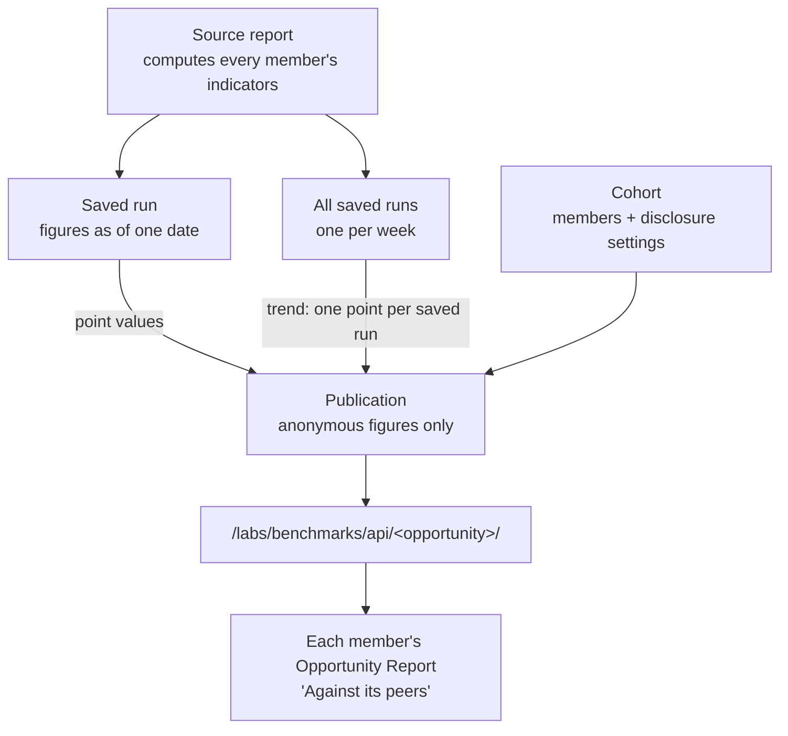

# Benchmarks

A **benchmark** shows an opportunity where it sits among comparable opportunities, without naming any of them. On an opportunity's report, each indicator gets two readings side by side: *where it sits today* (a bar for each peer, with this opportunity highlighted) and *how it got there* (a line for each peer over time, with this opportunity's line highlighted).

This page explains how benchmarks work, how to set one up, and how to keep one current. It uses KMC (Kangaroo Mother Care) as the worked example, but nothing in the system is specific to KMC.

!!! info "Who this is for"
    Programme and M&E leads who want opportunities in a programme to see how they compare, and whoever sets that
    up through Claude. It assumes you know what an indicator is. If not, start with
    [The Semantic Layer](semantic-layer.md).

---

## What it is for

An indicator value on its own ("38% of babies with sufficient weight data") is hard to act on. Is 38% low? Compared with what? A benchmark answers that by putting the figure next to the same figure for the opportunity's peers, computed the same way from the same definitions.

Two things make that safe to share across opportunities that belong to different organisations:

- **Peers are anonymous.** A viewer sees values, never which opportunity each value belongs to.
- **Only some figures are published.** Rates (percentages, per-100 figures) can be compared. Counts can't, because a count gives away how big an opportunity is, and opportunity sizes are visible elsewhere. The rules are described [below](#what-gets-published).

---

## How it works

Three objects are involved:

| Object | What it is |
| --- | --- |
| **Cohort** | A named list of opportunities that may be compared with each other. Being in a cohort is what lets an opportunity see the others' anonymous figures. It also holds the cohort's [disclosure settings](#disclosure-settings) and, optionally, the report it is published from. |
| **Source report** | One report that computes the indicators for **every** opportunity in the cohort, and keeps [saved runs](weekly-trends-and-snapshots.md). For KMC this is the Programme Report. |
| **Publication** | One publish of the cohort, taken from one saved run of the source report. It holds the anonymous figures. Each publish creates a new publication; nothing is edited in place, and the page always reads the latest one. |

### Where the numbers come from

- **Today's bars** come from the saved run being published. Nothing is recomputed at publish time; the figures are the ones that run was graded with.
- **The trend lines** come from the source report's **saved-run history**: one point for each saved run. If a week has more than one saved run (say, one saved by hand and one produced by a history rebuild), the most recently completed one wins. So **a trend can only be as long as the history behind it** (see [Weekly Trends and Saved Runs](weekly-trends-and-snapshots.md)).
- **This opportunity's own bar is its live figure**, fetched by its own report. The peers' bars are the published ones. The two can drift apart between publications, so the page places this opportunity's bar by rank rather than trying to match it to a published value.

### The trend runs on tenure, not on the calendar

The trend's horizontal axis is **each opportunity's own weeks of delivering**, counted from its first recorded activity: "week 8" means everybody's eighth week, whenever they started. Opportunities that launched months apart are compared like with like, and no line reveals when its opportunity started. The start is read from the run being published. An opportunity that run records no activity for can't be placed on this axis, so it contributes bars but no line.

### What gets published

Every figure passes through the same checks, in the same place, before it is stored:

- **Only rate-shaped indicators.** An indicator is published if its unit is `%` or per-100. The registry can adjust that per indicator with `benchmarkable: true` or `benchmarkable: false` in the indicator's `meta` (KMC marks its mean early growth rate, `mean_early_growth_rate`, as benchmarkable: a growth rate says nothing about size). **An indicator whose value is a count is never published**, whatever the registry says.
- **Only figures that would be shown anyway.** A figure the report hides or greys out (too few cases, the app never asks the question, the organisation is marked as not recording it credibly) is not published.
- **Denominators are never published.** Knowing that a rate is "out of 1,692 babies" would identify the opportunity.
- **Peers are re-shuffled for each indicator.** Peer order is by value within one indicator, so a bar can't be followed from one chart to the next to build up a profile of one opportunity.

### Disclosure settings

Each cohort also has three settings that decide how much it withholds:

| Setting | What it does | To turn it off |
| --- | --- | --- |
| `min_peers` | How many different opportunities must contribute before a figure, or a week of a trend, is published | `1` (0 isn't allowed) |
| `min_denominator` | An opportunity only contributes a figure if that figure's denominator is at least this | `0` |
| `require_complete_series` | Drop an opportunity's line if it has a gap, or starts or ends inside the window | `false` |

New cohorts start protective: `min_peers` 5, `min_denominator` 25, `require_complete_series` on. Relax them only when the cohort doesn't need that protection. With `min_peers` below 3, a viewer can work out a named peer's exact value.

!!! note "Who can see a benchmark"
    Two things must both be true: the opportunity is a member of the cohort, **and** the person looking can reach
    that opportunity through their own Connect login. If either isn't, the page shows no benchmark (it doesn't
    reveal whether a cohort exists). An opportunity in two cohorts sees each cohort's figures separately.

---

## Setting one up

You set benchmarks up by asking Claude. These are the steps, and the Labs tools Claude uses for each.

1. **Have a source report.** It must compute the indicators for every opportunity you want in the cohort, and keep saved runs. That usually means a report spanning several opportunities, often across programmes: see [Cross-Programme Reports](cross-program-rollups.md).
2. **Create the cohort** and add its members. *"Create a benchmark cohort called 'KMC programme peers' for organisation dimagi-kmc, and add opportunities 523, 524 and 675."* (`benchmarks_cohort_create`, then `benchmarks_cohort_add_opportunities`.) You must belong to the organisation the cohort is created under, and hold every opportunity you add: adding an opportunity to a cohort hands it the cohort's figures.
3. **Build the history first.** The trend is the source report's saved runs, so make sure they exist before publishing. If the report is new, rebuild its history (`workflow_rebuild_history`; see [Weekly Trends and Saved Runs](weekly-trends-and-snapshots.md#rebuilding-history)). Publishing before the history exists leaves opportunities without a line.
4. **Publish.** *"Publish cohort 4 from the latest saved run of workflow 19778."* (`benchmarks_publish`.) Claude reports back what was published and which indicators were withheld, and why.
5. **Make it follow the report.** *"Make cohort 4 republish itself whenever workflow 19778 saves a run."* (`benchmarks_cohort_update` with `source_workflow_id` and `auto_publish_on_completion: true`.) From then on, saving a run of the source report republishes the cohort from that run, and a finished history rebuild republishes it from the newest run. This happens in the background a short while after the save (it can take a minute on a large cohort); a failed republish never stops the save.
6. **Give every member a report to see it on.** *"Create an opportunity report for every member of cohort 4, sharing workflow 19778's pipelines and definitions."* (`benchmarks_create_opp_reports`.) See [Shared Report Templates](shared-report-templates.md) for how those reports stay in step.

To change a setting later, use `benchmarks_cohort_update`, then **republish**: settings apply to the next publication, not to past ones. To withdraw a cohort entirely, `benchmarks_cohort_delete` removes it, its membership and every publication made to it. That can't be undone.

---

## Keeping it healthy

- **Adding an opportunity** to the programme: add it to the cohort (`benchmarks_cohort_add_opportunities`), make sure the source report covers it, re-run `benchmarks_create_opp_reports` (it only creates the missing report), then republish.
- **After changing an indicator definition**: rebuild the source report's history, so the whole trend restates under the new definition. If the cohort follows the report, the finished rebuild republishes it.
- **Check what was withheld.** Each publish reports the indicators it left out. An indicator you expected to see missing from every cohort is usually a count, or has no `unit` the rules recognise.

---

## When something looks wrong

| What you see on the Opportunity Report | Usually means |
| --- | --- |
| "No benchmark is published for this opportunity yet" | The opportunity isn't in a cohort, the cohort has never been published, or the disclosure settings withheld every indicator. |
| "The benchmark could not be read" | The request failed. This is an error, not an empty benchmark: reload, and ask Claude if it persists. |
| Bars but "Too few peers span enough reports to publish a trend" | The source report doesn't have enough saved runs yet, or the disclosure settings removed the weeks. Rebuild history, or relax `require_complete_series`, then republish. |
| An opportunity has bars but no line | The published run records no activity for it, so it can't be placed on the tenure axis; or its weeks aren't in the history yet. |
| "This opportunity: not in the window" under a trend | This opportunity's own line didn't make it into the publication (same causes as above). |
| Peer figures are weeks old | The cohort isn't set to follow the source report, so it only changes when someone publishes by hand. The date is shown next to the cohort's name. |
| A trend line jumps up and down every week | An old publication made before one-point-per-week was enforced. Republish. |

!!! note "The empty-state text overstates the floor"
    The Opportunity Report's empty message says a cohort "needs at least three peers with enough cases". That is
    only true of a cohort whose settings require it: the floor is each cohort's own `min_peers` and
    `min_denominator`, which can be turned off.

---

## Not benchmarked across opportunities (yet)

**Field workers.** No worker-level figure is published across opportunities. Inside one report, the KMC Programme Report's worker table can compare a worker against colleagues in the same opportunity, workers who started the same month, or workers with a similar caseload, but that comparison never leaves the report. A design for publishing anonymous worker distributions exists in the repository (`docs/superpowers/specs/2026-09-15-flw-cohort-benchmarking-design.md`) but has not been built.

---

## Worked example: KMC

KMC runs 12 opportunities across several organisations and Connect programmes. All of them compute the same set of 24 KMC indicators from one [shared registry](semantic-layer.md#managing-registries-across-programmes).

- **The source report** is the KMC Programme Report, which spans all 12 opportunities even though they sit in different Connect programmes ([how](cross-program-rollups.md)). Its saved runs are weekly.
- **The cohort** is *KMC programme peers*, owned by the `dimagi-kmc` organisation, with the 12 opportunities as members. A second cohort mirrors it over the 12 synthetic (demo) KMC opportunities.
- **Disclosure settings are off** on both (`min_peers` 1, `min_denominator` 0, `require_complete_series` false), decided on 2026-09-18: the cohort has no competitive-leakage concern and publishes no personal data, and the floors were withholding exactly the early and late weeks the trends exist to show. With complete series required, only 5 of the 12 opportunities kept a line.
- **It follows the report.** The cohort's source report is the Programme Report, with automatic republishing on, so saving a weekly run refreshes every member's peer figures.
- **Each of the 12 opportunities has a KMC Opportunity Report**, created in one step with `benchmarks_create_opp_reports`, sharing the Programme Report's pipelines and registry. Its **Against its peers** section shows one card per indicator: bars for today, lines for how it got there.
- **What is published:** the rate-shaped KMC indicators, plus `mean_early_growth_rate`, which the registry marks benchmarkable. Counts such as `registered_cases` never are.

The order KMC was set up in is the order to follow elsewhere: shared registry → one report across all the opportunities → weekly saved runs with history rebuilt → cohort → publish → set it to follow the report → one opportunity report per member.

---

## See also

- [Shared Report Templates](shared-report-templates.md): how the per-opportunity reports stay in step
- [Cross-Programme Reports](cross-program-rollups.md): one report over opportunities in different programmes
- [Weekly Trends and Saved Runs](weekly-trends-and-snapshots.md): where the trend's points come from
- [The Semantic Layer](semantic-layer.md): the indicator definitions everything here is computed from
- `connect_labs/benchmarks/README.md` in the repository: the developer reference
