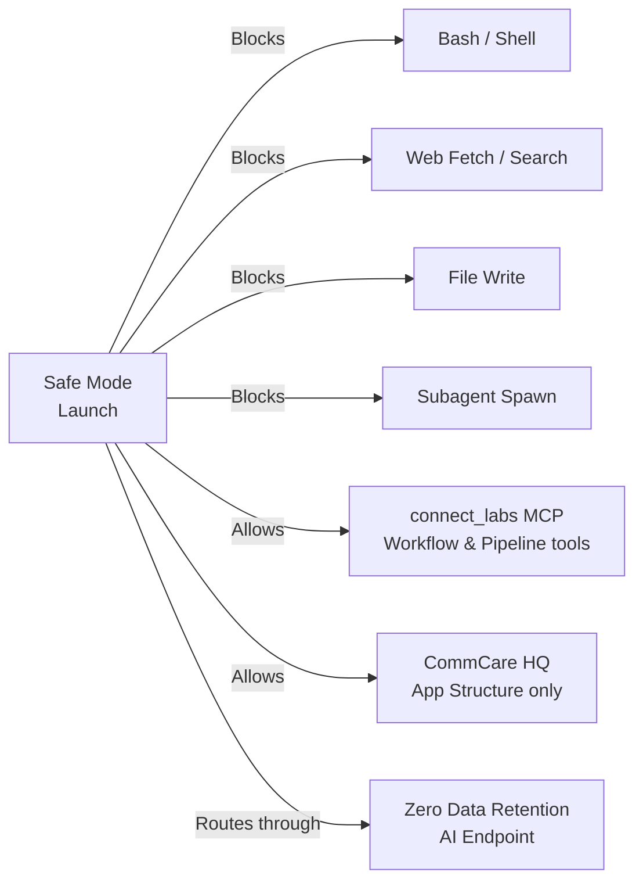

# Connect MCP & Safe Mode

Connect Labs gives non-developers a way to edit workflows using Claude Code (an AI assistant) from the command line — without writing any code themselves. **Safe Mode** adds security guardrails so that even when AI has access to real program data, it cannot leak that data outside approved channels.

---

## What Is This For?

Normally, editing a workflow's display logic or data fields requires a developer to write React/JavaScript code. With the Connect MCP (Model Context Protocol), you can describe changes in plain English and Claude Code makes the edits for you:

> _"Add a column showing how many weeks since the last visit"_
> _"Change the status colors so 'Overdue' shows in red"_
> _"Remove the RUTF field from the table — it's not relevant for this program"_

Claude reads the workflow's current definition, makes the change, and pushes it back to Labs — all from your terminal.

---

## Prerequisites

Before you start, you'll need these tools installed:

| Tool                 | How to get it                                                                        |
| -------------------- | ------------------------------------------------------------------------------------ |
| `git`                | [git-scm.com](https://git-scm.com)                                                   |
| Python 3.11          | [python.org](https://www.python.org)                                                 |
| Node.js              | [nodejs.org](https://nodejs.org)                                                     |
| Claude Code CLI      | `npm install -g @anthropic-ai/claude-code`                                           |
| 1Password CLI (`op`) | [1password.com/downloads/command-line](https://1password.com/downloads/command-line) |

You'll also need:

- A Dimagi 1Password account with access to the **AI-Agents** vault
- A **Labs login** (same account you use at [labs.connect.dimagi.com](https://labs.connect.dimagi.com))
- GitHub access to the connect-labs repository

Ask in **#engineering-connect** if you're unsure about any of these.

---

## First-Time Setup

### 1. Install 1Password CLI and sign in

=== "macOS"
`bash
    brew install 1password-cli
    op signin --account dimagi
    `

=== "Windows (WSL)"
`bash
    curl -sS https://downloads.1password.com/linux/keys/1password.asc | \
      sudo gpg --dearmor --output /usr/share/keyrings/1password-archive-keyring.gpg
    sudo apt update && sudo apt install 1password-cli
    op signin --account dimagi
    `

### 2. Clone the repo and set up credentials

```bash
git clone https://github.com/dimagi/connect-labs.git
cd connect-labs
op inject -f -i .env.tpl -o .env
```

### 3. Set up your Labs token

Your Labs token lets Claude Code talk to the Labs MCP server securely. Open a normal Claude Code session in any folder and run:

```
/labs-token-setup
```

Follow the prompts. When asked, choose **Production labs environment**. Claude will open a browser URL — approve the token there. This only needs to be done once (or when your token expires).

---

## Running Safe-Mode Claude

Pull the latest changes, then launch:

```bash
cd connect-labs
git pull origin main
source .venv/bin/activate    # or the path to your Python venv
inv safe-claude --auth=api-key
```

The `--auth` flag is required every time — choose:

- `--auth=api-key` — Anthropic ZDR API key (recommended)
- `--auth=vertex` — Google Vertex AI endpoint

---

## Editing Workflows

Once inside `inv safe-claude`, you can use the MCP-powered workflow skill:

```
/workflow-author
```

Then describe what you want in plain English. Claude will:

1. Pull the current workflow definition from Labs
2. Show you what it plans to change
3. Apply the change and push it back
4. Confirm the update was successful

To verify your change: open the workflow in your browser at [labs.connect.dimagi.com](https://labs.connect.dimagi.com).

---

## Safe Mode: What It Protects Against

Safe Mode is designed to prevent accidental exposure of patient data when an AI assistant has access to real program information.



| Safe Mode blocks                    | Why                                                         |
| ----------------------------------- | ----------------------------------------------------------- |
| Shell commands (`ls`, `curl`, etc.) | Can't execute arbitrary code or leak data to the filesystem |
| Web fetch / web search              | Can't send data to external URLs                            |
| Writing local files                 | Can't dump patient data to disk                             |
| Spawning sub-agents                 | Keeps the session audit trail linear                        |

**Safe Mode allows only:**

- Reading and editing workflows and pipelines via the Labs MCP
- Reading CommCare HQ app structure (form definitions only — no patient data)
- Reading files in the connect-labs repo

---

## Troubleshooting

| Problem                           | Fix                                                                              |
| --------------------------------- | -------------------------------------------------------------------------------- |
| "No connect_labs PAT found"       | Run `/labs-token-setup` in a normal Claude Code session                          |
| `op` errors or sign-in failures   | Run `op signin --account dimagi` in your terminal                                |
| "Workflow not found" or 403 error | Check the workflow ID; confirm you can open it in the Labs browser               |
| Claude says "I can't edit files"  | That's correct in Safe Mode — ask it to use the `connect_labs` MCP tools instead |

---

## More Information

- **[SAFE_MODE.md](https://github.com/jjackson/connect-labs/blob/main/docs/SAFE_MODE.md)** — full technical design and security model
- **[MCP_SETUP.md](https://github.com/jjackson/connect-labs/blob/main/docs/MCP_SETUP.md)** — Labs MCP server and token details
- For help, post in **#connect-labs** on Slack
