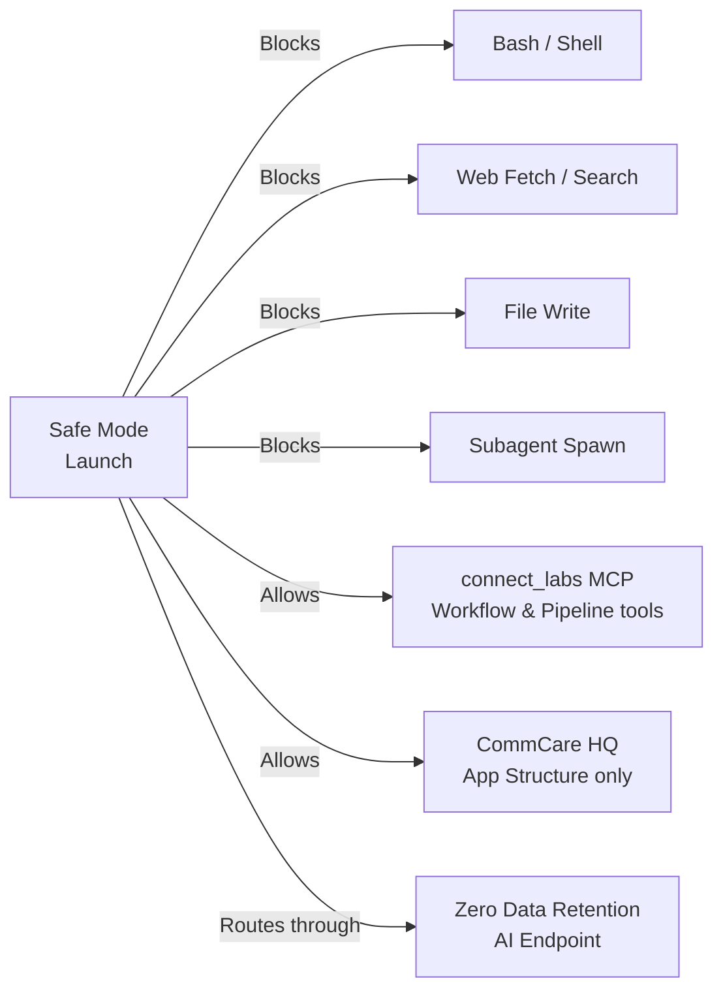

# Connect Safe Mode

Safe Mode adds security guardrails so that when AI has access to real program data, it cannot leak that data outside approved channels.

!!! note "Who this is for"
    This feature is for program administrators and technical staff who are comfortable working in a terminal. Complete [Connect MCP setup](connect-mcp.md) before using Safe Mode.

---

## What Is Safe Mode?

When Claude Code has access to real program data through the Connect MCP, there is a risk that it could accidentally send patient information to external services, write it to local files, or execute arbitrary commands. Safe Mode closes those channels — only workflow edits and CommCare app structure reads are allowed through.

All Claude interactions in Safe Mode route through a zero-data-retention (ZDR) AI endpoint, so patient data is never stored or logged by the AI provider.

---

## Running Safe Mode

Pull the latest changes, then launch:

```bash
cd connect-labs
git pull origin main
source .venv/bin/activate
inv safe-claude --auth=api-key
```

The `--auth` flag is required every time — choose:

- `--auth=api-key` — Anthropic ZDR API key (recommended)
- `--auth=vertex` — Google Vertex AI endpoint

Once launched, use `/workflow-author` to describe workflow changes in plain English. See [Editing Workflows](connect-mcp.md#editing-workflows) for the full editing loop.

---

## What Safe Mode Protects Against



| Safe Mode blocks                    | Why                                                                |
| ----------------------------------- | ------------------------------------------------------------------ |
| Shell commands (`ls`, `curl`, etc.) | Can't execute arbitrary code or exfiltrate data via the filesystem |
| Web fetch / web search              | Can't send data to external URLs                                   |
| Writing local files                 | Can't dump patient data to disk                                    |
| Spawning sub-agents                 | Keeps the session audit trail linear and reviewable                |

**Safe Mode allows only:**

- Reading and editing workflows and pipelines via the Labs MCP
- Reading CommCare HQ app structure (form definitions only — no patient data)
- Reading files in the connect-labs repository

---

## Troubleshooting

| Problem                           | Fix                                                                              |
| --------------------------------- | -------------------------------------------------------------------------------- |
| "No connect_labs PAT found"       | Run `/labs-token-setup` in a normal Claude Code session                          |
| `op` errors or sign-in failures   | Run `op signin --account dimagi` in your terminal                                |
| "Workflow not found" or 403 error | Check the workflow ID; confirm you can open it in Labs in the browser            |
| Claude says "I can't edit files"  | That's correct in Safe Mode — ask it to use the `connect_labs` MCP tools instead |

---

## More Information

- **[SAFE_MODE.md](https://github.com/jjackson/connect-labs/blob/main/docs/SAFE_MODE.md)** — full technical design and security model
- For MCP setup and workflow editing, see [Connect MCP](connect-mcp.md)
- For help, post in **#connect-labs** on Slack
