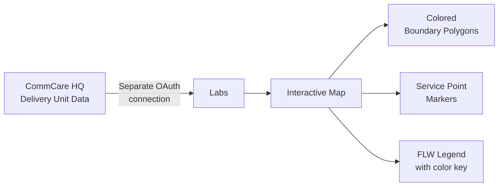

# Coverage Maps

The Coverage Maps feature shows an interactive map of delivery unit boundaries and service point locations for your program. Use it to understand which geographic areas each field worker covers and where services are being delivered.

---

## What You'll See

The map has three layers:

| Layer                        | What it shows                                                        |
| ---------------------------- | -------------------------------------------------------------------- |
| **Delivery unit boundaries** | Geographic polygons showing each FLW's assigned area, colored by FLW |
| **Service point markers**    | Individual locations where services have been delivered              |
| **FLW legend**               | Color key listing each FLW and their assigned boundary color         |

---

## Connecting to CommCare HQ

!!! warning "Separate login required"
Coverage Maps pulls boundary data directly from CommCare HQ using a separate OAuth connection. You must authorize this connection before the map will load. This is separate from your CommCare Connect login.

**First-time setup:**

1. Go to **Coverage Maps** in the top navigation
2. If not yet connected, you'll see a "Connect CommCare HQ" button
3. Click it and log in with your CommCare HQ credentials
4. Approve the access request

Your CommCare HQ token is time-limited. Check **Token Status** in the Coverage Maps menu to see when it expires.

!!! tip "Token expired?"
Go to **Coverage Maps → Token Status** and click **Re-authorize** to reconnect with your CommCare HQ credentials. This is quick and only takes a minute.

---

## Using the Map

**Filtering by FLW:**
Click a FLW's name in the legend to toggle their delivery units on or off. Useful when you have many workers and want to focus on a specific area.

**Filtering by service area:**
If your program uses service areas (larger geographic zones that contain multiple delivery units), use the service area filter at the top to narrow the view.

**Zooming and panning:**

- Use the `+` / `−` buttons or scroll to zoom
- Click and drag to pan the map

**Clicking a delivery unit:**
Click any colored polygon to see a popup with the delivery unit name, the FLW it's assigned to, and associated metrics.

**Clicking a service point:**
Click any marker to see the service point name, location, and a recent activity summary.

---

## Loading Data

Coverage data loads progressively as you interact with the map. A loading indicator appears while boundary data is being fetched. For programs with many delivery units, this may take 15–30 seconds.

---

## Common Questions

**My delivery units aren't showing on the map.**
Coverage Maps requires that delivery units have geographic boundary polygons defined in CommCare HQ. If boundary data hasn't been added for your program, units won't appear. Contact your CommCare administrator to add boundary data.

**The map is showing the wrong FLW assignments.**
FLW assignments come from CommCare HQ. If an assignment changed recently, wait a few minutes and refresh — data is fetched on-demand each time you load the map.

**I see a blank map with no boundaries.**
This usually means your CommCare HQ token has expired or your program doesn't have boundary data configured. Check **Token Status** first, then contact your CommCare administrator if the issue persists.

**The landing page used to show two buttons for Coverage — where did the second one go?**
The second button ("CHC Nutrition View") has been removed. It opened the same map with identical visuals, so it was redundant. Clicking **Coverage** on the landing page now takes you directly to the map, as before.
