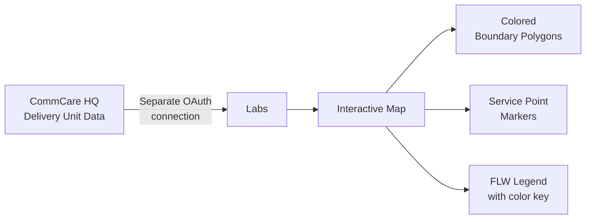

# Coverage Maps

The Coverage Maps feature shows an interactive map of delivery unit boundaries and service point locations for your program. Use it to understand which geographic areas each field worker covers and where services are being delivered.

---

## What You'll See

The map has three layers:

| Layer | What it shows |
|-------|--------------|
| **Delivery unit boundaries** | Geographic polygons showing each FLW's assigned area, colored by FLW |
| **Service point markers** | Individual locations where services have been delivered |
| **FLW legend** | Color key listing each FLW and their assigned color |

---

## Connecting to CommCare HQ

!!! warning "Separate login required"
    Coverage Maps pulls boundary data directly from CommCare HQ using a separate OAuth connection. You must authorize this connection before the map will load.

**First-time setup:**
1. Go to **Coverage Maps** in the top navigation
2. If not yet connected, you'll see a "Connect CommCare HQ" button
3. Click it and log in with your CommCare credentials
4. Approve the access request

Your CommCare HQ token lasts for a limited time. Check **Token Status** in the Coverage Maps menu to see when it expires. Re-authorize when it expires.

---

## Using the Map

**Filtering by FLW:**
Click a FLW's name in the legend to toggle their delivery units on or off. This is useful when you have many FLWs and want to focus on a specific worker's area.

**Filtering by service area:**
If your program uses service areas (larger geographic zones containing multiple delivery units), use the service area filter at the top to focus on a specific zone.

**Zooming and panning:**
- Use the `+` / `−` buttons or scroll to zoom
- Click and drag to pan the map
- Double-click any location to zoom in

**Clicking a delivery unit:**
Click any colored polygon to see a popup with the delivery unit name, assigned FLW, and associated metrics.

**Clicking a service point:**
Click any marker to see the service point name, location, and recent activity summary.

---

## Loading Data

Coverage data loads progressively as you interact with the map. A loading indicator appears while boundary data is being fetched. For programs with many delivery units, this may take 15–30 seconds.

---

## Common Questions

**My delivery units aren't showing on the map.**
Coverage Maps requires that delivery units have geographic boundaries defined in CommCare HQ. If your delivery units don't have boundary polygons attached, they won't appear on the map. Contact your CommCare administrator to add boundary data.

**The map is showing the wrong FLW assignments.**
FLW assignments come from CommCare HQ. If an assignment changed recently in CommCare, wait a few minutes and refresh — data is pulled on-demand each time you load the map.

**My token expired. What do I do?**
Go to **Coverage Maps → Token Status** and click **Re-authorize** to connect again with your CommCare credentials.
