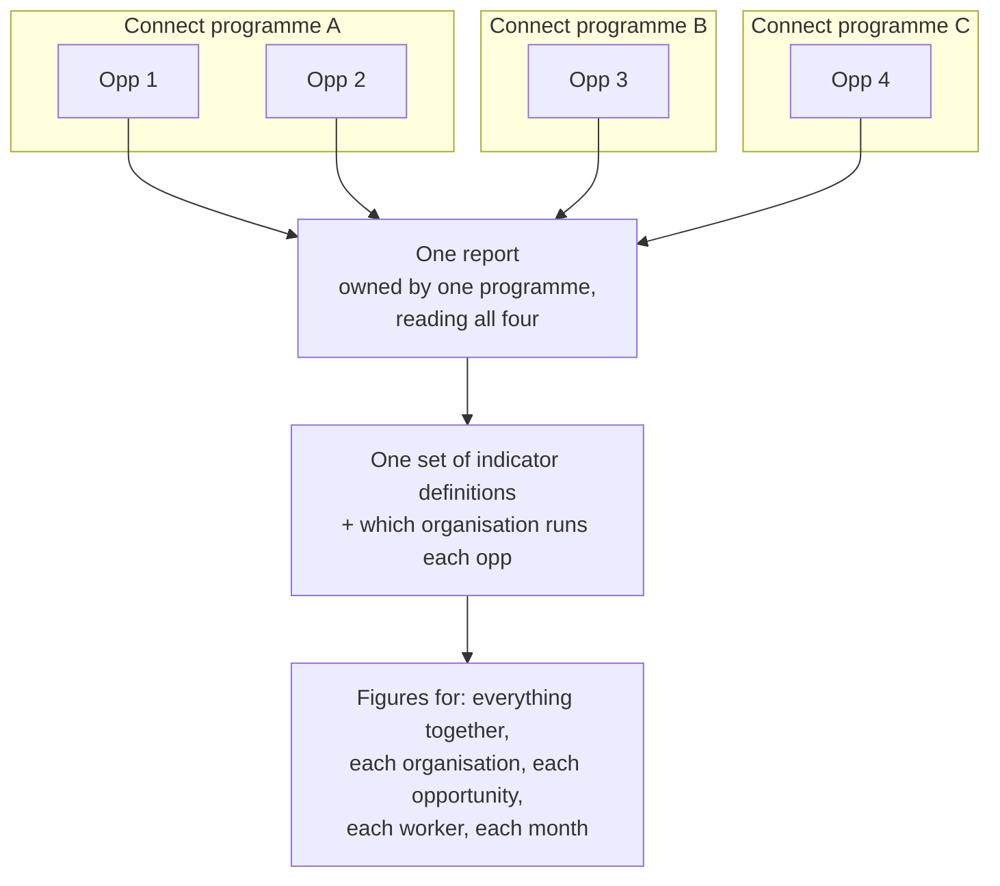

# Cross-Programme Reports

One Labs report can cover opportunities that sit in **different Connect programmes** and roll all of them up into one set of figures: a total across everything, a figure per organisation, per opportunity and per worker. Connect groups opportunities into programmes for contracting and management. A Labs report doesn't have to follow that grouping. It reads whatever list of opportunities it is given.

This page explains how that works, how to set it up, and what can go wrong. It uses the KMC Programme Report as the worked example, but any multi-opportunity template works the same way.

!!! info "Who this is for"
    Programme and M&E leads whose intervention runs in more than one Connect programme (different funders, countries
    or contracting rounds) but should be reported as one. You don't need to write code.

---

## How it works

Two things about a report are separate, and keeping them apart is the key to this page:

| | What it is | How many |
| --- | --- | --- |
| **Owner** | Where the report *lives*: one Connect programme or one opportunity. It decides which workflow list the report appears in. | Exactly one |
| **Opportunities it reads** | The list of opportunities whose data the report pulls in. | Any number, from **any** programme you have access to |

Nothing requires the opportunities a report reads to belong to the programme that owns it. So a report owned by one programme can read opportunities from three.

### What happens when the report loads

1. For **each** opportunity on the list, Labs runs the report's pipelines and tags every row with the opportunity it came from, then puts the rows together. A problem with one opportunity (its data can't be read, say) is recorded against that opportunity, and the rest carry on.
2. For indicator reports, the [semantic layer](semantic-layer.md) computes every indicator over those combined rows, grouped at each level at once.
3. **"Programme" in the report means everything on its list.** The programme-level figure is computed over every opportunity the report reads, whichever Connect programme each belongs to. It is not a Connect programme's figure.
4. **The organisation level comes from the registry, not from Connect.** Which organisation (LLO) runs each opportunity is written in the registry's deployment facts (`llo_map`). The registry, not the Connect programme structure, decides that two opportunities in different programmes belong to the same organisation.

### Who can do what

- **To create or change the list** you must have access to **every** opportunity on it, through your own Connect login. Labs refuses the whole change otherwise and names the opportunities you can't reach.
- **To find the report** you look in its owner's workflow list. A programme-owned report appears in that programme's list only, never under an individual opportunity, and an opportunity-owned one only under that opportunity. See [Program-level vs. opportunity-level workflows](workflow-engine.md#program-level-vs-opportunity-level-workflows).

Only templates built for several opportunities (**multi-opp** templates) can take a list. For any other template the list is ignored and the report reads its own opportunity only.

---

## Setting it up

### 1. Find the opportunities

Ask Claude to list them with the programme each belongs to:

> *"List every KMC opportunity I have access to, grouped by Connect programme."*

Claude uses `labs_context`, which returns your organisations, their programmes and each programme's opportunities.

### 2. Create the report over all of them

**In the browser:** open the owning programme's Workflows page (the address includes `?program_id=…`), click **Create Workflow** and choose a multi-opp template. The opportunity picker shows **every opportunity you have access to**, not just this programme's: this programme's own are listed first and already ticked. Tick the others, or paste a list of IDs (`523, 524, 675`).

**Through Claude:**

> *"Create a KMC Programme Metrics report owned by programme 123, covering opportunities 523, 524, 675, 874 and 938, bound to the shared KMC indicators registry."*

Claude uses `workflow_create_from_template` with the owner (`program_id` or `opportunity_id`), `opportunity_ids`, and, for indicator reports, `registry_source` so the report shares the existing definitions rather than getting its own copy ([why](semantic-layer.md#recommendations)).

!!! note "Where a programme-owned report's pipelines live"
    Pipelines always belong to an opportunity, even when the report belongs to a programme. A report created from
    a template stores its pipelines under the **first** opportunity on its list. That doesn't limit what the report
    reads; it only matters if you look for the pipeline records later.

### 3. Tell the registry who runs each opportunity

For an indicator report, add every opportunity to the registry's deployment facts:

- `llo_map`: opportunity → organisation, so the opportunity appears under the right organisation;
- `app_asks`: which questions its app asks, so indicators show *n/a* rather than 0% where a question isn't asked.

Neither gap produces an error. See [recommendation 4](semantic-layer.md#recommendations) on The Semantic Layer.

### 4. Load the data, then check every column

A report over many opportunities needs each one's visit data loaded. Opening the report does that; for a large report you can ask Claude to do it in batches:

> *"Load the visit cache for every opportunity in workflow 19778, and tell me which ones failed."*

Claude uses `workflow_ensure_visit_cache`, which works through the opportunities a few at a time and reports which were loaded, which already were, and which failed. Then open the report and check that each opportunity has figures.

### Changing the list later

- **In the browser:** on the report's run page, **Opportunities: N selected → Edit**.
- **Through Claude:** *"Add opportunity 2166 to workflow 19778."* (`workflow_update_opportunity_ids`, which replaces the whole list, so Claude reads the current list first.)

The owner can't be changed this way. When you add an opportunity, also add it to the registry (step 3), and to any [benchmark cohort](benchmarks.md) and [per-opportunity reports](shared-report-templates.md) that follow this report.

---

## When something looks wrong

| What you see | Usually means |
| --- | --- |
| "You do not have access to opportunities: …" when creating or editing | Your Connect login can't reach those opportunities. Someone who can must make the change, or you need access first. |
| Everything is 0, or "cold cache" | No opportunity's data is loaded. Open the report, or ask Claude to load it. |
| Totals too low, "partial cache" or "opportunities missing" | Some opportunities' data loaded and some didn't. The report names the missing ones. Load them and reload. |
| One opportunity has no figures while the others do | Its data couldn't be read. The per-opportunity error is recorded with the data: ask Claude *"Why does opportunity 938 have no rows on this report?"* |
| Every opportunity shows no rows at once, with "Pipeline not found" | The report can't find its pipeline records. Ask Claude to check the report's pipeline sources. |
| An opportunity's babies (or beneficiaries) are missing from every organisation, or appear under an unnamed one | The opportunity isn't in the registry's `llo_map`. Its data still counts in the overall figure. |
| *n/a* where the app does ask the question, or 0% where it doesn't | The opportunity's `app_asks` entry is missing or stale. |
| You can't find the report | You're looking in the wrong list. Check the owning programme's Workflows page. |

---

## Worked example: KMC

KMC is delivered by six organisations across 12 production opportunities, and those opportunities sit in several Connect programmes. All 12 roll up into one **KMC Programme Report** (template `kmc_programme_metrics`, workflow 19778 in production).

- **One report, 12 opportunities:** 523, 524, 675, 874, 938, 1234, 1236, 1487, 1488, 1739, 1790 and 2166. The report's programme-level figure is all 12 together.
- **One set of definitions:** it is bound to the shared **KMC indicators** registry, and the registry's `llo_map` groups the 12 into six organisations: PIPN (524, 874, 1487, 2166), NAMA (523, 938, 1488), GHI (675, 1234), EHA (1236), Kikapu (1739) and BERI (1790). That grouping is what gives the report its organisation view; Connect's programmes play no part in it.
- **A companion page:** creating a KMC Programme Metrics report also creates a **KMC Worker Review** over the same opportunities and pipelines, already linked from the worker rows.
- **Feeding the rest:** the Programme Report is the **source report** for the KMC benchmark cohort ([Benchmarks](benchmarks.md)) and for the 12 per-opportunity reports ([Shared Report Templates](shared-report-templates.md)), and its weekly saved runs draw its own trends ([Weekly Trends and Saved Runs](weekly-trends-and-snapshots.md)).
- **The demo twin:** a synthetic copy (workflow 5456) covers 12 synthetic KMC opportunities mapped to the same six organisations. Those all sit in one labs-only programme, so the demo doesn't exercise the cross-programme case; only production does.

Before the programme picker spanned programmes (September 2026), a KMC report owned by one programme could only be created over that programme's own opportunities from the browser. Now the other programmes' opportunities are in the same picker.

---

## See also

- [Workflow Engine](workflow-engine.md#program-level-vs-opportunity-level-workflows): program-owned vs opportunity-owned workflows
- [The Semantic Layer](semantic-layer.md): the definitions and deployment facts a roll-up is computed from
- [Benchmarks](benchmarks.md) and [Shared Report Templates](shared-report-templates.md): what hangs off a cross-programme report
- `connect_labs/workflow/WORKFLOW_REFERENCE.md` §8 in the repository: the developer reference for multi-opportunity workflows
