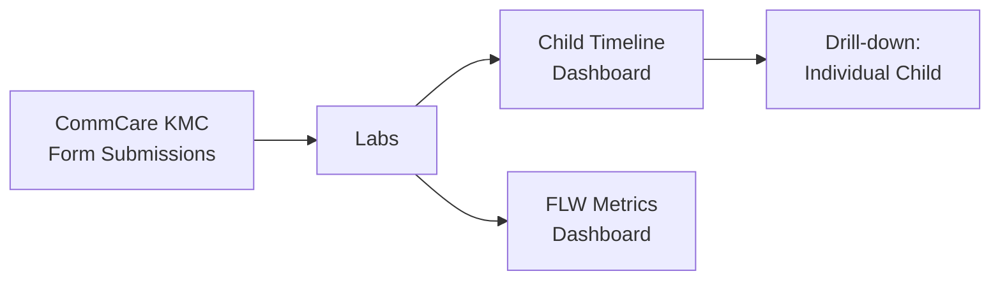

# Custom Analysis Dashboards

Custom Analysis provides program-specific reporting dashboards built for particular health program types — nutrition monitoring, maternal and child health, SAM treatment, and audit quality review. Each dashboard is tailored to the data and workflows of that program.

---

## Available Dashboards

Which dashboards you see depends on your program. Talk to your program administrator if you expect to see a dashboard that isn't showing.

### KMC (Kangaroo Mother Care)

Dashboards for programs supporting premature and low-birth-weight newborns.

**Child Timeline (`/kmc/children/`):**

- List of all KMC beneficiaries with key metrics: visit count, weight progression, and nutritional status
- Filter by FLW, date range, or case status
- Click any child to see their full visit timeline, weight chart, and visit photos

**FLW Metrics:**

- Aggregate view of each FLW's KMC caseload
- Columns: number of active cases, average visit frequency, cases needing follow-up

---

### RUTF (Ready-to-Use Therapeutic Food)

Dashboard for tracking SAM (Severe Acute Malnutrition) treatment with RUTF. The layout mirrors the KMC Child Timeline.

**Child List (`/rutf/children/`):**

- List of all SAM beneficiaries with key metrics: visit count, MUAC progression, and case status
- Filter by FLW, date range, or recovery status
- Click any child to open their full detail view

**Child Detail View:**

- **Visit History** — full timeline of all follow-up visits with dates and visit numbers
- **MUAC Progression Chart** — line chart showing mid-upper arm circumference measurements over time
- **Visit Photos** — MUAC measurement photos from each visit
- **Visit Locations** — map showing GPS coordinates of where visits occurred
- **Visit Details** — facility visits, treatment received, treatment adherence notes, and consent status

---

### MBW (Mother and Baby Wellness)

Monitoring dashboard for maternal and newborn health programs.

- FLW-level summary of visit frequency and case outcomes
- Flag workers or cases that need supervisory follow-up
- Data streams in progressively from CommCare as the page loads

---

### CHC Nutrition

Dashboard for Community Health Center nutrition programs.

- Nutrition indicators aggregated by FLW and time period
- Case status tracking (active, graduated, referred, lost to follow-up)
- Color-coded thresholds highlighting at-risk cases

---

### Audit of Audits

!!! note "Dimagi staff only"
This dashboard is visible to Dimagi program managers and is used for quality oversight across organizations.

Shows summary statistics on audit session quality across all programs:

- Which programs are conducting audits and at what frequency
- Pass rates by audit template and organization
- Heatmaps of audit activity over time
- Filter by organization, date range, or audit template

---

## Common Features Across Dashboards

All custom analysis dashboards share these patterns:

**Progressive data loading:**
Data streams in from CommCare rather than loading all at once. A progress bar shows how much has loaded. For large programs, this may take 30–60 seconds.

**Filtering:**
Most dashboards let you filter by:

- Date range (reporting period)
- Field worker
- Geographic area (if configured)
- Case status

**Drill-down:**
Click any row in a summary table to open the detail view for that worker or child. Detail views show the full visit timeline, individual measurements, and linked photos.

**Export:**
Some dashboards have an **Export** button to download the current view as a CSV. If you need data not available for export, contact your program team.

---

## Common Questions

**My program isn't listed — how do I get a dashboard?**
Custom dashboards are built for specific programs and require development work. Reach out in **#connect-labs** on Slack to discuss what your program needs.

**The numbers look different from CommCare's built-in reports — why?**
Labs dashboards may apply additional filters or use different date logic than CommCare's standard reports. Check the date range filter and confirm which visits are included.

**Data is loading slowly — is something wrong?**
Large programs with many visits take longer to load. If the progress bar hasn't moved in 5+ minutes, try refreshing the page. If the problem persists, post in **#connect-labs**.
