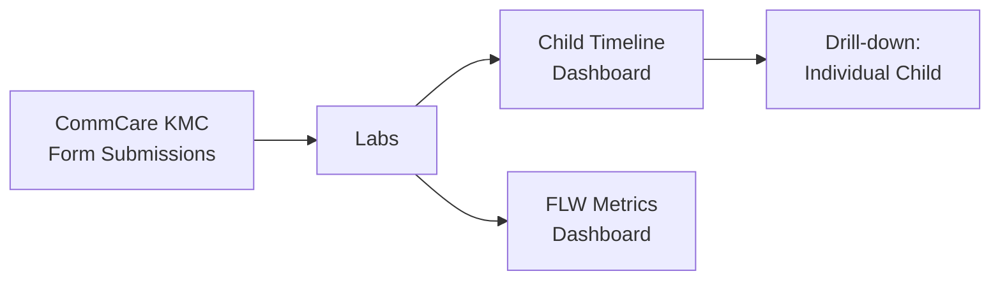

# Custom Analysis Dashboards

Custom Analysis provides program-specific reporting dashboards for health program data. Each dashboard is tailored to a specific program type — nutrition monitoring, maternal and child health, audit quality review, and more.

---

## Available Dashboards

Which dashboards you see depends on your program. Talk to your program administrator if you expect to see a dashboard that isn't showing.

### KMC (Kangaroo Mother Care)

Dashboards for programs supporting premature and low-birth-weight newborns.

**Child Timeline (`/kmc/children/`):**

- List of all KMC beneficiaries with key metrics: visit count, weight progression, nutritional status
- Filter by FLW, date range, or status
- Click any child to see their full visit timeline, weight chart, and images

**FLW Metrics:**

- Aggregate view of each FLW's KMC caseload
- Columns: number of active cases, average visit frequency, cases needing follow-up

---

### MBW (Mother and Baby Wellness)

Monitoring dashboard for maternal and newborn health programs.

- FLW-level summary of visit frequency and case outcomes
- Flag workers or cases that need supervisory follow-up
- Progressive loading — data streams in as it's fetched from CommCare

---

### CHC Nutrition

Dashboard for Community Health Center nutrition programs.

- Nutrition indicators aggregated by FLW and time period
- Case status tracking (active, graduated, referred, lost to follow-up)
- Color-coded thresholds for at-risk cases

---

### Audit of Audits

!!! note "Dimagi staff only"
This dashboard is visible to Dimagi program managers and is used for quality oversight across organizations.

Shows summary statistics on audit session quality across all programs:

- Which programs are conducting audits
- Pass rates by template type and organization
- Heatmaps of audit activity over time
- Filter by organization, date range, or audit template

---

### RUTF Analysis

Dashboard for Ready-to-Use Therapeutic Food programs tracking SAM treatment.

---

## Common Features Across Dashboards

All custom analysis dashboards share these patterns:

**Data loading indicator:**
Data streams in progressively from CommCare. A progress bar shows how much has loaded. For large programs, this may take 30–60 seconds.

**Filtering:**
Most dashboards let you filter by:

- Date range (reporting period)
- Field worker
- Geographic area (if configured)
- Case status

**Drill-down:**
Click any row in a summary table to open the detail view for that worker or case. Detail views show the full visit timeline, individual measurements, and linked images.

**Export:**
Some dashboards have an **Export** button to download the current view as a CSV. If you need data not available for export, contact your program team.

---

## Common Questions

**My program isn't listed — how do I get a dashboard?**
Custom dashboards are built for specific programs and require development work. Reach out in **#connect-labs** on Slack to discuss what your program needs.

**The numbers look different from the CommCare aggregate reports — why?**
Labs dashboards may apply additional filters or use different date logic than CommCare's built-in reports. Check the date range filter and confirm which visits are included.

**Data is loading slowly — is something wrong?**
Large programs with many visits take longer to load. If the progress bar hasn't moved in 5+ minutes, try refreshing the page. If the problem persists, post in **#connect-labs**.
