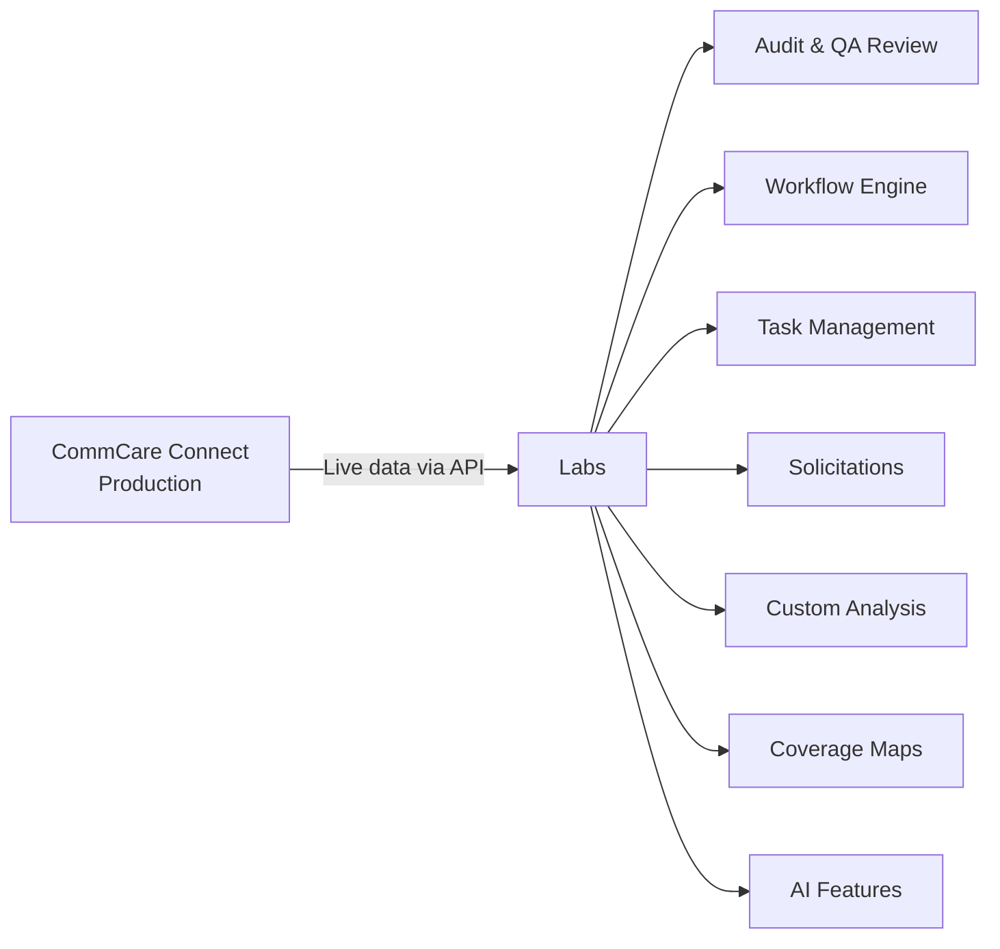

# Connect Labs

**Connect Labs** is a rapid prototyping environment for CommCare Connect, hosted at [labs.connect.dimagi.com](https://labs.connect.dimagi.com). It gives program teams early access to new tools — dashboards, audit workflows, AI assistants, and more — before they reach the main Connect platform.

!!! info "What is Labs?"
Labs connects directly to your live CommCare Connect data via your existing login — no separate data entry required. Features here may evolve quickly based on feedback.

## How to Log In

1. Go to [labs.connect.dimagi.com](https://labs.connect.dimagi.com)
2. Click **Log in with CommCare Connect**
3. Approve access using your existing Connect credentials

Once logged in, your programs and opportunities are automatically available — no extra setup.

---

## What's Available

| Feature                               | What it does                                                                  |
| ------------------------------------- | ----------------------------------------------------------------------------- |
| [Audit & QA Review](audit.md)         | Review field worker visit images for quality; flag issues with AI assistance  |
| [Workflow Engine](workflow-engine.md) | Configurable dashboards showing live CommCare data by worker and case         |
| [Task Management](task-management.md) | Create and track follow-up actions from audits or manual triage               |
| [Solicitations](solicitations.md)     | Post RFPs/EOIs, collect responses from organizations, score and award funding |
| [Custom Analysis](custom-analysis.md) | Program-specific dashboards for KMC, MBW, nutrition, and SAM tracking         |
| [Coverage Maps](coverage-maps.md)     | Interactive map of delivery unit boundaries and service point locations       |
| [AI Features](ai-features.md)         | AI assistants embedded throughout Labs for editing, reviewing, and analysis   |

These features work together. A common flow: review visits with **Audit**, create follow-up **Tasks** for flagged workers, and monitor outcomes in a **Workflow** dashboard.

---

## Getting Help

- Questions about Labs features → post in **#connect-labs** on Slack
- [Weekly changelog](https://dimagi.atlassian.net/wiki/spaces/connect/pages/3918528513/Connect+Labs+Changelog) — what changed this week
- [Full documentation hub](https://dimagi.atlassian.net/wiki/spaces/connect/pages/3916103691/Connect+Labs+Documentation) on Confluence
