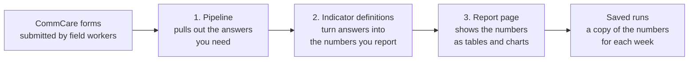

# Building and Changing Reports with Claude

You can build and change Labs reports by talking to Claude. You don't need to write code. Claude reads the report, makes the change and tells you what it did, and you check the result in your browser.

This page is for program staff who want to do that. It explains how a report is put together, which part to change for the result you want, and what to be careful of. You do not need to read code to follow it.

!!! info "Before you start"
    You need a Labs login and Claude connected to Labs. [Get connected](#get-connected) takes about two minutes.

---

## How a report is put together

Every Labs report is built from up to three parts. Knowing which part holds what tells you what to ask for.



| Part | What it is | Plain-English example |
| --- | --- | --- |
| **Pipeline** | Picks which form questions to read and tidies up the answers, one row per visit or per case. | "Read the baby's weight from the follow-up form, and the birth weight from the registration form." |
| **Indicator definitions** (the *semantic layer*) | The rules that turn those answers into the figures you report: what counts, what it's counted *out of*, when a figure is too thin to show, and what counts as good or bad. | "Of babies with enough weight data, the share whose weight is recorded often enough. Green at 60% or more, red below 40%. Hidden if fewer than 25 babies qualify." |
| **Report page** | The screen people look at: tables, charts, colours, filters, wording. | "Show this indicator as a column and let people sort by it." |
| **Saved runs** | A copy of the report's numbers kept for each period, so you can see a trend over time. | "What the programme report said for the week ending 14 September." |

!!! tip "The one-line rule"
    **Meaning goes in the indicator definitions, looks go on the page, data goes in the pipeline.**
    If you want to change *what a number means*, don't ask for a change to the page. Change the definition.

!!! note "Which reports use indicator definitions today?"
    Only two: the **KMC Programme Report** and the **KMC Opportunity Report**. The **KMC Worker Review** has no
    definitions of its own. It shows the Programme Report's figures. Other reports calculate their numbers either
    on the report page (Claude can change those) or inside Labs' own code (only a developer can change those).
    Ask Claude *"How does this report calculate its numbers, and can you change that?"* before you plan a change.

---

## Get connected

Labs has an MCP server: a secure connection that lets Claude read and change Labs on your behalf. Claude acts as you, so it can see and change exactly what your own Connect login can.

=== "Claude Code"

    Run this once:

    ```
    claude mcp add --transport http connect_labs https://labs.connect.dimagi.com/mcp/
    ```

    Then type `/mcp`, choose `connect_labs` and sign in with CommCare Connect when the browser opens.

=== "Claude desktop or claude.ai"

    1. Open **Settings → Connectors** and choose **Add custom connector**.
    2. Name it `Connect Labs` and paste this address: `https://labs.connect.dimagi.com/mcp/`
    3. Click **Connect**. A Labs sign-in page opens. Sign in with CommCare Connect and approve.

    On a Team or Enterprise plan, an organisation owner may need to allow custom connectors first.

To check it's working, ask Claude: *"List the Labs workflows for opportunity 12345."*

To see or disconnect the apps you've signed in to Labs, go to [labs.connect.dimagi.com/labs/mcp/tokens/](https://labs.connect.dimagi.com/labs/mcp/tokens/).

!!! warning "If Claude reports "User must log into labs in a browser at least once""
    Labs needs you to have signed in to Labs in a browser at least once. Go to
    [labs.connect.dimagi.com/labs/login/](https://labs.connect.dimagi.com/labs/login/), sign in, then try again.

---

## What to ask for

Each item below is a common task. It shows what to say, what Claude will do, and what to check afterwards.
**Always start by pasting the link to the report** (the address in your browser bar), so Claude works on the right one.

### Understand a number

> *"On this report, how exactly is C14 (Mortality) calculated? Explain it so I could check it by hand."*

Claude looks up the indicator's full definition: what it's counted out of, what it counts, every rule it depends on, and every cutoff. You get the actual logic the report runs, not a summary written by someone else. This makes no changes, so it's a safe first question.

Also try: *"Give me a list of every indicator on this report with a one-line definition."*

On the KMC reports you can also click any **indicator column heading** to see its definition without Claude.

### Change what an indicator means

> *"Change C09 so it only counts babies registered after 1 March. Show me the current and new definitions side by side before you save."*

Before saving, Claude checks that the new definition can be calculated at every level of the report: programme, organisation, opportunity, worker, month, the month-by-level trends, and a single baby. It refuses to save one that can't. **That check catches a broken definition, not a wrong number.** You see the new numbers only after it's saved, so check the report straight away.

Once saved, the change shows on the next page load. There is no deploy and no review step. Two things don't update straight away:

- **Saved weekly runs** keep the numbers they were saved with. So does a Worker Review opened from one of them. See [Rebuild the trend](#rebuild-the-trend-after-a-definition-change).
- **The trend line** can take up to 10 minutes to refresh.

Smaller changes work the same way:

- *"Raise the minimum number of babies needed to show C14 from 25 to 30."*
- *"Make C09 green at 70% or more instead of 60%."*
- *"Change whether higher or lower is better for C20."*

!!! danger "Indicator definitions can be shared"
    A report created from a KMC template gets its **own** copy of the definitions unless it was set up to share an
    existing one. Linked copies, and the per-opportunity reports made for a benchmark group, share on purpose.
    When definitions are shared, editing them changes **every** report that uses them.
    Ask first: *"Which set of definitions does this report use, and which other reports use the same set?"*
    Claude can only see reports your login can see.

### Add a new question from the form to a report

> *"Add whether the mother was counselled on breastfeeding (from the follow-up form) to this report, as a percentage of visits."*

This is usually two steps, and Claude does them in order:

1. **Pipeline**: add the form question. Claude looks through the opportunity's app to find where the question sits, then runs the pipeline on real data to check the new column actually fills in. If a column comes back empty for every row, it has the wrong question, and Claude should fix that before going further.
2. **Indicator or page**: turn the new column into a figure, either as an indicator definition (KMC reports) or on the report page.

Tell Claude the form and the question as field workers see it.

!!! tip "Ask to see sample rows"
    *"Show me 10 rows with the new column before you save anything"* is the quickest way to catch the wrong question.

!!! warning "Pipelines can be shared too"
    One pipeline often feeds more than one report. On KMC, for example, the Programme Report and the Worker Review
    read the same pipelines. Ask *"What else uses this pipeline?"* before changing or removing a column.

### Change how the report looks

> *"Move the Attention column to the far left and make the header sticky."*
> *"Rename 'LLO' to 'Organisation' everywhere on the page."*
> *"Add a bar chart of visits per week above the table."*

These are page-only changes. The numbers don't change. Reload the page to check the result.

Some reports **follow the Labs template**: their page updates automatically whenever Labs is released, and Claude can't edit it. Claude will say so and offer to turn the page into an editable copy first. After that, the page no longer picks up template improvements automatically.

### Run the same report somewhere else

> *"Make a linked copy of this report for opportunity 67890."*

There are two kinds of copy, and the difference matters:

- **A linked copy** stays in step with the original: same indicator definitions, same pipelines, and a page that follows the Labs template. Use this for "the same report for another opportunity or programme". You can't restyle a linked copy on its own.
- **An unlinked copy** gets its own page, which you can restyle. But it **still uses the same pipelines and indicator definitions** as the original, so changing those changes both.

To experiment with indicator definitions without affecting anyone else, ask for a copy *"with its own new set of indicator definitions"*.

### Rebuild the trend after a definition change

Trend lines come from saved runs, one per week. Today only the **KMC Programme Report** keeps them. If you change what an indicator means, past weeks still show the **old** figures until you rebuild them.

> *"I changed C14. First show me what the week ending 7 September would say under the new definition, then rebuild the last 6 months."*

Claude recalculates one past week first, without saving anything, so you can check it against a figure you trust. Then it rebuilds the history a few weeks at a time.

!!! warning "Rebuilding rewrites the past"
    A rebuilt week shows what we would say *today* about that week: new definitions plus any visits that synced late.
    That's right while definitions are still being worked out, and wrong once a figure has been reported to a funder.
    If past figures have already gone outside the team, check with the report owner before rebuilding.

    Runs that someone created by hand are never overwritten, so they keep the **old** definitions. A trend with
    hand-made runs in it can mix old and new figures.

### Find out why a number looks wrong

> *"Why does C20 show n/a for this worker but a number for the one next to them?"*
> *"Why is everything zero on this report?"*

Claude can tell you which of these it is:

| What you see | Usually means |
| --- | --- |
| **Everything is 0** | The report's data hasn't been loaded recently. Opening the Programme or Opportunity Report loads it. You can also ask Claude to load it and check again. |
| **Totals look too low** | Only part of the data has loaded, for example some opportunities but not others. Reload, or ask Claude to load it. |
| **n/a** or **not recorded** | This worker's app never asks the question the indicator needs, or asks but nothing was recorded. That's different from a real 0%. |
| **n<25** (or another number) | Too few cases to give a meaningful figure, so it's hidden on purpose. Most indicators need 25. |
| **Greyed out, not coloured** ("shown, not credible") | That organisation is marked as not recording this reliably. The number is shown, but don't read it as a score. On the Opportunity Report it may show as n/a instead. |
| **A number you don't believe** | Ask Claude to explain the indicator (see [Understand a number](#understand-a-number)) and work through one case by hand. |

---

## How to work well with Claude

**Give it the report link and the result you want.** *"On [link], I want C14 to exclude transfers"* works better than *"fix the mortality number"*.

**Ask to see the current version before it changes anything.** Labs doesn't keep a history of earlier versions of report pages, pipelines or indicator definitions. Claude can undo a change only by putting back what it read earlier **in the same conversation**. If you might want to go back, start with *"show me what's there now"*, and do the undo before you close the conversation.

**Preview where you can.** Claude can run a pipeline change on real data before saving it, and recalculate a past week without saving anything. Ask for that whenever the change affects numbers someone will act on.

**Check in the browser.** After each change, reload the report and look. The fastest way to work is: say the change → Claude applies it → reload → check → next change. Small steps are easier to check than one big one.

**Ask what else it touches.** *"Which other reports use this?"* costs nothing and avoids surprises.

**You don't need a developer or a release.** Changes to report pages, pipelines and indicator definitions are saved in Labs straight away. Only changes to Labs' own code (for example, a report whose numbers are calculated inside Labs) need a developer.

!!! note "Who can make changes"
    Anyone who can reach a report's opportunity or programme through their Connect login can change its page,
    pipelines and indicator definitions. There is no separate "editor" role, so agree within your team who changes what.

!!! tip "Working with real program data in Claude Code?"
    Use [Safe Mode](connect-safe-mode.md). It's for Claude Code only, and needs a copy of the connect-labs repository and
    1Password access. It blocks shell, web, file-writing and sub-agent tools, so program data can't be copied out of the
    session, and it sends everything through a zero-data-retention AI endpoint. It still allows every Labs tool, including edits.

---

## Terms you'll see

| Term | What it means |
| --- | --- |
| **Workflow** | Labs' name for a report or dashboard. |
| **Pipeline** | The step that pulls answers out of submitted forms. |
| **Semantic layer / semantic registry** | The indicator definitions: the stored rules that turn pipeline data into reported figures. A *registry* is one saved set of definitions, which one or more reports use. |
| **Indicator** | One reported figure, such as C14. It always has a numerator (what's counted) and a denominator (what it's out of). |
| **Scope** | The level a figure is calculated at: programme, organisation (LLO), opportunity, worker (FLW), month, those levels by month, or a single baby (case). |
| **Minimum denominator** | The fewest cases an indicator needs before it's shown. Below that it shows as n<25, or the indicator's own minimum. |
| **Saved run** | The report's figures for one period (usually a week), kept so the trend can be drawn. |
| **Rebuild history** | Recalculating past saved runs under today's definitions. |
| **Linked copy** | A copy of a report that shares the original's definitions and pipelines and follows the Labs template. |
| **Render code** | The code behind the report page's layout. Claude edits it; you don't need to. |
| **Cold cache** | The report's underlying data hasn't been loaded recently, so figures show as zero until it is (or too low, if only part has loaded). |

---

## Getting help

- Ask in **#connect-labs** on Slack. Paste the report link and what you asked Claude.
- For setup detail and sign-in troubleshooting, see [Connect MCP](connect-mcp.md).
- For what each report shows, see [Workflow Engine](workflow-engine.md).
