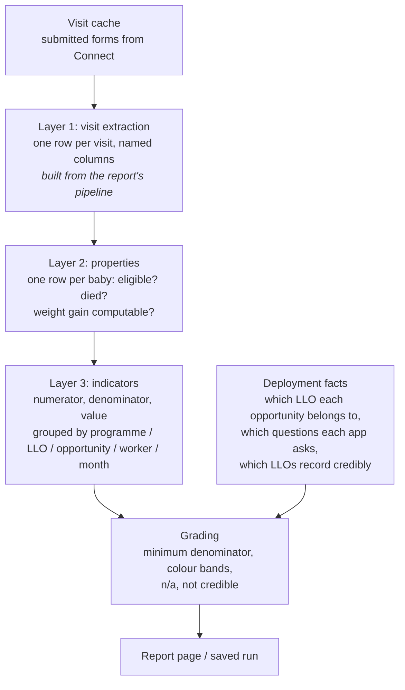

# The Semantic Layer

The semantic layer is where Labs keeps the **definitions** behind a report's indicators: what a baby has to be to count, what an indicator counts, when a figure is too thin to show, and what counts as good or bad. Those definitions are stored as data in a **registry**. Labs turns the registry into SQL and runs it against the visit data every time a report loads.

This page is the detailed companion to [Reports with Claude](reports-with-claude.md). It covers:

- [how the layer works](#how-it-works), end to end
- [what a registry contains](#what-a-registry-contains)
- [how to read the SQL it generates](#reading-the-generated-sql), and [how to debug a number](#debugging-a-number)
- [converting an existing report](#converting-an-existing-report) to the semantic approach
- [how to manage registries](#managing-registries-across-programmes) across several opportunities and programmes

!!! info "Who this is for"
    Anyone who owns indicator definitions or needs to explain a number: M&E leads, programme analysts, and whoever
    answers "why does this say 38%?". You don't need to write SQL. The sections on SQL show you what to look for,
    and Claude can do the reading.

!!! note "KMC is one registry, not the shape of the engine"
    The KMC reports were the first on the semantic layer, and the engine used to assume KMC data: a baby, a weight
    series, organisations (LLOs). It no longer does. What a registry counts (its **entity**), the extra columns it
    adds to each visit, which pipelines feed it and whether it has a reading series are all declared in the registry
    itself — see [The model](#the-model). A second, non-KMC registry, `visit_quality`, ships alongside KMC as a worked
    example.

---

## Why it exists

Before the semantic layer, each KMC report worked out its indicators in JavaScript inside the page. That caused three problems:

- **Definitions couldn't be read or reviewed as data.** They were buried in page code.
- **Copies drifted.** The live page and the saved weekly run each had their own copy of the logic, so they could disagree about the same number.
- **Every change to a definition needed a code deploy.**

The semantic layer replaced that with **one** set of definitions, stored as a record and run by **one** engine. The live report, saved weekly runs, the Opportunity Report and the Worker Review drill all read the same definitions. Change a definition, and all of them change on the next load. Before the switch, the engine's results were checked against the old JavaScript report on every indicator at every level: 5,698 checks, with no differences.

---

## How it works

A number on a report is built in three layers, and a fourth set of facts about the deployment decides when to show it.



| Layer | What it is | Where it lives | How you change it |
| --- | --- | --- | --- |
| **1. Visit extraction** | Which form answers are read, and from where, with every fallback path. One row per visit. | The report's **pipeline** (the `children` pipeline, plus `visits` for weights). | Change the pipeline. Claude uses `pipeline_update_schema`. |
| **2. Properties** | Facts about each baby, worked out from all of that baby's visits: *started*, *eligible*, *died*, *weight gain computable*… | The registry's **properties** document. | Edit the registry. |
| **3. Indicators** | Each indicator as three measures: a numerator, a denominator, and the value (numerator ÷ denominator). Also its title, colour bands, minimum denominator and direction. | The registry's **indicators** document. | Edit the registry. |
| **Deployment facts** | Which LLO each opportunity belongs to, which questions each opportunity's app actually asks, and which LLOs record deaths or completion credibly. | The registry's **deployment** document. | Edit the registry. |

**Layer 1 is never written by hand.** It is generated from the pipeline's own field definitions. That is deliberate: when the semantic layer was first built, a hand-written version quietly kept only 3 of the 10 ways a danger sign can be recorded, and three indicators came out wrong. The pipeline already knew all ten.

### What happens when a report loads

- **KMC Programme Report.** A saved (completed) run shows the numbers stored with it and runs nothing. A live run asks the server to build what the snapshot *would* contain right now. The server reads the cached visit data, generates Layer 1 from the pipeline, compiles the registry into one SQL statement, runs it, then grades the results.
- **KMC Opportunity Report.** Calls the semantic endpoint (`/labs/workflow/api/<id>/semantic/`) directly and grades the rows in the page.
- **KMC Worker Review.** Reads the Programme Report run's figures, and asks the semantic endpoint for one row per baby for the worker being reviewed.

**Nothing about the results is cached.** Every live load recomputes every indicator at every level from the visit cache, which takes tens of seconds for a large programme. Only the raw visit data is cached, for about 90 minutes. If it's missing, the report says so (see [Debugging a number](#debugging-a-number)).

### Saved runs use the same definitions

A saved weekly run is graded by the same engine, cut off at the run's end date. It stores the definitions it was graded with, so a later change to a threshold can't silently re-colour an old run. To restate past weeks under new definitions, **rebuild history** explicitly (see [Reports with Claude](reports-with-claude.md#rebuild-the-trend-after-a-definition-change)).

---

## What a registry contains

A registry is one record with three documents. These excerpts come from the KMC registry, trimmed.

### The model

The top of the properties document says what one row is and where the visit rows come from:

```yaml
entity:
  name: baby                 # one row per baby; the row key is baby_id
  plural: babies             # used in explanations
  key: baby_case_id          # the visit column that identifies a baby within an opportunity
  cohort_date: 'COALESCE(reg_date, first_visit::timestamp)'   # which month a baby belongs to
visit_columns:               # extra columns added to every visit row
  - name: child_alive_no
    word_match: { column: death_visits, word: 'no' }   # the answer contains the word "no"
  - name: ebf_recorded
    sql: 'ebf_visits IS NOT NULL'
  - name: form_name
    column: form_names                                 # a plain rename
pipelines:
  entity: children           # the report's pipeline the visit rows are built from
  extra_fields: { weight_g: visits }   # a column taken from another of the report's pipelines
```

and the indicators document can set defaults:

```yaml
defaults: { min_denominator: 20 }   # the floor for an indicator that sets none of its own
series: [KMC]                       # the indicator family (or families)
```

`visit_quality` answers the same questions differently: one row per **beneficiary** keyed by `entity_id`,
cohorted on the first visit, visit columns built from `status` and `flagged`, one `visits` pipeline, no weight
series and no organisations.

Registries saved before these sections existed (the live KMC records) have none of them. For those, and only
those, Labs supplies KMC's values; a registry that declares `entity:` as a mapping gets nothing it didn't declare.

### Properties (Layer 2)

```yaml
constants:
  MATURITY_OUTCOME_DAYS: 28   # a baby counts toward outcomes 28 days after their first visit
  STARTED_MIN_VISITS: 2       # "started" means two or more follow-up visits
aggregates:              # one value per baby, over all their visits
  - name: death_visits
    label: 'Visits recording death'
    sql: 'COUNT(*) FILTER (WHERE child_alive_no)'
weight_series:           # optional: how the day-by-day weight series is cleaned
  value_column: weight_g
  day_collapse: 'AVG(weight_g)'
  valid: 'weight_g BETWEEN :WMIN AND :WMAX'
  derived:
    - name: win_n        # weighings in the first 21 days of the series
      sql: 'COUNT(*) FILTER (WHERE NOT is_seed AND series_day <= :SERIES_WINDOW_DAYS)'
properties:              # yes/no or numeric facts about each baby
  - name: eligible_28d
    label: 'Followed 28+ days'
    type: bool
    sql: 'started AND first_visit IS NOT NULL AND days_since_first_visit >= :MATURITY_OUTCOME_DAYS'
```

- **Constants** are named numbers. Writing `:MATURITY_OUTCOME_DAYS` anywhere means 28, and changing the constant changes every rule that uses it.
- **Aggregates** summarise a baby's visits: how many there were, the first visit date, how many recorded a death.
- **The weight series** (optional — a registry without one has no series steps at all) turns raw readings into one clean value per day, then works out things like "was there an impossible jump between weighings?" and "how fast did the baby gain over the first 21 days?"
- **Properties** are built from the above and from each other. Labs works out the order: `eligible_28d` needs `started`, so `started` is computed first.

### Indicators (Layer 3)

Every indicator is three measures:

```yaml
  - name: lost_by_day_28                  # the value
    title: Loss to follow-up by day 28
    type: number
    sql: '100.0 * {lost_by_day_28_numerator} / NULLIF({lost_by_day_28_denominator}, 0)'
    meta: { indicator: lost_by_day_28, direction: lower, bands: [10, 25],
            unit: '%', flw_applicable: true }
  - name: lost_by_day_28_numerator        # what's counted
    type: count
    filters: [{ sql: 'NOT {CUBE}.outcome_known' }, { sql: '{CUBE}.eligible_28d' }]
  - name: lost_by_day_28_denominator      # what it's out of
    type: count
    filters: [{ sql: '{CUBE}.eligible_28d' }]
```

Read it as: *of started babies followed for 28 days or more, the percentage whose outcome is unknown.*

- `{CUBE}.eligible_28d` means "the baby's `eligible_28d` property". `{lost_by_day_28_numerator}` means "the numerator measure above".
- The notation is borrowed from [Cube](https://cube.dev), so other tools can read the same file, but nothing runs Cube. Labs compiles it itself.
- An indicator's ID is a plain name and its measure's name. A registry declares its **family** in `series:` (KMC's is `KMC`, `visit_quality`'s is `Q`), and every indicator belongs to it. A registry with several families says which each indicator is in, with `meta.series` or an ID prefix naming the family, and a report can ask for one family at a time.

!!! note "KMC's indicators are working definitions"
    KMC has one set of 24 indicators. It used to have two, the workbook's (C01–C31) and the demo compute spec's
    (N01–N15), which disagreed on when a baby counts as started and how growth is judged. Neal Lesh wrote both; the
    compute spec was his later attempt to make them make sense, so its rules now apply everywhere: started means two
    or more follow-up visits, outcomes wait 28 days and growth 42, growth is judged against the baby's birthweight
    band, and a figure needs 20 babies behind it. The workbook indicators the spec never covered were kept and moved
    onto the same rules; each says so in its note. Expect these to keep changing. Reports saved before the change
    show only the indicators whose definition did not change.

The `meta` block controls how the figure is shown:

| Key | What it does |
| --- | --- |
| `indicator`, `title`, `plain`, `unit` | The ID, the name, the plain-English explanation in the definition popup, and the unit |
| `direction` | `higher` or `lower` is better; `mid2` means both too low and too high are bad (as with mortality); `none` means no colour |
| `bands` | Colour cutoffs. `[60, 40]` with `higher` means green at 60 or more, red below 40, amber between. `mid2` takes two pairs, inner and outer. |
| `min_denominator` | The fewest entities (babies, on KMC) needed to show a figure. Below it the cell shows `n<20`, or whatever the minimum is. Indicators without one use the registry's `defaults.min_denominator` (20 on KMC, 5 on `visit_quality`). |
| `inputs` | The questions the indicator needs. If an opportunity's app never asks one, the figure is **n/a**, not 0. |
| `scope_note`, `prominence`, `category`, `benchmarkable`, `flw_applicable` | Captions, placement on the page, grouping, whether it can be benchmarked across opportunities, whether it makes sense per worker |

The indicators document also has **suppression rules**. For example, `mortality` at LLO level depends on whether that LLO records deaths credibly.

### Deployment facts

```yaml
llo_map:  { 524: PIPN, 1236: EHA, 10042: BERI }        # opportunity → organisation
settings:
  mortality_recording_credible: { PIPN: true, EHA: true, NAMA: false, GHI: false }
app_asks:                                               # does this opportunity's app ask…
  523: { weights: true, self_referral_visits: false, days_discharge_to_reg: false }
asks_as: { ever_danger_sign: danger_visits, referred: referral_visits }
```

These are facts the data itself can't tell you. That's why they live in the registry, and why [adding an opportunity means editing it](#recommendations) (recommendation 4).

### How a report reads it (display)

The generic indicator reports — **Indicator Programme Report**, its **Indicator Worker Review** and the **Indicator Opportunity Report** ([Shared Report Templates](shared-report-templates.md)) — have no page code of their own for a programme. Everything a reader sees about the programme comes from the registry. So a new programme gets the whole programme → organisation → opportunity → worker → case drill by writing a registry, not a page.

On each indicator's `meta`:

| Key | What it does | If you leave it out |
|---|---|---|
| `headline` | `true`, or a position (`1`, `2`, …), puts the indicator in the headline tiles | The first five indicators with `prominence: Top` (or the first five, if none has a prominence) |
| `target` | The goal, in the same units as `bands` (`70` for 70%). Printed under the tile and drawn as the dashed line on its trend | The green edge of `bands` for `higher`/`lower` indicators; no target otherwise |
| `label` | A short name for tiles and column headers | The indicator's `title` |
| `plain` | One plain-English sentence, shown in the definitions panel and column tooltips | None |
| `order` | Sort position inside its category | Registry order |
| `scorecard` | `true`/`false`: whether it is a column in the organisation and worker tables | Every `prominence: Top` indicator (or all of them, if none has a prominence) |
| `credibility` | The name of a `settings` table in the deployment facts. The headline figure is pooled over the organisations that table marks credible, and the others' cells are marked | No credibility gate |

And one `display:` block at the top of the indicators document:

```yaml
display:
  title: Kangaroo Mother Care programme            # report heading
  entity: { name: baby, plural: babies }           # what a case is called
  worker: { name: facilitator, plural: facilitators }
  organisation: { name: partner, plural: partners }
  categories: [Scale, Case mix, Follow-up]         # category order in tables
  headline_count: 5                                # tiles, when defaulted
  case_fields:                                     # columns of the case table
    - { field: reg_date, label: Registered, format: date }      # date | count | number | text
    - { field: last_weight_g, label: Latest weight, format: count, unit: g }
  reading: { column: weight_g, label: Weight, unit: g }        # charted per case in the worker review
  targets_note: 'Targets from the 2026 workplan.'
```

Every key is optional. Without the block: the entity noun is the model's `entity.name` / `entity.plural`, workers are "workers", organisations "organisations", categories appear in the order the indicators first use them, the case table shows first visit, last visit and visit count, and the worker review charts the registry's `weight_series` value column if it has one (nothing otherwise).

The **organisation level** is the deployment facts' `llo_map`. A registry without one shows opportunities where organisations would be. A `case_fields` entry must name a column the case index carries: `entity_id`, `username`, `opportunity_id`, `first_visit_date`, `last_visit_date`, `total_visits`, plus any field of the entity pipeline.

The on-disk `visit_quality` registry declares none of this and renders on the defaults. The on-disk `kmc` registry declares the five headline tiles the KMC report shows, their targets, and `credibility: mortality_recording_credible` on mortality.

The resolved block is saved with every run (`display` in the snapshot), next to the thresholds, so a saved report keeps reading the way it did when it was saved.

### Validation

Labs checks every registry before saving it:

- every reference resolves;
- **every piece of SQL** (indicators, properties, aggregates, series rules, visit columns, the cohort date) uses only allow-listed functions, with no subqueries, no references to other tables, and no comments;
- constants are numbers, and every name is a plain identifier (a `word_match` word is letters, digits and `_` only);
- nothing is circular;
- the whole registry compiles at **every** level it can have (programme, opportunity, worker, month, each level by month, single entity — and the LLO levels when it has an `llo_map`; a registry without one simply has no LLO level).

- the display keys above have the right types: a headline position is used once, a percentage target is between 0 and 100, a `case_fields` entry names a column and a known format, and a `credibility` table exists in the deployment facts.

Validation doesn't run the SQL, so **it catches a broken definition, not a wrong number.**

---

## Reading the generated SQL

You rarely need the SQL, but it's the final answer to "what exactly does this count?". Here's how to get it and read it.

### Getting it

| You want | Ask Claude for | What it uses |
| --- | --- | --- |
| One indicator's full logic, in words and SQL | *"Explain lost_by_day_28 on this report, including the SQL."* | `semantic_registry_explain` |
| A list of every indicator with one-line definitions | *"List every indicator in this report's registry."* | `semantic_registry_explain` with no indicators |
| The indicator definitions as a download | Open `/labs/workflow/api/<id>/indicator-definitions/?indicators=lost_by_day_28&format=sql` (or `format=md`) | The report's definitions endpoint |
| Layer 1: how the answers are read from forms | *"Show me the SQL for the children pipeline."* | `pipeline_sql` |

For one indicator, `semantic_registry_explain` returns:

- a plain-English description;
- the numerator and denominator, compiled;
- **every property it depends on, in the order they're computed, with the constants filled in**;
- the aggregates and weight-series values it touches;
- the full compiled statement.

In that statement, Layer 1 appears as a placeholder named `pipeline_visit_rows`. The real Layer 1 comes from `pipeline_sql`.

### Reading it

The compiled statement is one long query built from named steps (*CTEs*). Here's the shape, trimmed from the real output for `lost_by_day_28` and `mortality` at opportunity level:

```sql
WITH visits_all AS (
    SELECT * FROM pipeline_visit_rows          -- Layer 1: one row per visit, from the pipeline
),
visits AS (SELECT * FROM visits_all
    WHERE visit_date < ((CURRENT_DATE)::date + 1)::timestamp)  -- the "as of" cut; a saved run uses its end date

-- ── The weight series ────────────────────────────────────────────────
weight_readings AS ( ... valid readings, 250–8000 g, plus the enrolment weight as a seed ... ),
weight_days     AS ( ... one weight per baby per day ... ),
weight_seq      AS ( ... each day next to the previous one (LAG), days since first visit ... ),
weight_agg      AS (SELECT baby_id,
    COUNT(*) FILTER (WHERE NOT is_seed) AS n_weight_days,
    COUNT(*) FILTER (WHERE NOT is_seed AND series_day <= 21) AS win_n,
    ... FROM weight_seq GROUP BY baby_id),

-- ── One row per baby: aggregates over their visits ──────────────────
visit_agg AS (SELECT opportunity_id || '|' || baby_case_id AS baby_id,
    COUNT(*) AS num_visits, MIN(visit_date) AS first_visit,
    COUNT(*) FILTER (WHERE child_alive_no) AS death_visits, ...
    FROM visits GROUP BY opportunity_id, baby_case_id),
base_m AS (SELECT v.*, w.*,
    CASE v.opportunity_id WHEN 523 THEN 'NAMA' WHEN 524 THEN 'PIPN' ... END AS llo   -- from llo_map
    FROM visit_agg v LEFT JOIN weight_agg w USING (baby_id)),

-- ── Layer 2: properties, one step per dependency level ──────────────
props_0 AS (SELECT base_m.*, (death_visits > 0) AS died, ... FROM base_m),
props_1 AS (SELECT props_0.*,
    (started AND first_visit IS NOT NULL AND days_since_first_visit >= 28) AS eligible_28d, ...
    FROM props_0),
props_2 AS (...), props_3 AS (...),
props AS (SELECT * FROM props_3)

-- ── Layer 3: indicators, grouped by the chosen level ────────────────
SELECT props.opportunity_id, COUNT(*) AS n_cases,
    100.0 * (COUNT(*) FILTER (WHERE NOT props.outcome_known AND props.eligible_28d))
          / NULLIF(COUNT(*) FILTER (WHERE props.eligible_28d), 0) AS lost_by_day_28,
    COUNT(*) FILTER (WHERE ...) AS lost_by_day_28_numerator,
    COUNT(*) FILTER (WHERE ...) AS lost_by_day_28_denominator,
    BOOL_OR(props.llo IS NULL OR props.llo NOT IN ('PIPN', 'EHA')) AS mortality_suppressed,
    MAX(CASE WHEN COALESCE(props.n_weights, 0) > 0 THEN 1 ELSE 0 END) AS anyrec_weights
FROM props GROUP BY props.opportunity_id
```

How to read it, top to bottom:

1. **`visits`**: every visit up to the "as of" date. If a number differs from a saved run, check the date first.
2. **`weight_*`**: the cleaned weight series, one row per baby. The constants (250, 8000, 21) are filled in, so you can see exactly which readings were dropped.
3. **`visit_agg` / `base_m`**: one row per baby, keyed by *opportunity + case*, because the same case ID appears in more than one opportunity. This is also where the baby gets its LLO from `llo_map`. An opportunity missing from `llo_map` gets no LLO.
4. **`props_0`, `props_1`, …**: each property is a column, `(<its rule>) AS <its name>`. Each step can use the columns from the steps before it.
5. **The final `SELECT`**: each indicator is a `COUNT(*) FILTER (WHERE …)` over the babies. The `GROUP BY` is the level: `opportunity_id` here, `llo` for organisations, `(opportunity_id, username)` for workers, nothing at all for the whole programme. A multi-level report asks for several levels at once (`GROUPING SETS`) and labels each row with its level.

!!! note "What's *not* in the SQL"
    The SQL produces counts. It doesn't apply the minimum denominator, the colour bands, n/a for questions an app
    never asks, or "not credible" greying. Those are applied **afterwards**, when the results are graded. The
    `anyrec_*` columns (did anyone record this input?) and `*_suppressed` columns are what grading reads.
    So a figure that's hidden or greyed on screen can still have a perfectly good value in the SQL output.

---

## Debugging a number

Work down this list. Most problems are caught by the first three steps.

1. **Is the data loaded?** The semantic endpoint reports `cold_cache` (nothing loaded, so everything is 0) and `partial_cache` / `opportunities_missing` (some opportunities loaded, so totals are too low). A partial cache once gave 608 babies instead of 8,718 without any error. Ask Claude: *"Is this report's visit cache complete?"*
2. **Which definitions is the report using?** `workflow_get` shows the bound registry: a record ID, or the built-in file if the report isn't bound. Every saved run also records which registry graded it. A common mistake is editing one registry while the report reads another.
3. **Is it the same date?** Live numbers are "as of today". A saved run's are as of its end date. To compare with a saved run, recompute as of that date (`workflow_preview_as_of`, or `as_of=YYYY-MM-DD` on the semantic endpoint).
4. **Read the definition.** Ask Claude to *explain* the indicator: every property in its chain and every constant.
5. **Look at the rows behind it.** The semantic endpoint can return **one row per entity**, meaning per baby on KMC or per beneficiary on `visit_quality` (`scopes=case`, narrowed to one worker with `flw=<opportunity>::<username>`). Each row shows whether that entity is in the denominator (1/0) and the numerator. Pick three and check them by hand against the rule. This is usually where the answer is.
6. **Check the inputs.** An **n/a** means the opportunity's `app_asks` says its app doesn't ask a question the indicator needs. If that's wrong, the fix is in `deployment.app_asks`, not the indicator. (A stale `app_asks` entry once hid two organisations' within-3-days figure, at 72% and 95%.)
7. **Check Layer 1.** If a property looks wrong for every entity, the form answer may not be reaching it. Ask for `pipeline_sql` and check that the question's form paths, **including the fallbacks**, are all there. Missing fallback paths are the most common cause of an indicator that is plausibly but consistently low.
8. **Try a fix before saving it.** A candidate registry can be evaluated against real data without binding it: the semantic endpoint takes `registry_id=<candidate>`. Save a copy with the change, compare, then apply the change to the real one.

Known ways numbers have gone wrong before, so you can recognise them:

| Symptom | Cause |
| --- | --- |
| Some indicators consistently low compared with the old report | Layer 1 missing some of a question's form paths |
| Entities counted twice | Duplicate cached copies of visits, or an entity keyed by its ID alone rather than opportunity + ID (the engine always keys on both) |
| Everything green | Colour bands written as fractions (0.6) for a percentage value (60) |
| An organisation's figure missing at LLO level | Its opportunity isn't in `llo_map` |
| n/a where the app does ask the question | Stale `app_asks` |
| Registry saved but the report didn't change | The report is bound to a different registry, or you're looking at a saved run |

---

## Converting an existing report

### What "converting" means

A report is on the semantic layer when:

1. it is **bound to a registry record**: its definition has `registry_source: {registry_id: N}`;
2. its numbers come from the engine, either the semantic endpoint (`/api/<id>/semantic/`) or a saved run graded by the `semantic_snapshot` builder;
3. its page has no indicator logic of its own. It only displays and grades what comes back.

### Step 1: describe the data (the model)

Every registry starts by saying what it counts. Answer these questions in the registry's [model](#the-model):

| Question | Where it goes |
| --- | --- |
| What is one row, and which visit column identifies it? | `entity: {name, plural, key}` |
| Which month does a row belong to? | `entity.cohort_date` (defaults to a `first_visit` aggregate) |
| Which extra per-visit columns do the rules need? | `visit_columns` (`word_match`, `sql` or `column`) |
| Which of the report's pipelines feed it? | `pipelines: {entity, extra_fields}` |
| Is there a per-entity reading series (weights, MUAC…)? | `weight_series` with its `value_column`, or leave it out |
| Are there organisations? | `llo_map` in the deployment facts, or leave it out |
| What is the minimum denominator? | `defaults.min_denominator` in the indicators document |

Start by copying the registry closest to your data. Copy `visit_quality` for anything counted per beneficiary from ordinary Connect visit columns. Copy `kmc` for a per-baby programme with a weight series. The engine doesn't care what the entity is called, what the indicator IDs start with, or whether there's a series. Explanations use your entity's own noun.

### Step 2: convert the report

These steps are the same for any programme:

1. **Pipelines.** The report needs the pipeline named in `pipelines.entity`, with one row per visit and the fields your rules read. If you have a series, it also needs the pipelines named in `pipelines.extra_fields`. Check with `pipeline_preview` that every column comes back filled in.
2. **Registry.** If a registry for this indicator family already exists, bind to it (see [Managing registries](#managing-registries-across-programmes)). Otherwise create one with `semantic_registry_create`: `seed_from: kmc` or `seed_from: visit_quality` to start from an example, or supply your own documents. Validation runs on every save.
3. **Bind.** `workflow_update_definition` with `registry_source: {registry_id: N}`. Or create the report from a template with `registry_source` set, so it binds to that registry instead of seeding a copy of its own.
4. **Page.** The page fetches `/api/<id>/semantic/?scopes=opportunity,flw` (add `&series=<family>` if the registry has several) and grades the rows. The KMC Opportunity Report is a working example. The definitions popup reads `/api/<id>/indicator-definitions/`. The KMC templates' pages are built for KMC. A non-KMC registry needs its own page. There isn't a generic "indicator report" template yet.
5. **Saved runs.** For a weekly trend, set `snapshot_inputs` to `{builder: semantic_snapshot, series, scopes, case_index, credibility, …}`. `case_index.date_fields` names the fields that date a case; the default is KMC's `reg_date` and `first_visit_date`, so set it for other data. Copy the rest from the KMC Programme Report. Then [rebuild history](reports-with-claude.md#rebuild-the-trend-after-a-definition-change).
6. **Prove it.** Before switching anyone over, compare the new numbers with the old report on the same date, at every level, for every indicator. That's how KMC was converted, and the comparison found seven real defects, each invisible on its own. Keep the old report until it matches.

!!! note "Registries saved before the model existed"
    The live KMC records were saved before the model sections existed. For those registries, and only those, Labs
    supplies KMC's values. A new registry must declare its model. Nothing is quietly assumed to be KMC.

### Worked example: how KMC was converted

In order, from the project history:

1. **Wrote the definitions as data.** Every indicator was copied out of the page's JavaScript into the registry files, and the compiler was built alongside.
2. **Compared on a small fixture**, then on **live data at every level**. The first live comparison surfaced seven defects:
    - constants that had been guessed;
    - a hand-written Layer 1 that dropped form paths;
    - babies keyed by case alone;
    - duplicate cache rows;
    - the wrong anchor day for the growth window;
    - missing input gates;
    - the "as of" cut.

    After fixing them: 5,698 checks, no differences.
3. **Moved deployment facts out of page code into the registry** (`llo_map`, credibility, `app_asks`).
4. **Deleted the page's own indicator engine**, so there was only one copy.
5. **Made the registry a record** that can be edited without a deploy, bound the reports to it, and made saved runs use the same engine through a declared builder instead of custom code.

---

## Managing registries across programmes

### What's in place today

The live KMC reports (Programme Report, Opportunity Report, Worker Review) all read one shared record: **"KMC indicators (live, Dimagi-KMC)"**. Its `deployment` document covers 24 opportunities across six organisations. That's the right structure. The recommendations below keep it that way as more opportunities, programmes and reports are added.

Some facts about registry records that shape the recommendations:

- **A record belongs to one home: an organisation, a programme or an opportunity.** Only someone working from that home can edit it. A *shared* record can be read and bound from anywhere by anyone signed in.
- **There is no version history.** An edit overwrites the record; the version number only counts edits. Nothing copies a live record back to the repository.
- **The repository's registry files are only a starting point.** New records are seeded from them, and an administrator can refresh a record from them. A report that isn't bound to a record reads the files directly.
- **Creating a report from a KMC template seeds a new, separate registry** unless you pass `registry_source`. This is the easiest way to end up with drifting copies.

### Recommendations

**1. One registry per indicator family, bound by every report that uses it.**
All KMC reports, for every programme and opportunity (live reports, benchmark reports, synthetic copies), should bind the one KMC record. Create a second record only when the *definitions* genuinely differ, for example a funder who defines mortality differently. Name it for that difference, not for the programme. Differences in which opportunities exist, or in which apps ask what, belong in `deployment`, not in a new registry.

**2. Always pass `registry_source` when creating a report.**
With `workflow_create_from_template`, pass `registry_source: {registry_id: <the family's record>}`. For "the same report somewhere else", use a **linked** clone, which keeps the binding. Afterwards, check that `workflow_get` shows `registry.source: record` with the expected ID. Periodically list registries and remove seeded copies that nothing binds to.

**3. Put the record's home where the definition owners are.**
Only people working from the home scope can edit, and anyone with access there can. So choose the home deliberately: the organisation or programme whose M&E team owns the definitions. The `deployment` document includes judgements about which organisations record deaths credibly. Share the record publicly only if it's genuinely fine for any Labs user to read those judgements. Otherwise keep it shared within the owning organisation.

**4. Make "add the opportunity to the registry" part of onboarding.**
Adding an opportunity to a KMC programme needs two entries in `deployment`:

- `llo_map` (opportunity → organisation). Without it, the opportunity's babies have no organisation: they're missing from LLO views and treated as not credible for mortality.
- `app_asks` (which questions its app asks). Without it, the input checks fail *open*: an indicator shows 0% where it should say n/a.

Neither mistake produces an error. Put both on the opportunity launch checklist, and check the new opportunity's column on the Opportunity Report before telling anyone it's live.

**5. Keep a history, because the record doesn't.**
Pick one of these and stick to it:

- *Repository first (recommended once definitions are settled):* change `connect_labs/semantic/registry/kmc/*.yml` in a pull request, review it, then refresh the live record from the files. Git gives you history, review and blame.
- *Record first (fine while iterating):* edit the live record through Claude, then copy the change into the repository files within the same week so the files don't drift.

Either way, **note every definition change** (what, why, who, which version number) where the programme team will see it, for example the programme's shared tracker.

**6. Decide when history is restated.**
After a definition change, the weekly trend mixes old and new definitions until you rebuild it. While definitions are still being settled, rebuild after each change. Once figures have gone to a funder, freeze: don't rebuild past reported periods. Say which periods were rebuilt, and why, in the change note.

**7. Test a change before it goes live.**
Save the candidate as a separate (unshared) registry and evaluate it against real data with the semantic endpoint's `registry_id=` option, or ask Claude to recalculate one past week with it. Compare with the current figures. Only then apply it to the shared record.

### Moving pre-existing reports onto the shared registry

For KMC reports created before the shared record existed, or created from a template without `registry_source`:

1. **Inventory.** For each KMC report, `workflow_get` and note its `registry` (record ID, or file if it isn't bound).
2. **Compare before switching.** For a report on a different record, check the difference between that record and the shared one: definitions *and* `deployment`. If the definitions differ on purpose, keep the record and document why. If they differ by accident, the shared record wins.
3. **Merge deployment facts.** Add any opportunities the report covers to the shared record's `llo_map` and `app_asks`.
4. **Rebind** with `workflow_update_definition` → `registry_source: {registry_id: <shared>}`, then compare a week's numbers against the report's last saved run (`workflow_preview_as_of`).
5. **Decide about history** (recommendation 6): rebuild, or leave past runs as they were published.
6. **Delete the orphaned copy** once nothing binds to it, so nobody edits the wrong one later.

---

## See also

- [Reports with Claude](reports-with-claude.md): the task-by-task guide to changing reports
- [Workflow Engine](workflow-engine.md): what each report shows
- [Benchmarks](benchmarks.md): anonymous peer comparisons computed from these definitions
- [Shared Report Templates](shared-report-templates.md): many per-opportunity reports sharing one page, one set of pipelines and one registry
- [Cross-Programme Reports](cross-program-rollups.md): one report over opportunities in different Connect programmes
- [Weekly Trends and Saved Runs](weekly-trends-and-snapshots.md): how saved runs make a trend, and rebuilding history
- `connect_labs/semantic/PARITY.md` in the repository: how parity with the old report was proven
