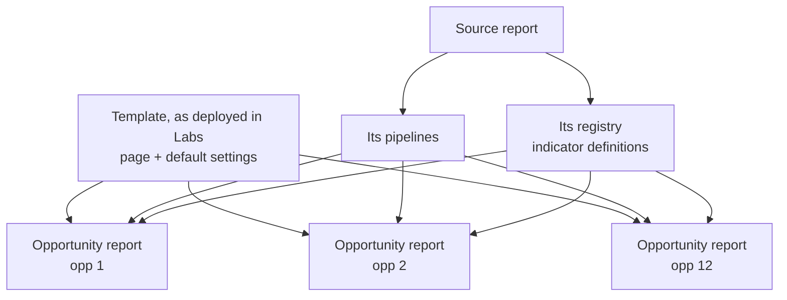

# Shared Report Templates

When the **same report** is needed for many opportunities (one Opportunity Report per opportunity in a programme, say), Labs can make every copy **point at one shared source** instead of holding its own. The page layout, the pipelines and the indicator definitions each live in one place. Change that place once, and every copy changes with it.

This page explains how that works, how to set it up, and what still needs a person. It uses KMC's 12 Opportunity Reports as the worked example, but the mechanism works for any template.

!!! info "Who this is for"
    Anyone who looks after a report that exists in more than a couple of opportunities, and whoever sets those
    reports up through Claude. You don't need to write code.

---

## Why it exists

A Labs report (a *workflow*) is built from a page, one or more pipelines, and, for indicator reports, a set of indicator definitions (a *registry*). See [Reports with Claude](reports-with-claude.md#how-a-report-is-put-together).

By default, a report created from a template gets its **own copy** of all three. That's right for a report someone will customise. It's wrong when twelve reports are meant to be the same report over twelve opportunities, because every copy then has to be updated separately:

- a page fix has to be pushed to each copy after every Labs release, and a missed copy quietly shows an older page;
- a new setting added to the template reaches none of the existing copies;
- pipelines copied per opportunity drift apart, and each one reads and caches the data separately;
- indicator definitions copied per opportunity drift apart, so "C09" means slightly different things in different places.

In September 2026 the real and demo KMC reports held four copies of the same page between them. The shared approach replaced that.

---

## How it works

A **shared** report instance owns as little as possible. Each part points somewhere else:

| Part | Where a shared instance gets it | What that means |
| --- | --- | --- |
| **Page** (render code) | The template as deployed in Labs. The instance **follows the template**. | Every Labs release updates every following instance at once. There is nothing to sync. |
| **Settings** (config) | Filled in from the template when the report is read, for any setting the instance doesn't have. | A setting added to the template later reaches instances created earlier. |
| **Pipelines** | The source report's pipeline records, **referenced** where they live, not copied. | One pipeline definition and one data cache, read by every instance. |
| **Indicator definitions** | The source report's registry record, **bound** rather than copied. | An indicator edit reaches every instance on its next load, with no release. |

### Following the template

An instance that follows its template renders the template's page exactly as Labs has it deployed, rather than a stored copy. Two consequences:

- **You can't edit a following instance's page on its own.** Labs refuses the edit (Claude will say the workflow "follows the deployed template") rather than saving a change that would never be shown. To change the page for every instance, change the template. That's a code change in Labs, so it needs a developer.
- **To customise one instance, fork it.** Forking turns the template's current page into that instance's own stored copy, which you can then edit. The page doesn't change at the moment you fork, but from then on that instance no longer picks up template improvements.

An instance can only follow its **own** template: the one it was created from.

### Settings filled in from the template

When a report is read, any setting the template declares that the instance doesn't have is filled in from the template. There's one limit, and it's deliberate: **a setting the instance already has keeps the instance's value**, so a per-instance override survives. That also means changing the *value* of an existing setting in the template does not reach existing instances. Those have to be updated one by one (`workflow_update_definition`).

### Shared pipelines and definitions

A shared instance references the source report's pipelines in the scope they live in, so all instances read one pipeline definition and one cache. It binds the source report's registry record, so all instances compute from one set of indicator definitions.

!!! danger "Shared means shared"
    Editing a shared pipeline or registry changes **every** report that uses it. That is the point, but check
    before you edit: *"Which other reports use this pipeline / these definitions?"*

---

## Setting it up

There are two ways to get shared instances. Both are driven through Claude.

### One report per member of a benchmark cohort

If the opportunities are already in a [benchmark cohort](benchmarks.md), one call creates a report in each member that doesn't have one yet:

> *"Create an opportunity report for every member of cohort 4, sharing the pipelines and definitions of workflow 19778."*

Claude uses `benchmarks_create_opp_reports` with the cohort, the template (the default is `kmc_opp_report`), and the **source report** plus the scope it can be read from (`source_workflow_id` with `source_opportunity_id` or `source_program_id`). Every instance it creates follows the template, references the source's pipelines and binds the source's registry.

- **Name a source report.** Without one, each instance creates its own pipelines and its own copy of the definitions. It still works, but you are back to twelve copies. The result says `shared: false` when that happened.
- **It's safe to repeat.** An opportunity that already has an instance of the template is skipped, so re-running after adding an opportunity only creates the new one.
- **You need access to everything involved:** the cohort's organisation, every opportunity in the cohort (creating a report in an opportunity is a change to that opportunity), and the source report's scope.

### One more copy of an existing report

For "the same report somewhere else" without a cohort, use a **linked** copy:

> *"Make a linked copy of workflow 19778 for opportunity 67890."*

Claude uses `workflow_clone` with `linked: true`. A linked copy references the original's pipelines, binds its registry and follows the template: the same three things a fan-out instance does. An unlinked copy (the default) is a fork with its own page.

### Every new instance needs a run

A newly created report has no run, and its page needs one to open. Ask Claude to create one for each new instance (`workflow_create_run`).

### Tools you may hear Claude mention

| Tool | What it's for | Relevant here because |
| --- | --- | --- |
| `benchmarks_create_opp_reports` | One shared report per cohort member | The main way to fan a report out |
| `workflow_clone` (`linked: true`) | One linked copy | Same sharing, one at a time |
| `workflow_update_definition` | Change an instance's settings, or its `render_source` | Setting `render_source` to `null` forks an instance; setting it to `{"template": "<its template>"}` makes a forked one follow again |
| `workflow_get` | Read an instance | Shows whether its page comes from the template or a stored copy, and which registry it's bound to |
| `workflow_sync_from_deployed_template` | Copy the template's current page into a **forked** instance | Does nothing for an instance that follows the template: there's nothing to sync |
| `workflow_set_template_flag` | Mark a report as a template other people can copy | **Not** the same as following a template. It controls whether a report appears as a starting point to clone. |

`workflow_create_from_template` creates a report from a template with its own stored page. To have it share an existing registry, pass `registry_source` (see [The Semantic Layer](semantic-layer.md#recommendations), recommendation 2).

---

## Keeping it healthy

- **A new opportunity joins the programme:** add it to the cohort (`benchmarks_cohort_add_opportunities`), re-run `benchmarks_create_opp_reports`, then create a run for the new instance. Also add the opportunity to the shared registry's `deployment` facts ([why](semantic-layer.md#recommendations), recommendation 4).
- **A template setting's value changes:** existing instances keep their own value. Patch them with `workflow_update_definition`.
- **A page fix ships in Labs:** nothing to do. Following instances show it on the next load.
- **An indicator definition changes:** nothing to do for the live figures. Every instance bound to the registry shows the change on its next load. Saved runs keep their old figures until history is rebuilt (see [Weekly Trends and Saved Runs](weekly-trends-and-snapshots.md)).
- **Check an instance is really shared:** *"For each KMC Opportunity Report, does its page follow the template, which registry is it bound to, and where do its pipelines live?"* (`workflow_get` on each).

---

## When something looks wrong

| What you see | Usually means |
| --- | --- |
| Claude says it can't edit the page because the workflow "follows the deployed template" | Working as designed. Change the template, or fork this instance first. |
| One instance looks different from the others | It's been forked (its page is a stored copy), or it has its own value for a setting. `workflow_get` shows which. |
| A template improvement didn't reach one instance | Same: it's forked. Set `render_source` back to its template, or sync it with `workflow_sync_from_deployed_template`. |
| A new instance's page won't open | It has no run yet. Create one. |
| An indicator edit reached some instances but not others | Those instances are bound to a different registry, or aren't bound at all. See [Moving pre-existing reports onto the shared registry](semantic-layer.md#moving-pre-existing-reports-onto-the-shared-registry). |
| An older, hand-made instance still has its own copies after a fan-out | The fan-out skips any opportunity that already has an instance, and doesn't convert it. Fork-and-follow or rebind it by hand, or delete it and re-run the fan-out. |
| Figures show 0 or "cold cache" | The shared data hasn't been loaded. KMC Opportunity Reports load it themselves when opened (below); other reports may need it loaded first. |

---

## Worked example: KMC

KMC has 12 opportunities across several organisations and Connect programmes, and each one has a **KMC Opportunity Report** (template `kmc_opp_report`) showing its own scorecard, its own workers and its [benchmark](benchmarks.md).

- **Created in one step** with `benchmarks_create_opp_reports` over the 12-member *KMC programme peers* cohort, naming the **KMC Programme Report** (workflow 19778 in production) as the source.
- **Page:** all 12 follow the deployed `kmc_opp_report` template. A Labs release updates all 12 at once, and none can be edited on its own.
- **Pipelines:** all 12 reference the Programme Report's pipelines rather than holding copies, so the visit data is read and cached once.
- **Indicator definitions:** all 12 are bound to the Programme Report's registry, the shared **KMC indicators** record, so an edit to C09 reaches all 12, the Programme Report and the Worker Review on the next load.
- **Loading data on open:** the template sets `warm_cache_on_read`. An Opportunity Report never streams its pipelines; it asks the semantic layer for its figures. With this setting, opening it loads that opportunity's visit data if nobody else has recently. It is best effort: if loading fails, the page reports a cold or partial cache instead. The multi-opportunity Programme Report does not do this, so opening it never triggers a download of every opportunity.
- **When a thirteenth opportunity joins**, the steps are the ones in [Keeping it healthy](#keeping-it-healthy): add it to the cohort and the registry, re-run the fan-out, create a run.

---

## See also

- [Benchmarks](benchmarks.md): the cohort these reports read their peer figures from
- [Cross-Programme Reports](cross-program-rollups.md): the source report that spans every opportunity
- [The Semantic Layer](semantic-layer.md#managing-registries-across-programmes): one registry per indicator family
- [Reports with Claude](reports-with-claude.md#run-the-same-report-somewhere-else): linked and unlinked copies
- `connect_labs/workflow/WORKFLOW_REFERENCE.md` §12 in the repository: the developer reference
