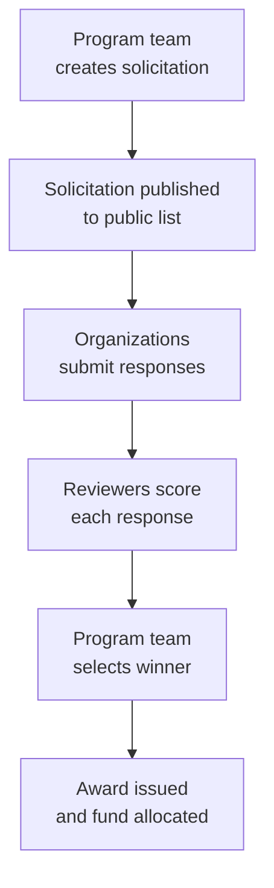

# Solicitations

The Solicitations module manages requests for proposals (RFPs) and expressions of interest (EOIs). Program teams can post solicitations, collect responses from implementing organizations, review and score submissions, and award funding.

---

## Process Overview

---

## For Program Managers (Creating & Managing)

### Creating a Solicitation

Click **Solicitations** in the top navigation, then **Manage Solicitations**, then **Create Solicitation**.

Fill in:

| Field               | Description                                                             |
| ------------------- | ----------------------------------------------------------------------- |
| Title               | Name of the solicitation (e.g., "EOI: OCS Implementation – Niger 2026") |
| Type                | EOI (Expression of Interest) or RFP (Request for Proposals)             |
| Description         | Full context: program background and what you're looking for            |
| Scope of Work       | What the implementing organization must do                              |
| Budget              | Maximum funding available                                               |
| Deadline            | When responses are due                                                  |
| Evaluation criteria | What you'll score responses on                                          |
| Response template   | Questions responding organizations must answer                          |
| Status              | Draft (not yet public) or Published                                     |

**AI-assisted criteria generation:**
Click **Generate Criteria** and paste in text describing your program requirements, or upload a PDF. The AI will suggest a structured set of evaluation criteria and scoring weights. Review and adjust the suggestions before saving.

### Reviewing Responses

Once the deadline passes, go to the solicitation and click **Responses**.

For each response:

1. Click the response to open it
2. Read the organization's answers to each question
3. Click **Review** to score the submission
4. Score each criterion from 1–10 and add notes
5. Set your recommendation: Approve / Reject / Needs Revision

Multiple reviewers can score independently — average scores are calculated automatically.

### Awarding a Response

When the team agrees on a winner:

1. Open the winning response
2. Click **Award Response**
3. Confirm the award amount
4. Optionally link the award to a fund to track disbursements over time

---

## For Implementing Organizations (Submitting)

### Finding Solicitations

Published solicitations are visible on the Labs solicitations page without logging in. Filter by type (EOI or RFP) to find relevant opportunities.

### Submitting a Response

1. Open a solicitation and read the full description and scope of work
2. Click **Submit Response**
3. Answer each question in the response template
4. Review your answers, then click **Submit**

!!! warning "Submissions are final"
Responses cannot be edited after submission. Make sure your response is complete before submitting. If you need to make a correction, contact the program team directly.

### Tracking Your Submission

After submitting, you can view your response status:

| Status           | Meaning                                |
| ---------------- | -------------------------------------- |
| **Submitted**    | Received and under consideration       |
| **Under Review** | Reviewers are scoring your response    |
| **Approved**     | Selected as the winner — award pending |
| **Rejected**     | Not selected for this solicitation     |

---

## Common Questions

**Can I see other organizations' responses?**
No — applicants cannot see each other's responses. Program managers see all responses.

**What happens to my response if I'm not selected?**
Your response remains in Labs for the program team's reference. It is not shared publicly.

**Can I submit responses to multiple solicitations?**
Yes — each solicitation is independent.

**What is a "fund" in the context of an award?**
Funds are optional tracking records in Labs that let program teams monitor disbursements after an award is made. They are not required to complete an award.

**How do I remove a solicitation from the public listing?**
Edit the solicitation and uncheck the **Publicly Listed** checkbox. Saving the form immediately removes it from the public marketplace.

**My solicitation shows as published but isn't appearing on the public listing — what's wrong?**
This should no longer occur for solicitations edited through the standard Labs interface — unchecking **Publicly Listed** and saving is all that is needed. If you are working with a solicitation that was last edited before this fix was in place and it still appears incorrectly, contact your Labs administrator to have the visibility settings corrected.
