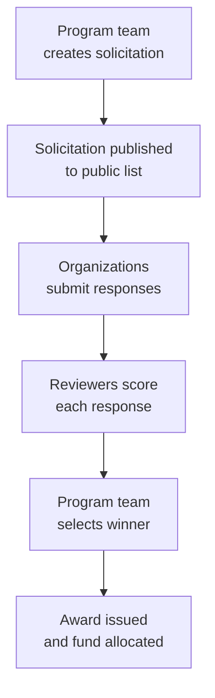

# Solicitations

The Solicitations module manages requests for proposals (RFPs) and expressions of interest (EOIs). Program teams can post solicitations, collect responses from implementing organizations, review and score submissions, and award funding.

---

## Process Overview

---

## For Program Managers (Creating & Managing)

### Creating a Solicitation

Click **Solicitations** in the top navigation, then **Manage Solicitations**, then **Create Solicitation**.

Fill in:

| Field               | Description                                                                          |
| ------------------- | ------------------------------------------------------------------------------------ |
| Title               | Name of the solicitation (e.g., "Expression of Interest: OCS Implementation – Niger 2026") |
| Type                | Expression of Interest or Request for Proposals                                      |
| Description         | Full context: program background and what you're looking for                         |
| Scope of Work       | What the implementing organization must do                                           |
| Budget              | Maximum funding available                                                            |
| Deadline            | When responses are due                                                               |
| Evaluation criteria | What you'll score responses on                                                       |
| Response template   | Questions responding organizations must answer                                       |
| Status              | Draft (not yet public) or Published                                                  |

After you save a new solicitation, Labs takes you directly to that solicitation's responses page so you can monitor for incoming submissions right away.

**AI-assisted criteria generation:**
Click **Generate Criteria** and paste in text describing your program requirements, or upload a PDF. The AI will suggest a structured set of evaluation criteria and scoring weights. Review and adjust the suggestions before saving.

**Adding context to response questions:**
When building your response template, each question has an optional **Framing** field where you can write one or two sentences explaining why you're asking that question. This framing appears above the question prompt on the public solicitation page, displayed in muted italic text, so respondents understand the intent behind the question — not just what you're asking. Framing is optional; questions without it display exactly as before.

!!! info "Validation errors on the creation form"
Labs now checks that all fields are in the correct format when a solicitation is saved. If something is wrong — for example, a deadline that isn't a valid date, an evaluation criterion missing a name, or a response question that references something that no longer exists — you will see an inline error message on the relevant field. Correct the flagged fields and save again. These checks prevent incomplete or misformatted solicitations from being stored silently.

### Creating a Solicitation from a Micro-Plan

If your solicitation is tied to specific geographic areas already defined in Labs, you can start directly from a micro-plan or plan group rather than writing the solicitation from scratch.

**From a plan group:**
Go to the plan group's management page and click **Create solicitation**. The solicitation form opens pre-filled with a title and scope of work drawn from the group name and region, and with all plans in the group already attached as coverage areas.

**From a single plan:**
Go to the plan's review page and click **Create solicitation**. The form opens pre-filled in the same way, with that one plan attached as a coverage area.

In both cases, the coverage areas are shown on a map on the creation form, with the actual ward boundaries drawn for each attached plan. You can edit any pre-filled field before publishing. Once you save the solicitation, Labs takes you directly to that solicitation's responses page. The attached plans become a fixed snapshot — later edits to the underlying micro-plans will not change what is shown on the published solicitation.

The coverage areas are displayed on the public solicitation page — both as a map showing the ward boundaries and as a list — so applicants can see exactly which areas are on the table.

!!! info "Plans are captured as a snapshot"
Because coverage areas are fixed at the time the solicitation is created, any changes you make to a micro-plan after that point will not be reflected in the solicitation. If your plans change significantly before the deadline, you will need to update the solicitation's coverage areas manually or create a new solicitation.

### Reading the Coverage Map Legend

Wherever a coverage map appears — on the solicitation page, the response submission form, and the responses review pages — a small legend is displayed on the map showing how areas are colour-coded:

| Colour | Meaning       |
| ------ | ------------- |
| Green  | Intervention area |
| Blue   | Comparison area   |

This applies to all coverage maps across the solicitations module.

### Reviewing Responses

Once the deadline passes, go to the solicitation and click **Responses**.

The page header shows the solicitation's current state. Once a winner has been awarded, the header updates to show **Awarded** so you can see at a glance that the process is complete.

For each response:

1. Click the response to open it
2. Read the organization's answers to each question
3. Review the applicant's selected coverage areas — these are shown on the responses list and on the response detail page
4. Click **Review** to score the submission
5. Score each criterion from 1–10 and add notes
6. Set your recommendation: Approve / Reject / Needs Revision

Multiple reviewers can score independently — average scores are calculated automatically.

The responses list shows a **Status** column and a **Recommendation** column for each submission. For an awarded response, **Awarded** appears only in the Status column — the Recommendation column shows your reviewer recommendation as normal, without repeating "Awarded".

The **Actions** column (containing the Award control) is pinned to the right edge of the responses table. This means it stays visible and reachable even when the table is wide, without needing to scroll horizontally.

### Awarding a Response

When the team agrees on a winner:

1. Open the winning response
2. Click **Award Response**
3. Confirm the award amount — this is displayed as a formatted currency value (for example, $25,000.00)
4. Optionally link the award to a fund to track disbursements over time

!!! info "Coverage area assignments after award"
In the current version, the coverage areas selected by an applicant are captured for your review alongside the rest of their response. Formal area assignment to the awarded organization is handled outside Labs as part of your normal award process.

---

## For Implementing Organizations (Submitting)

### Finding Solicitations

Published solicitations are visible on the Labs solicitations page without logging in. Filter by type (Expression of Interest or Request for Proposals) to find relevant opportunities. Where a solicitation was created from micro-plans, the specific geographic areas on offer are shown on a map with ward boundaries drawn, as well as in a list, on the solicitation page. The map includes a legend showing intervention areas in green and comparison areas in blue.

### Submitting a Response

1. Open a solicitation and read the full description and scope of work
2. Click **Submit Response**
3. Answer each question in the response template — where present, read the italicised framing above each question to understand what the program team is looking for. Each answer box is sized to show a typical response in full as you type, so you can review your wording without scrolling inside the box
4. If the solicitation includes coverage areas, select the areas you can cover by clicking the ward boundaries directly on the map, or by checking the boxes in the checklist alongside it — both controls are kept in sync, so selecting an area in one automatically updates the other. Selected areas are highlighted on the map so you can clearly see which plans you have chosen. You must select at least one plan to submit
5. Review your answers, then click **Submit**

!!! info "Selecting coverage areas"
Each plan is offered as a whole unit. Clicking any part of a plan's boundary on the map selects that entire plan — you cannot select only part of a plan. Selected plans are highlighted in a distinct colour on the map so it is easy to see at a glance what you have chosen. If a plan includes multiple wards or intervention and control areas, you take all of it. If you are unsure what a plan covers, read the solicitation description or contact the program team before submitting.

!!! warning "Submissions are final"
Responses cannot be edited after submission. Make sure your response is complete before submitting. If you need to make a correction, contact the program team directly.

### Tracking Your Submission

After submitting, you can view your response status:

| Status           | Meaning                                |
| ---------------- | -------------------------------------- |
| **Submitted**    | Received and under consideration       |
| **Under Review** | Reviewers are scoring your response    |
| **Approved**     | Selected as the winner — award pending |
| **Rejected**     | Not selected for this solicitation     |

---

## Common Questions

**Can I see other organizations' responses?**
No — applicants cannot see each other's responses. Program managers see all responses.

**What happens to my response if I'm not selected?**
Your response remains in Labs for the program team's reference. It is not shared publicly.

**Can I submit responses to multiple solicitations?**
Yes — each solicitation is independent.

**What is a "fund" in the context of an award?**
Funds are optional tracking records in Labs that let program teams monitor disbursements after an award is made. They are not required to complete an award.

**How do I remove a solicitation from the public listing?**
Edit the solicitation and uncheck the **Publicly Listed** checkbox. Saving the form immediately removes it from the public marketplace.

**My solicitation shows as published but isn't appearing on the public listing — what's wrong?**
This should no longer occur for solicitations edited through the standard Labs interface — unchecking **Publicly Listed** and saving is all that is needed. If you are working with a solicitation that was last edited before this fix was in place and it still appears incorrectly, contact your Labs administrator to have the visibility settings corrected.

**I'm seeing inline errors on fields I didn't change when editing an existing solicitation — why?**
A small number of older solicitations were saved before Labs began enforcing field validation. When you open one of these records for editing, any fields that were stored in the wrong format will be flagged immediately so they can be corrected. Update the highlighted fields to the expected format and save. If you are unsure what a field requires, refer to the table in [Creating a Solicitation](#creating-a-solicitation) or contact your Labs administrator.

**What is the Framing field on a response question?**
Framing is an optional one-to-two sentence note you can attach to any question in your response template. It appears above the question prompt on the public solicitation page in italics, giving respondents context about why you're asking. It has no effect on scoring or submission — it is purely for the benefit of applicants reading the solicitation.

**Can I create a solicitation from a micro-plan if the plans haven't been finalised yet?**
You can, but the coverage areas are fixed as a snapshot at the moment you save the solicitation. If your plans change after that point, the published solicitation will not update automatically. Wait until your plans are stable before creating the solicitation, or be prepared to update the coverage areas manually if things change before the deadline.

**Do applicants have to cover all the areas listed in a solicitation?**
No — applicants select only the areas they can cover. They must select at least one plan to submit a response, but they do not need to take all areas on offer. Applicants can select areas by clicking the boundaries on the map or by using the checklist — both show the same options and stay in sync. Selected areas are highlighted on the map so applicants can see their choices at a glance. The program team can see each applicant's selected areas when reviewing responses.

**What does it mean that a plan is selected "as a whole unit"?**
If a micro-plan bundles multiple wards, or includes both intervention and control areas, an applicant who selects that plan is committing to all of it. Clicking any part of that plan's boundary on the map selects the entire plan — there is no option to select only part of it.

**I clicked "Create solicitation" from a plan and got a "Failed to create solicitation" error — what should I do?**
This error could previously occur on certain Labs-managed study programs. It has been fixed, so clicking **Create solicitation** from a plan on any program should now work. If you still see this error, try refreshing the page and attempting again. If the problem persists, contact your Labs administrator.

**The responses page header still shows "Active" after I awarded a response — is something wrong?**
This display issue has been fixed. Once you award a response, the responses page header updates immediately to show **Awarded**. If you are viewing a page that was loaded before the award was made, refresh your browser to see the updated status.

**The awarded response shows "Awarded" in both the Status and Recommendation columns — is that correct?**
No — this duplicate display has been fixed. **Awarded** now appears only in the Status column for an awarded response. The Recommendation column shows the reviewer recommendation as normal.

**What do the colours on the coverage map mean?**
Green areas are intervention areas and blue areas are comparison areas. A small legend on every coverage map explains this colour coding.

**Where do I land after creating a solicitation?**
After you save a new solicitation, Labs takes you directly to that solicitation's responses page. This means you can immediately see whether any responses have come in, without having to navigate back from the general solicitations list.

**The "Generate Criteria" button or the AI Application Coach isn't working — what should I do?**
Both AI features were temporarily returning errors for all users on Labs. This has been fixed and both tools should now work as expected. If you click **Generate Criteria** on the solicitation creation form or use the AI Application Coach on the response form and still see an error, try refreshing the page and attempting again. If the problem persists, contact your Labs administrator.

**The Award action was cut off on the right side of the responses table — is that a known issue?**
This has been fixed. The **Actions** column is now pinned to the right edge of the responses table so the Award control is always visible, regardless of how wide the table is or what screen size you are using.

**The answer boxes on the response form were too small and cut off my text — is that a known issue?**
This has been fixed. The answer boxes are now taller, so a typical response is fully visible as you type without text being clipped at the bottom edge.

---

---

---

---

---

---
