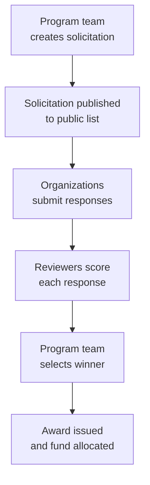

# Solicitations

The Solicitations module manages requests for proposals (RFPs) and expressions of interest (EOIs). Program teams can post solicitations, collect responses from implementing organizations, review and score submissions, and award funding.

---

## Process Overview

---

## For Program Managers (Creating & Managing)

### Creating a Solicitation

Click **Solicitations** in the top navigation, then **Manage Solicitations**, then **Create Solicitation**.

Fill in:

| Field               | Description                                                             |
| ------------------- | ----------------------------------------------------------------------- |
| Title               | Name of the solicitation (e.g., "EOI: OCS Implementation – Niger 2026") |
| Type                | EOI (Expression of Interest) or RFP (Request for Proposals)             |
| Description         | Full context: program background, what you're looking for               |
| Scope of Work       | What the implementing organization must do                              |
| Budget              | Maximum funding available                                               |
| Deadline            | When responses are due                                                  |
| Evaluation criteria | What you'll score responses on (see AI assist below)                    |
| Response template   | Questions responding organizations must answer                          |
| Status              | Draft (not yet public) or Published                                     |

**AI-assisted criteria generation:**
Upload a PDF or paste text describing your program requirements. The AI will suggest a structured set of evaluation criteria and scoring weights based on your input. Review and adjust before saving.

### Reviewing Responses

Once the deadline passes, go to the solicitation and click **Responses**.

For each response:

1. Click the response to open it
2. Read the organization's answers to each question
3. Click **Review** to score the submission
4. Score each criterion from 1–10 and add notes
5. Set your recommendation: Approve / Reject / Needs Revision

Multiple reviewers can score independently. Average scores are calculated automatically.

### Awarding a Response

When the team agrees on a winner:

1. Open the winning response
2. Click **Award Response**
3. Confirm the award amount
4. Optionally allocate the award to a fund for tracking disbursements

---

## For Implementing Organizations (Submitting)

### Finding Solicitations

Public solicitations are visible at the Labs solicitations page without logging in. Filter by type (EOI or RFP) to find relevant opportunities.

### Submitting a Response

1. Open a solicitation and read the full description and scope
2. Click **Submit Response**
3. Answer each question in the response template
4. Review your answers, then click **Submit**

!!! warning "Deadlines"
Responses cannot be edited after submission. Make sure your response is final before submitting. Contact the program team directly if you need to make a correction.

### Tracking Your Submission

After submitting, you can view your response status:

- **Submitted** — received, under review
- **Under Review** — reviewers are scoring
- **Approved** — selected as winner (awaiting award)
- **Rejected** — not selected this round

---

## Common Questions

**Can I see who else applied?**
No — other organizations' responses are not visible to applicants. Program managers see all responses.

**What happens to my data if I'm not selected?**
Your response remains in Labs for the program team's reference. It is not shared publicly.

**Can I submit for multiple solicitations?**
Yes — each solicitation is independent.
