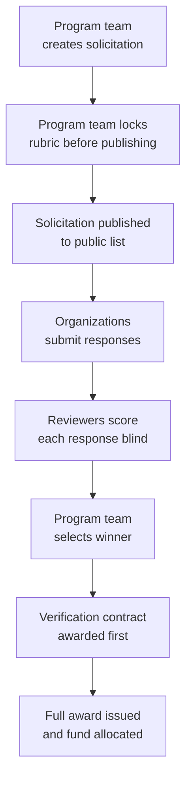

# Solicitations

The Solicitations module manages requests for proposals (RFPs) and expressions of interest (EOIs). Program teams can post solicitations, collect responses from implementing organizations, review and score submissions, and award funding.

---

## Process Overview

```mermaid
flowchart TD
    A[Program team\ncreates solicitation] --> B[Program team locks\nrubric before publishing]
    B --> C[Solicitation published\nto public list]
    C --> D[Organizations\nsubmit responses]
    D --> E[Reviewers score\neach response blind]
    E --> F[Program team\nselects winner]
    F --> G[Verification contract\nawarded first]
    G --> H[Full award issued\nand fund allocated]
```

---

## For Program Managers (Creating & Managing)

### Creating a Solicitation

Click **Solicitations** in the top navigation, then **Manage Solicitations**, then **Create Solicitation**.

Fill in:

| Field               | Description                                                                          |
| ------------------- | ------------------------------------------------------------------------------------ |
| Title               | Name of the solicitation (e.g., "Expression of Interest: OCS Implementation – Niger 2026") |
| Type                | Expression of Interest or Request for Proposals                                      |
| Description         | Full context: program background and what you're looking for                         |
| Scope of Work       | What the implementing organization must do                                           |
| Budget              | Maximum funding available                                                            |
| Deadline            | When responses are due                                                               |
| Evaluation criteria | What you'll score responses on                                                       |
| Response template   | Questions responding organizations must answer                                       |
| Status              | Draft (not yet public) or Published                                                  |

After you save a new solicitation, Labs takes you directly to that solicitation's responses page so you can monitor for incoming submissions right away.

**Programme tag:**
Every solicitation now carries a programme tag drawn from Connect's standard programme names (for example, Kangaroo Mother Care, Child Health Campaign, Readers Distribution, Malaria). This tag appears on the marketplace home page, the solicitation page, and the organization page. When creating a solicitation, select the programme it belongs to so organizations can find it through the programme filters and so it is clearly distinguished from other rounds — for example, "CHC 2024 — Northern Nigeria" and "CHC 2025 — East & Southern Africa" appear as separate, clearly labelled rounds rather than both showing as "CHC".

**AI-assisted criteria generation:**
Click **Generate Criteria** and paste in text describing your program requirements, or upload a PDF. The AI will suggest a structured set of evaluation criteria and scoring weights. Review and adjust the suggestions before saving.

**Adding context to response questions:**
When building your response template, each question has an optional **Framing** field where you can write one or two sentences explaining why you're asking that question. This framing appears above the question prompt on the public solicitation page, displayed in muted italic text, so respondents understand the intent behind the question — not just what you're asking. Framing is optional; questions without it display exactly as before.

The question input box in the template editor automatically expands to fit longer question text, so lengthy questions are always fully visible as you type.

The published solicitation shows the number of questions in the response template. This count is phrased correctly for any number — for example, "1 question" or "3 questions".

!!! info "Validation errors on the creation form"
Labs now checks that all fields are in the correct format when a solicitation is saved. If something is wrong — for example, a deadline that isn't a valid date, an evaluation criterion missing a name, or a response question that references something that no longer exists — you will see an inline error message on the relevant field. Correct the flagged fields and save again. These checks prevent incomplete or misformatted solicitations from being stored silently.

### Locking the Rubric Before Publishing

For survey-firm procurements and any solicitation where a defensible, consistent scoring process matters, Labs lets you lock the evaluation rubric before the call goes public.

**How it works:**

1. Build and review your evaluation criteria — either manually or using **Generate Criteria**
2. Click **Lock Rubric** once you are satisfied with the criteria and their weights
3. Publish the solicitation

Once locked, the criteria and their weights are fixed for the entire period the call is open. No reviewer or program manager can modify them while the solicitation is published. This ensures every applicant is scored against exactly the same standard.

A **Rubric locked before publishing** badge is displayed on the solicitation page and on the responses list, so reviewers and program managers can see at a glance that the scoring framework was set before any applications came in.

!!! warning "Locking is permanent while the solicitation is open"
You cannot unlock or edit the rubric after locking without first returning the solicitation to Draft status. If you need to revise the criteria, set the solicitation back to Draft, make your changes, lock again, and republish. Do not republish until you are confident the criteria are final — applicants who submitted under the previous criteria will have answered questions calibrated to the original rubric.

### Creating a Solicitation from a Micro-Plan

If your solicitation is tied to specific geographic areas already defined in Labs, you can start directly from a micro-plan or plan group rather than writing the solicitation from scratch.

**From a plan group:**
Go to the plan group's management page and click **Create solicitation**. The solicitation form opens pre-filled with a title and scope of work drawn from the region, and with all plans in the group already attached as coverage areas. The pre-filled title does not repeat the place name — if the group and region share a name, it appears only once.

**From a single plan:**
Go to the plan's review page and click **Create solicitation**. The form opens pre-filled in the same way, with that one plan attached as a coverage area.

In both cases, the coverage areas are shown on a map on the creation form, with the actual ward boundaries drawn for each attached plan. You can edit any pre-filled field before publishing. Once you save the solicitation, Labs takes you directly to that solicitation's responses page. The attached plans become a fixed snapshot — later edits to the underlying micro-plans will not change what is shown on the published solicitation.

The coverage areas are displayed on the public solicitation page — both as a map showing the ward boundaries and as a list — so applicants can see exactly which areas are on the table. The ward count is shown at a readable size alongside the map.

!!! info "Plans are captured as a snapshot"
Because coverage areas are fixed at the time the solicitation is created, any changes you make to a micro-plan after that point will not be reflected in the solicitation. If your plans change significantly before the deadline, you will need to update the solicitation's coverage areas manually or create a new solicitation.

### Reading the Coverage Map Legend

Wherever a coverage map appears — on the solicitation page, the response submission form, and the responses review pages — a small legend is displayed on the map showing how areas are colour-coded:

| Colour | Meaning       |
| ------ | ------------- |
| Green  | Intervention area |
| Blue   | Comparison area   |

This applies to all coverage maps across the solicitations module.

### Reviewing Responses

Once the deadline passes, go to the solicitation and click **Responses**.

The page header shows the solicitation's current state. Once a winner has been awarded, the header updates to show **Awarded** so you can see at a glance that the process is complete.

The responses table pins the **Organization** column to the left edge, so firm names remain visible even when you scroll the table horizontally to see all columns.

For each response:

1. Click the response to open it
2. Read the organization's answers to each question
3. Review the applicant's selected coverage areas — these are shown on the responses list and on the response detail page
4. Click **Review** to score the submission
5. Score each criterion from 1–10 and add notes — every criterion in the rubric has a score field, including criteria that are not tied to a specific application question (such as Independence or Timeline)
6. Set your recommendation: Approve / Reject / Needs Revision

Multiple reviewers can score independently — average scores are calculated automatically.

Once a review is saved, the full criterion-by-criterion breakdown is shown on the saved review: each criterion's name, its weight, and the score given out of 10. This replaces the previous single overall number, giving you and other reviewers a clear record of how each dimension was scored.

The responses list shows a **Status** column and a **Recommendation** column for each submission. For an awarded response, **Awarded** appears only in the Status column — the Recommendation column shows your reviewer recommendation as normal, without repeating "Awarded". Where a response has not yet been scored, the Score cell shows a neutral dash (—); the Recommendation column shows the **Pending review** indicator for that submission.

The responses list displays the submitting firm's contact email address in place of a repeated organization name, making it easier to identify individual contacts at a glance when multiple people from the same organization have submitted.

The **Actions** column (containing the Award control) is pinned to the right edge of the responses table. This means it stays visible and reachable even when the table is wide, without needing to scroll horizontally. The Score cell is no longer clipped by the pinned Actions column.

#### Blind Scoring

When a solicitation uses blind scoring, reviewers see each submission identified only as **Response #[number]** — the submitting firm's name is not shown anywhere on the scoring screen. This means reviewers judge the content of the application, not who submitted it.

The firm's identity is revealed only at the award step, once all scoring is complete. At that point, the winner's name becomes visible on the award confirmation screen so you can verify and confirm the award.

Blind scoring is enabled automatically for survey-firm solicitations. Where it is active, the **Rubric locked before publishing** badge on the responses list also confirms that scoring conditions were set before any applications were received.

### Awarding a Response

When the team agrees on a winner:

1. Open the winning response
2. Click **Award Response**
3. Confirm the award amount — this is displayed as a formatted currency value (for example, $25,000.00). The confirmation screen also shows the winning review's score and, if blind scoring was active, reveals the firm's name here for the first time so you can verify you are awarding the intended submission
4. Optionally link the award to a fund to track disbursements over time

#### Staged-Contract Award

For survey-firm procurements, Labs supports a staged award process. Rather than committing the full contract value immediately, you can first issue a small **verification contract** to confirm the selected firm's performance on the ground, then scale to the full survey award once you are satisfied.

This is the recommended approach for managing conflict-of-interest risk in independent survey procurement: start with a limited engagement, verify the firm performs as expected, then proceed with the full scope.

To use staged contracting:

1. At the award step, choose **Verification contract** instead of the full award
2. Set the verification contract amount and scope
3. After the verification period, return to the solicitation and issue the **Full award** to the same firm

!!! info "Setting up the live Connect opportunity after award"
Formally standing up the awarded survey firm's opportunity on the Connect marketplace is a next step that is not yet built into Labs. After completing the award, follow your programme's standard process for setting up the Connect opportunity.

!!! info "Coverage area assignments after award"
In the current version, the coverage areas selected by an applicant are captured for your review alongside the rest of their response. Formal area assignment to the awarded organization is handled outside Labs as part of your normal award process.

### Access to Labs-Only Solicitations

Some solicitations in Labs are marked as labs-only (also called synthetic opportunities). These are used for pilot programs, testing, and other work that is not part of the main Connect marketplace.

Access to a labs-only solicitation is controlled by an **allowed domains** list — a set of email domains whose users are permitted to see and interact with that solicitation. If your organization's email domain is on the list, you can access the solicitation normally. If it is not, the solicitation will not appear for you, even if you have the direct link.

!!! info "Who always has access"
Dimagi platform staff and the person who originally created the solicitation retain access regardless of the allowed domains list. A labs-only solicitation with no allowed domains configured remains open to all logged-in users — this is the default when no restriction has been set.

Standard (non-labs-only) solicitations on Connect are not affected by this — access rules for those work as they always have.

If you believe you should have access to a labs-only solicitation but cannot see it, contact your Labs administrator to confirm your email domain has been added to the allowed domains list for that solicitation.

### Audit Trail

Labs keeps a complete, tamper-evident record of activity across all program data — including solicitations, responses, and awards. Every time a record is viewed, edited, or deleted, a visit export is run, a login succeeds or fails, or access is denied, the event is logged automatically with who performed it, what they did, when, where they connected from, and whether the action succeeded.

Labs administrators can review this log on the **Audit Trail** page, linked from **Labs Admin**. The page includes:

- **Anomaly cards** that surface patterns worth investigating — for example, a burst of failed login attempts, an unusual spike in bulk data exports, or activity at unexpected hours
- **Filters** to narrow the log by user, action type, date range, or outcome
- A **Mark reviewed** button on each anomaly that records the fact that a compliance review was carried out, creating a clear audit record of your oversight work

!!! info "Who can access the Audit Trail"
The Audit Trail page is available to Labs administrators only. If you need to review a specific event and do not have administrator access, contact your Labs administrator.

---

## For Implementing Organizations (Submitting)

### Finding Solicitations

Published solicitations are visible on the Labs solicitations page without logging in. Filter by type (Expression of Interest or Request for Proposals) to find relevant opportunities.

**Filtering by programme:**
The marketplace now offers two programme-based filters to help you find relevant opportunities:

| Filter | What it shows |
| ------ | ------------- |
| **Has delivered** | Solicitations from programs your organization has completed delivery work on |
| **Has applied for** | Solicitations from programs your organization has applied for, whether or not you were selected |

Both filters use Connect's standard programme names — Kangaroo Mother Care, Child Health Campaign, Readers Distribution, Malaria, and so on — the same names you see everywhere else in Connect. The two filters are kept separate because an organization that has applied for a programme but never delivered it is often exactly who a new round is looking for.

Every solicitation displays its programme tag on the marketplace home page, the solicitation page, and the organization page. Round titles include enough detail to tell similar rounds apart — for example, "CHC 2024 — Northern Nigeria" and "CHC 2025 — East & Southern Africa" appear as distinct entries.

Where a solicitation was created from micro-plans, the specific geographic areas on offer are shown on a map with ward boundaries drawn, as well as in a list, on the solicitation page. The map includes a legend showing intervention areas in green and comparison areas in blue.

Solicitations created for finished study programs clearly state their purpose — recruiting an independent survey firm to measure the program's outcomes — and display the number of coverage wards at a readable size.

Where the rubric was locked before the call was published, a **Rubric locked before publishing** badge is shown on the solicitation page. This means the evaluation criteria were fixed before any applications came in and will not change during the open period.

### Submitting a Response

1. Open a solicitation and read the full description and scope of work
2. Before filling in your answers, review the **Evaluation Criteria** panel shown above the application questions. This panel lists each criterion the program team will use to score responses, including the criterion name, its weight in the overall score, and any scoring guidance provided. Use this to understand what reviewers are looking for before you write your answers
3. Click **Submit Response**
4. Answer each question in the response template — where present, read the italicised framing above each question to understand what the program team is looking for. Each answer box sizes to fit your content as you type, so your full response is always visible without scrolling inside the box
5. If the solicitation includes coverage areas, select the areas you can cover by clicking the ward boundaries directly on the map, or by checking the boxes in the checklist alongside it — both controls are kept in sync, so selecting an area in one automatically updates the other. Selected areas are highlighted on the map so you can clearly see which plans you have chosen. You must select at least one plan to submit
6. If you use the **AI Application Coach** for feedback on your draft answers, the coach will prompt you to support your claims with verifiable evidence — for example, real numbers, named prior projects, back-check rates, or other concrete details. Suggestions are presented with clear headings so you can scan the structured advice at a glance. Responses backed by specific evidence score more strongly against the evaluation rubric
7. Review your answers, then click **Submit**

After you submit, the solicitation page updates to show a **Response submitted** confirmation state. The option to submit another response is no longer shown — this prevents accidental duplicate submissions.

!!! info "Selecting coverage areas"
Each plan is offered as a whole unit. Clicking any part of a plan's boundary on the
