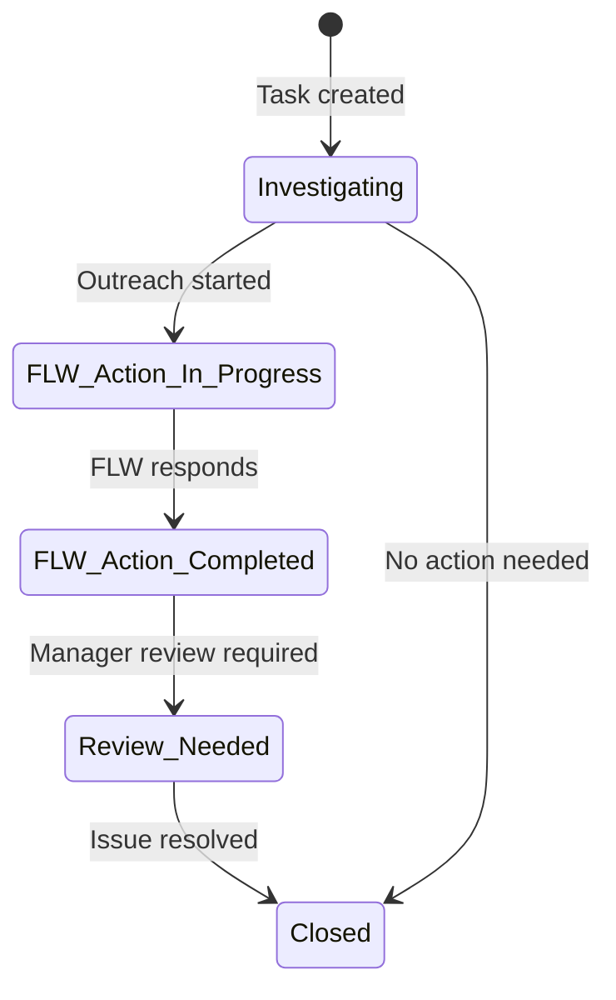

# Task Management

The Task module helps program teams track follow-up actions for field workers. Create tasks from audit findings or manually, assign them to supervisors or managers, monitor progress, and coordinate automated outreach.

---

## Task Lifecycle

---

## Creating a Task

**Option 1 — From an Audit Session:**
After completing an audit, click **Create Task** next to any flagged visit. The task is pre-populated with the worker's name, audit details, and date.

**Option 2 — Manually:**
Click **Tasks** in the top navigation, then **New Task**.

Fill in:

| Field           | Description                                                                    |
| --------------- | ------------------------------------------------------------------------------ |
| Title           | Short description of the follow-up needed                                      |
| Description     | Full context, what was found, what action is needed                            |
| Assigned worker | The FLW this task is about                                                     |
| Assignee        | Who is responsible for resolving it (you, network manager, or program manager) |
| Priority        | High / Medium / Low                                                            |
| Status          | Starting status (usually "Investigating")                                      |

**Option 3 — Bulk Create:**
If you have many workers to follow up with after an audit, use **Bulk Create** to create tasks for multiple workers at once from a single audit session.

---

## Task List

The task list shows all tasks for your program. Use filters to focus on what you need:

- **Status** — filter by where tasks are in the lifecycle
- **Priority** — see high-priority tasks first
- **Search** — find tasks by worker name or keyword

Each task row shows the current status, assigned worker, priority, and when it was last updated.

---

## Working on a Task

Open a task to see its full timeline — a chronological record of all activity:

- Status changes with timestamps
- Comments from team members
- AI session summaries (if OCS bot was used)

**Adding a comment:**
Type in the comment box and click **Post**. Comments are visible to all team members with access to the program.

**Updating status:**
Use the status dropdown at the top of the task to move it to the next stage. Each status change is recorded in the timeline automatically.

---

## OCS Bot (Automated Outreach)

The OCS Bot can send an automated chat message to a field worker to gather information or prompt action, without a supervisor needing to make a direct call.

To trigger the OCS Bot:

1. Open the task
2. Click **Start OCS Chat**
3. The bot sends a message to the FLW via CommCare Connect messaging
4. The conversation transcript appears in the task timeline as it progresses

!!! note
The OCS Bot is only available for programs that have OCS (Outreach Communication System) configured. Ask your program administrator if you're unsure.

---

## Common Questions

**Who can see my tasks?**
Tasks are visible to all team members with access to your program in Labs.

**Can I delete a task?**
Tasks can be closed but not deleted. This keeps the audit trail intact.

**How do I know when a task is updated?**
Currently, Labs doesn't send email notifications — check the task list regularly or ask your team to update you directly.
