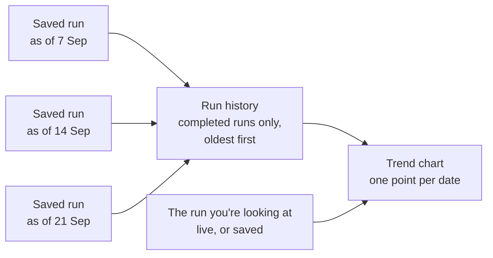

# Weekly Trends and Saved Runs

The trend lines on a Labs report ("how has healthy growth moved over the last three months?") are not calculated from the visit data on the fly. **Each point on a trend is one saved run**: a copy of the report's figures, frozen as of one date. A report with no saved runs has no trend; a report with gaps in its saved runs has a trend with gaps.

This page explains how saved runs and trends work, how to build and keep a healthy history, and why a trend can look empty or wrong. It uses the KMC Programme Report as the worked example; any report built on the [semantic layer](semantic-layer.md) works the same way.

!!! info "Who this is for"
    Anyone who reads a report's trends and wants to trust them, and whoever keeps a report's history in order
    through Claude.

---

## How it works

### A saved run

A report's **run** starts **in progress**: its figures are live and change as visits sync. **Saving** it (the **Save this report** button, or `workflow_save_snapshot` through Claude) freezes it:

- Labs builds the run's **snapshot** on the server: every indicator at every level (programme, organisation, opportunity, worker, month), graded exactly as the page would show it, **as of the run's end date**. Visits after that date are left out, and every "has it been 28 days?" rule is judged at that date.
- The snapshot records **which set of indicator definitions** graded it, so a later change to a definition can't silently re-colour an old run.
- The run becomes **completed** and read-only. Opening it later shows exactly those figures, and runs nothing.

A saved run never changes. To see a week again under new definitions, you replace it (see [Rebuilding history](#rebuilding-history)).

### The trend

When a report opens, it asks Labs for the report's **completed runs** and takes the few figures each trend needs from each one. Then:

- **One point per date.** If two saved runs share a date (one saved by hand and one produced by a rebuild, say), the one completed **most recently** wins.
- **The run you're viewing is the newest point**, live if it's in progress, unless a saved run already has that date.
- **A figure that was too thin to show** (below its minimum denominator, or not credible) leaves a break in that line. It's never drawn as zero.
- **Points are evenly spaced, one per saved run.** A missing week doesn't leave a gap on the axis, so the line looks continuous even when the history isn't. Check the dates under the chart.
- **Runs saved before a report's layout changed** may not carry the figures a newer trend reads, and are skipped.

The run history is cached for up to **10 minutes**. Saving or deleting a run through Labs clears that cache, so the new point shows on the next load.

!!! note "Two kinds of chart"
    Trend **lines** of indicators come from saved runs, as above. A chart of **activity** by week (registrations and
    visits per week, on the KMC Programme Report) comes from inside the one snapshot you're viewing. It needs no
    history, and weeks with no activity are left out rather than shown as zero.

### Rebuilding history

A report created this week has one point and no line. **Rebuilding history** writes the runs the report *would* have if it had been saving on schedule all along: one completed run per week (or day), each computed as of that period's end, all graded under **today's** definitions.

Four things to know:

- **Rebuilt points can move.** A rebuilt week is what we would say *today* about that week: current definitions, plus visits that synced late. That is right while definitions are still being settled. It's wrong once figures have been reported to a funder. So a rebuild only ever happens when someone asks for one.
- **It only replaces its own work.** Every run a rebuild writes is marked as rebuilt, and only marked runs are replaced. A run someone saved by hand is never deleted. The new run is built before the old one is removed, so a failed rebuild leaves the existing history intact.
- **Weeks run Monday to Sunday, and only finished weeks count.** By default it starts at the earliest date in the report's data and ends at the last complete week.
- **It needs the data loaded, and it takes time.** Each week is a full recalculation (on the order of ten seconds for a programme of about 9,000 cases), so Claude rebuilds a few weeks per call and picks up where it left off. If an opportunity's data can't be loaded, the rebuild stops rather than writing wrong weeks.

Only reports whose saved runs actually depend on their date can be rebuilt (today, reports on the semantic layer's `semantic_snapshot` builder). A report whose snapshot ignores the date would draw the same figure for every week: a flat line that looks like a programme that didn't move.

---

## Setting it up

For a report already on the semantic layer (see [Converting an existing report](semantic-layer.md#converting-an-existing-report), step 5, for turning saved runs on):

1. **Check it can be rebuilt.** *"Can workflow 19778's history be rebuilt?"* (`workflow_history_eligibility`). This shows the definitions it will use, and how many rebuilt and hand-saved runs already exist.
2. **Check one week first.** *"Show me what the week ending 7 September would say, without saving anything."* (`workflow_preview_as_of`.) Compare it with a figure you trust.
3. **Load the data.** *"Load the visit cache for every opportunity in this report."* (`workflow_ensure_visit_cache`.)
4. **Rebuild.** *"Rebuild the weekly history from 26 April."* (`workflow_rebuild_history`, with `cadence: weekly` and a `start`.) Ask for a dry run first to see how many weeks it will write. Claude repeats the call until it reports it's done.
5. **Then save a run every week.** Open the report after the week ends and click **Save this report**, or ask Claude to create and save a run for that week (`workflow_create_run` with the week's dates, then `workflow_save_snapshot`).

If the report is the source of a [benchmark](benchmarks.md) that follows it, every save and every finished rebuild republishes the benchmark automatically.

### Tools for looking after history

| You want to | Ask Claude | Tool |
| --- | --- | --- |
| See the saved and rebuilt runs | *"List this report's saved runs."* | `workflow_history_runs` |
| Preview a run's snapshot before saving it | *"What would saving run 5631 capture?"* | `workflow_preview_snapshot` |
| Recalculate one past date without saving | *"What did mortality look like as of 7 September?"* | `workflow_preview_as_of` |
| Rebuild weeks | *"Rebuild the last 6 months weekly."* | `workflow_rebuild_history` |
| Remove rebuilt runs outside a window, or specific runs | *"Delete the rebuilt runs before March."* | `workflow_prune_history` (a dry run by default; naming run IDs can remove hand-saved runs too) |

---

## Keeping it healthy

- **Save one run per week, after the week ends.** A run you create in the browser covers the current Monday-to-Sunday week and is computed as of its **Sunday**. Save it once that Sunday has passed (see the note below).
- **Save only when the data is fully loaded.** The **Save this report** button waits for the figures to load, but it doesn't check that *every* opportunity loaded. If the page shows a "partial" or "cold cache" warning, reload (or ask Claude to load the data) before saving. A save freezes whatever was loaded.
- **After a definition change, decide about history.** Past weeks keep their old figures until you rebuild. While definitions are being settled, rebuild after each change. Once figures have gone outside the team, don't restate reported weeks. Write down which weeks were rebuilt and why. See [recommendation 6](semantic-layer.md#recommendations).
- **Tidy stray runs.** Runs someone saved by hand survive a rebuild. Where one shares a date with a rebuilt run, the rebuilt one (completed later) is drawn. Where it doesn't, the hand-made run is drawn with the definitions it was saved under, so the line can mix old and new figures. List the runs and remove the stray ones.
- **Watch the size.** A snapshot over 5 MB can't be saved (Labs warns above 1 MB). A report that grows past that needs a slimmer snapshot, which is a developer change.

!!! warning "A run saved mid-week is dated the coming Sunday"
    A run created in the browser is dated to the end of the current week, and its figures are computed as of that
    date, even if you save it on a Wednesday. Rules like "28 days since the first visit" are then judged up to six
    days early. Save each week's run after its Sunday.

---

## When something looks wrong

| What you see | Usually means |
| --- | --- |
| "One report so far — the line builds as reports are saved weekly" | The report has at most one run with this figure. Rebuild history, or keep saving weekly. |
| "No report has enough cases to score this yet" | No saved run had enough cases to show this indicator. |
| A break in a line | That week's figure was too thin, or not credible, so it isn't drawn. |
| The line looks smooth but some weeks are missing | No run was saved for those weeks. Points are spaced by run, not by date. Rebuild the missing weeks. |
| The latest point disagrees with the live report | They're as of different dates, or computed under different definitions. The run's date and its definitions are recorded with it. |
| A line jumps between two levels every week | Two runs per date computed differently (for example, stray hand-saved runs next to rebuilt ones). Current Labs draws one per date; list the runs and remove the stray ones. |
| A new save doesn't show up | The history is cached for up to 10 minutes. It clears on a save through Labs; otherwise wait and reload. |
| A trend changed without anyone editing a definition | History was rebuilt, and late-syncing visits moved past weeks. |
| A rebuild stops with "cache incomplete" or "cache miss" | Some opportunity's data isn't loaded. Load it, then resume from where it stopped. |
| "Snapshot too large" on save | The snapshot is over 5 MB. The run stays in progress; ask a developer. |

---

## Worked example: KMC

- **The report:** the **KMC Programme Report** (template `kmc_programme_metrics`) over the 12 KMC opportunities ([how it spans them](cross-program-rollups.md)). Its saved runs use the `semantic_snapshot` builder and carry the KMC indicators at every level, plus a slim index of cases so the Worker Review can drill into a saved run.
- **The trends:** four trend cards, each with a dashed target line: healthy growth (`pct_healthy_growth`, target 70%), early growth rate (`mean_early_growth_rate`, 15 g/kg/day), mortality (`mortality`, 4%) and lost by day 28 (`lost_by_day_28`, 10%). The headline figures show their change since the previous saved run. A separate chart shows registrations and visits by week, from inside the current run.
- **Drill pages inherit the run.** A Worker Review opened from a saved run reads that run's figures, so the whole drill is as of one date.
- **How the history was built:** the first weeks were created by hand, one run per past Sunday, and then the history was rebuilt weekly from 26 April 2026 with `workflow_rebuild_history`, a few weeks per call. Each week takes roughly ten seconds to compute.
- **Weekly is a habit, not a schedule.** Nothing saves the KMC Programme Report automatically: its template doesn't support scheduled runs. Each week's point comes from someone saving that week's run, or from a rebuild.
- **It feeds the benchmark.** The Programme Report's saved runs are also the trend behind the KMC [benchmark](benchmarks.md), where the same runs are re-based onto each opportunity's own weeks of delivering. Each save republishes it.
- **What went wrong once:** on 11 September 2026, two stale hand-made runs sat beside the rebuilt history and pulled healthy growth on the trend from 61% to 34%. Drawing one point per date, with the latest completion winning, is what fixed that.

---

## See also

- [Reports with Claude](reports-with-claude.md#rebuild-the-trend-after-a-definition-change): rebuilding after a definition change
- [The Semantic Layer](semantic-layer.md#saved-runs-use-the-same-definitions): why a saved run keeps its definitions
- [Benchmarks](benchmarks.md): peer trends built from the same saved runs
- `connect_labs/workflow/WORKFLOW_REFERENCE.md` §9 in the repository: the developer reference for saved runs and rebuilding
