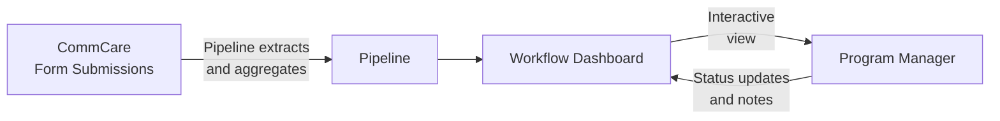

# Workflow Engine

The Workflow Engine lets program managers view configurable dashboards that pull live data directly from CommCare. Each workflow displays field worker performance metrics and supports drill-down into individual records, status tracking, and filtering.

---

## How Data Flows



**Pipelines** define what data to pull from CommCare and how to aggregate it — counts, sums, most recent values, percentages, and more. **Workflows** define what to display and how users interact with it.

---

## Finding Your Workflows

Click **Workflows** in the top navigation. You'll see a list of all workflows configured for your program.

Each row shows:

- Workflow name and type
- Last run time and data freshness
- Current status

Click any workflow to open its dashboard.

---

## Reading a Workflow Dashboard

A typical workflow dashboard shows a **table of field workers** with performance columns:

| Column type | What it shows                                |
| ----------- | -------------------------------------------- |
| Count       | Number of visits or activities in the period |
| Status      | Current enrollment or case status            |
| Last value  | Most recent recorded measurement             |
| Percentage  | Proportion of cases meeting a threshold      |

**Filtering and sorting:**

- Use the **date range picker** to focus on a specific period
- Click column headers to sort ascending or descending
- Use the **search box** to find a specific worker by name

**Drilling into a worker:**

Click any row to see that worker's detailed record — individual visit data, timeline of activities, and linked cases.

---

## Workflow Statuses

Many workflows include a status column that tracks where a case is in a program process:

```mermaid
stateDiagram-v2
    [*] --> Active
    Active --> "Review Needed": Flag raised
    "Review Needed" --> "Action Taken": Intervention done
    "Action Taken" --> Closed: Case resolved
    Active --> Closed: Graduated
```

Program managers can update a case's status directly from the workflow view. Status changes are stored in Labs and visible to all team members with access to the program.

---

## Starter Templates

Labs includes pre-built workflow templates for common program types. Your program administrator can create a workflow from any of these templates and configure it for your opportunity.

| Template                | Best for                                        |
| ----------------------- | ----------------------------------------------- |
| **KMC Longitudinal**    | Kangaroo Mother Care — tracking cases over time |
| **KMC FLW Flags**       | Flag workers needing supervisory follow-up      |
| **KMC Project Metrics** | Program-level KPIs and summary statistics       |
| **MBW Monitoring**      | Mother and baby wellness visit tracking         |
| **Performance Review**  | FLW performance compared across programs        |
| **SAM Follow-up**       | Severe acute malnutrition case management       |
| **OCS Outreach**        | Community health outreach tracking              |
| **Bulk Image Audit**    | Image-based QA combined with workflow status    |
| **CHC Nutrition Analysis** | Community health centre nutrition program monitoring |

---

## Creating and Customizing Workflows

This section is for program administrators and technical staff who want to build or adapt a workflow for their program. End users who just want to read a workflow dashboard don't need to read this section.

### Templates vs. Instances

Every workflow you see in Labs is an **instance** — a copy attached to a specific CommCare opportunity. Instances are created from **templates**, which are reusable blueprints.

- A **template** never runs on its own. It defines the SQL pipelines and display logic that will be applied when a workflow is created for an opportunity.
- An **instance** is what you see in the Workflows list: a template applied to one opportunity, with real data flowing through it.

The recommended starting point: pick the closest existing template from the [Starter Templates](#starter-templates) list, have Claude Code derive a new template from it, deploy it to Labs, then create an instance for your opportunity.

### How Data Gets into a Workflow

All workflows follow the same core pattern — the same approach Superset uses:

1. CommCare form submissions are synced into a Connect Labs SQL database.
2. **Pipelines** run JSON-based SQL queries against that data to extract and aggregate it — one row per visit, one row per FLW, counts, percentages, and more.
3. The **workflow dashboard** renders the query results and lets users interact with them.

All aggregation belongs in SQL. If Claude Code ever suggests doing aggregation in Python instead, that is a signal the session has gone off track — ask in **#connect-labs** before continuing. Because the pipelines use the same JSON query approach as Superset, you can paste a pipeline's SQL directly into Superset to debug it if something looks wrong.

The `custom_analysis/` section of Labs predates the workflow engine. Most of those dashboards could now be rebuilt as workflows. Write custom Django or Python only for a genuinely complex multi-step UI — and even then, the better answer is usually to split the work into multiple simpler workflows.

### Generating Demo or Test Data from a Real Opportunity

If you need realistic data for testing, training, or demonstrations, Labs can generate a **synthetic dataset** based on the statistical profile of an existing opportunity — without any real patient data leaving the server.

This works by analysing the shape and distribution of real data (record counts, visit patterns, field value ranges, and so on) and producing a synthetic dataset that looks realistic but contains no actual records. The result can be used to populate a test workflow instance so you can demonstrate the dashboard or validate a new template without using live data.

Synthetic opportunities now support the complete program management loop, not just the dashboard view. This means a demo can include:

- **Audit drill-downs with MUAC photos** — so stakeholders can see what an image-based quality audit looks like end to end.
- **Task follow-ups** — showing how supervisors assign and track corrective actions after a flagged visit.
- **OCS coaching transcripts** — demonstrating the outreach coaching conversation flow within the synthetic opportunity.

This makes synthetic data suitable for full stakeholder and funder demonstrations without any real patient data being used.

To use this capability, ask your program administrator or raise a request in **#connect-labs**. You will need to specify which opportunity to base the profile on and where the synthetic data should be loaded.

!!! note "No real data is used in the output"
    The synthetic profile captures statistical patterns only — it does not copy, export, or store any individual patient or field worker records. The generated data is entirely artificial.

!!! note "Nutrition metrics and other program-specific fields in synthetic data"
    Fields such as MUAC measurements, gender, and health status will now appear correctly in synthetic datasets used with the CHC Nutrition Analysis dashboard and similar templates. Previously, if a workflow's configuration used field paths that differed slightly from how CommCare named those questions in its app schema, those fields were silently left blank in the generated data — producing empty columns in the dashboard. This has been corrected, and synthetic data will now populate all fields specified in the workflow configuration.

### Creating a New Workflow with Claude Code

1. **Get the connect-labs repo and Claude Code.** Clone the repository — you don't need to run it locally, but having it gives Claude Code the context it needs to understand the system. Install the Claude Code CLI.

2. **Pick a starting template.** Find the closest match in the Starter Templates table. If you're new, a good first project is a one-row-per-FLW weekly performance chart based on **KMC Project Metrics**.

3. **Open Claude Code and describe what you want.** Start with something like:

   > "I want to create a new workflow template for [my opportunity]. Walk me through the initial steps to create a basic one-row-per-FLW weekly performance chart."

4. **Claude Code generates the template and deploys it.** Changes go directly to Connect Labs prod — no local server needed. After Claude pushes the update, reload the workflow in your browser to see the result.

5. **Iterate.** Describe changes in plain English or use the `/workflow-author` skill to keep Claude on track with the correct design patterns.

### You Don't Need a Local Instance

For workflow development, **do not run Connect Labs locally.** Even when running locally, data is still fetched from Connect prod — so there is no isolation benefit. The only reason to run locally is if you are modifying the core Connect Labs application code (the Django app itself).

For all workflow work, deploy directly to Labs prod. The deployment cycle is fast. If you push something wrong, reverting it is straightforward. Get comfortable with this loop: describe change → Claude pushes → reload browser → verify.

### Tips for Working with Claude Code

**Treat the design doc as a temporary input, not a living document.** Write your requirements — what metrics you want, what CommCare fields to pull, what the UI should look like — and give that to Claude Code as initial context. Once the workflow is built, the code is the source of truth. Don't try to keep the design doc in sync.

**Start fresh if the session goes off track.** If Claude has started writing Python aggregation, referencing old custom-analysis code you don't want to replicate, or producing output that doesn't follow the SQL pipeline pattern, don't try to correct it in the same session. Ask Claude to summarize what it knows about your requirements and design decisions into a new Markdown file, then open a fresh Claude Code session and feed in only that summary.

**Use the `/workflow-author` skill.** Running `/workflow-author` before describing changes loads workflow-specific guidance that prevents the most common mistakes.

### When Workflows Are the Right Tool

Use a workflow for nearly all program dashboards and reporting tasks:

- One row per FLW with performance indicators
- Visit completion rates and status by period
- Case status summaries and flags
- GPS anomaly or audit flags surfaced in a sortable table
- Reports that trigger an audit or task with a single click

Workflows are also more powerful than Superset because they can call other Labs APIs — creating audits, tasks, or conversations directly from a button on the dashboard.

Design workflows to be simple and action-oriented. A good workflow has a clear rule for what "done" looks like for each row. If you are building something that requires an LLO to follow a complex 10-step process with judgment at each step, reconsider the design — ideally those steps map to separate workflows with obvious success criteria at each stage.

### How Workflow Data Is Stored

Labs is a rendering and caching layer. All workflow definitions, pipeline configurations, run history, and status updates are stored as JSON records ("labs records") in Connect prod. When Labs lists your workflows, it is fetching those records in real time.

This has a useful implication: **resetting or redeploying the Labs environment never destroys your workflow data** — everything survives in Connect prod. Editing a workflow via Claude Code or the MCP is equivalent to updating that JSON record on Connect prod.

---

## MBW Monitoring Dashboard

The **MBW Monitoring** template has five tabs. The sections below describe what each tab shows and how its numbers are calculated, so you know what to expect when reviewing data.

### Overview tab

- **Eligible mothers** counts only mothers who qualify for the full intervention bonus — this is the same eligibility rule used in the Performance tab and the drilldown, so all three figures stay consistent with each other.
- **Expected visits** (shown as _total_cases_ in exports) is the count of visits that were expected in the selected period, matching the original MBW v1 definition.

### Followups tab

- **Completion rate** is calculated using the same eligibility filter as MBW v1, and includes a 5-day grace window so visits completed slightly after their due date are not counted as missed.
- **Worker attribution**: if no visits have been recorded for a mother yet, the dashboard attributes her to the field worker who submitted her registration form, rather than leaving the row blank.
- **Visit status** uses six categories: _Completed – On Time_, _Completed – Late_, _Due – On Time_, _Due – Late_, _Missed_, and _Not Due Yet_. The visit-type breakdown chart will render correctly with this data.

### GPS tab

- **Flagged visits** and **total flagged** are now calculated using the 5 km distance threshold.
- **Cases with revisits** counts distinct mothers, not the total number of distance log entries.
- **Visits with GPS**, **unique cases**, and **average daily travel (km)** are all produced and visible in the tab.

### Performance tab

Field workers are grouped into four categories, matching the original MBW v1 logic:

| Category             | What it means                                            |
| -------------------- | -------------------------------------------------------- |
| Eligible for Renewal | Worker meets the still-eligible business rule            |
| Probation            | Worker is at risk — missed visits above the threshold    |
| Suspended            | Worker has exceeded the allowable missed-visit threshold |
| No Category          | Insufficient data to place the worker in a category      |

The tab also shows the percentage of workers who missed one visit or fewer (_pct_missed_1_or_less_) and milestone percentages.

---

## MBW Auditing V4 Dashboard

### % Still Eligible

The **% Still Eligible** figure answers the question: of mothers who are bonus-eligible AND have a completed ANC visit, how many have missed at most 1 of their post-ANC visits within their expiry window?

A mother is included in the denominator only if she meets both of the following conditions:

1. She qualifies for the full intervention bonus.
2. Her antenatal visit completion is recorded as complete on her visit form.

The missed-visit check then looks only at the five post-ANC visit types — **Postnatal Delivery, 1 Week, 1 Month, 3 Month, and 6 Month** — within the mother's expiry window. The ANC visit itself is not counted in this check, because it is already required just to be included in the denominator.

If you see this figure change compared to an earlier version of the dashboard, it is because the calculation now correctly matches visit records to their scheduled visit types and applies both eligibility filters together before checking for missed visits.

### Mother counts per field worker

Each field worker row shows two mother counts: a **total** and an **eligible** figure (shown in parentheses). Both numbers are drawn from the same source — the set of mothers linked to that worker through visit records. This means the eligible count will always be equal to or less than the total, and you should never see the eligible figure exceed the total.

### Prev column

The **Prev** column shows the performance category assigned to each field worker in the most recent previous run. This lets you compare a worker's current category against where they stood last time. The column looks back across previous workflow versions as well, so a worker's prior category will appear even if the workflow has been updated since that run. If the column was showing "—" for all workers even when previous runs existed, that display issue has been corrected — the column now correctly loads categories from the most recent run where categories were set.

---

## Solicitations

Solicitations are the structured postings used to invite field workers to apply for an opportunity. They are created either through the MCP tool or via the Labs manager interface.

### Required fields and validation

When a solicitation is created, Labs now checks that all required fields are present and correctly named before saving. If anything is wrong — a misspelled field name, a missing deadline, a malformed evaluation rubric, or a question reference that points to something that doesn't exist — the creation will fail immediately with a clear error message describing exactly what needs to be fixed.

This replaces the previous behaviour where incorrectly shaped solicitations were saved silently, causing data to land in the wrong place. If you are using the manager UI to create a solicitation and something is wrong with the form, you will now see an inline error on the affected field rather than having the problem slip through unnoticed.

!!! note "If you receive a validation error"
Read the error message carefully — it will tell you which field is wrong and what the expected format is. Common issues include using the wrong field name (for example, `overview` instead of `description`) or leaving the application deadline blank. Correct the flagged fields and resubmit.

### Evaluation rubric

Each solicitation can include an evaluation rubric — a list of criteria used to score applications. Each criterion must have a **name** and a **description**. Any questions referenced in the rubric must exist in the solicitation's question list. If a criterion references a question that isn't defined, the validation will catch this and tell you which reference is broken.

---

## Common Questions

**How do I create a new workflow for my program?**
Start from the closest existing template and have Claude Code build a new one — see [Creating and Customizing Workflows](#creating-and-customizing-workflows) above for step-by-step guidance. You don't need to run Labs locally; changes deploy directly to Labs prod.

**Should I build a workflow or a custom dashboard in Python?**
Use a workflow for almost all program reporting needs. Custom Python or Django code is only warranted for genuinely complex multi-step UIs — and even then, breaking the work into multiple simpler workflows is usually the right answer.

**Claude Code keeps generating Python aggregation code instead of SQL — what should I do?**
All data aggreg
