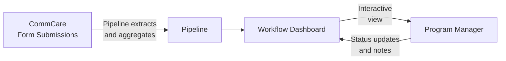

# Workflow Engine

The Workflow Engine lets program managers view configurable dashboards that pull live data directly from CommCare. Each workflow displays field worker performance metrics and supports drill-down into individual records, status tracking, and filtering.

---

## How Data Flows



**Pipelines** define what data to pull from CommCare and how to aggregate it — counts, sums, most recent values, percentages, and more. **Workflows** define what to display and how users interact with it.

---

## Finding Your Workflows

Click **Workflows** in the top navigation. You'll see a list of all workflows configured for your program.

Each row shows:

- Workflow name and type
- Last run time and data freshness
- Current status

Click any workflow to open its dashboard.

---

## Reading a Workflow Dashboard

A typical workflow dashboard shows a **table of field workers** with performance columns:

| Column type | What it shows                                |
| ----------- | -------------------------------------------- |
| Count       | Number of visits or activities in the period |
| Status      | Current enrollment or case status            |
| Last value  | Most recent recorded measurement             |
| Percentage  | Proportion of cases meeting a threshold      |

**Filtering and sorting:**

- Use the **date range picker** to focus on a specific period
- Click column headers to sort ascending or descending
- Use the **search box** to find a specific worker by name

**Drilling into a worker:**

Click any row to see that worker's detailed record — individual visit data, timeline of activities, and linked cases.

---

## Flags and Actions

### Flags column

Many per-opportunity reports include a **Flags** column. Flags are findings the system raises automatically based on the metrics — they represent concerns surfaced from the data, not judgments that a manager records manually.

When you open a report, the system reads the data and applies all relevant flags immediately on page load. There is nothing to click to trigger this — flags are already present by the time the dashboard is visible. A row with no concerns shows an em-dash (—).

Each active concern appears as a coloured pill in the Flags cell. The pill displays only the label text — there are no icons inside the pill. A row can carry more than one flag at the same time. Flag pills never break mid-phrase — the FLAGS column widens to fit the full label of whichever flags are active on that row.

### Actions column

Every row has an **Actions** column. What the Actions cell shows depends on whether an audit or task has already been created for that worker in the current run, and whether the run is still in progress or has been saved as completed.

**When no audit or task exists yet**, the cell shows two menu buttons: **Create Audit ▾** and **Create Task ▾**.

The dropdown menus display each option as an outlined button so every option is clearly clickable. The open menu has a coloured border and header band matching its trigger button — blue for **Create Audit**, purple for **Create Task** — so the menu is visually connected to the button that opened it.

**Menu positioning:** When a row is near the bottom of the screen, the Create Audit and Create Task dropdown menus open upward instead of downward, so the options are always fully visible and never hidden below the edge of the screen.

**Create Audit menu** always contains exactly two options:

- **New Audit** — opens a blank audit record for that worker
- **Audit Last 7 days** — opens an audit pre-scoped to the most recent seven days of that worker's visits

**Create Task menu** contains:

- **New Task** — opens a blank task record for that worker
- **Coach on Flag implications** — only appears when the row carries at least one flag; opens a coaching task whose prompt is composed from the specific flag labels active on that row, so the coaching prompt stays relevant whether the FLW tripped SAM-low, MAM-low, gender-skew, or any combination of those flags

**When an audit or task has already been created**, the create menus are replaced by plain links:

- **View Audit** — appears in place of the Create Audit menu when an audit already exists for that worker in this run; clicking it opens that audit record directly
- **View Task** — appears in place of the Create Task menu when a task already exists for that worker in this run; clicking it opens that task record directly

**On a completed (saved) run**, rows that have no existing audit or task show greyed-out, non-interactive Create Audit and Create Task buttons. A saved run is a historical record — no new work can be started from it. Rows that already produced an audit or task still show working **View Audit / View Task** links so you can always navigate back to those records.

This means the Actions cell always reflects the current state of the row: rows with no prior action offer the create menus (on an in-progress run) or greyed-out buttons (on a completed run), and rows where action has already been taken show direct links to those records. This applies whether you are viewing the current week's run or replaying a historical run.

### CHC Nutrition Analysis flags

The CHC Nutrition Analysis dashboard uses the following flag catalog:

| Flag                            | What it means                                                                                                                     |
| ------------------------------- | --------------------------------------------------------------------------------------------------------------------------------- |
| **SAM rate < 1%**               | The FLW's SAM case rate is below 1% — a signal they may be visiting easier-to-reach households and missing the most at-risk cases |
| **MAM rate < 3%**               | The FLW's MAM case rate is below 3% — same pattern as the SAM flag but for moderate acute malnutrition                            |
| **Gender split outside 40–60%** | The gender split of the FLW's caseload falls outside the 40–60% range, in either direction                                        |

!!! note "SAM/MAM flags signal too few at-risk cases, not too many"
These flags trigger when an FLW's rate is **below** the expected threshold. A very low SAM or MAM rate suggests the worker is not reaching the households most likely to have malnourished children, not that their caseload is unusually healthy.

!!! note "Flags appear immediately when opening a new weekly run"
    When you open a brand-new CHC Nutrition weekly review, auto-detected flags (SAM rate < 1%, MAM rate < 3%, gender split) appear on each row the moment the table loads. You do not need to reload the page to see the system's findings — they are ready as soon as the dashboard is visible.

---

## Workflow Statuses

Many workflows include a status column that tracks where a case is in a program process:

```mermaid
stateDiagram-v2
    [*] --> Active
    Active --> "Review Needed": Flag raised
    "Review Needed" --> "Action Taken": Intervention done
    "Action Taken" --> Closed: Case resolved
    Active --> Closed: Graduated
```

Program managers can update a case's status directly from the workflow view. Status changes are stored in Labs and visible to all team members with access to the program.

---

## Concluding a Run

When you are ready to save a run as complete, click **Conclude** on the workflow run. The system freezes exactly the dashboard you were looking at — the data already on your screen — and saves it as a locked historical record. Conclude never refetches or recomputes data behind your back, so on large opportunities it completes in seconds rather than waiting for a server-side rebuild.

!!! note "Make sure the dashboard has finished loading before you conclude"
    Because Conclude saves what is on screen, the dashboard must be fully loaded before you click the button. If the page is still loading data when you click Conclude, you will see a message asking you to reload the run page, let the dashboard finish loading, and then conclude again. This ensures the snapshot captures a complete picture rather than a partial one.

When a run is concluded, the snapshot captures what **that workflow** is currently set up to track at the time you click Conclude. This means:

- If your team has added new data pipelines or tracking fields to the workflow since it was first created, those additions will be included in the snapshot — as long as the workflow's manifest has been updated to reflect them.
- Workflows that were built from scratch rather than from a starter template can also use the conclude-and-save flow in the same way.

!!! note "Keeping snapshots current after workflow changes"
    If your program administrator adds new pipelines or columns to a workflow, those changes will appear in future concluded runs automatically once the workflow's manifest is updated. Runs that were already concluded before the change are unaffected — they remain exactly as they were saved.

!!! note "If Conclude fails with a template error"
    In rare cases — most commonly seen on MBW Auditing workflows — Conclude may show an error such as *"Failed to complete run: Workflow has no template_type; cannot resolve completion handler."* This happens when the workflow's internal definition is missing its template link.

    The system now recovers from this automatically: if the workflow's name matches a known template, Conclude will succeed and the workflow will repair itself in the process. If the name does not match any known template, the error message will tell you exactly what needs to be corrected. In that case, contact your program administrator or post in **#connect-labs** with the workflow name and run number so the link can be restored.

!!! note "If Conclude fails with a snapshot size error"
    On very large opportunities, Conclude may show an error indicating the snapshot is too large to save. This is a safeguard to protect system stability. Contact your program administrator or post in **#connect-labs** with the workflow name and run number so the snapshot scope can be reviewed and adjusted.

---

## Starter Templates

Labs includes pre-built workflow templates for common program types. Your program administrator can create a workflow from any of these templates and configure it for your opportunity.

| Template                              | Best for                                                                                                                    |
| ------------------------------------- | --------------------------------------------------------------------------------------------------------------------------- |
| **KMC Longitudinal**                  | Kangaroo Mother Care — tracking cases over time                                                                             |
| **KMC FLW Flags**                     | Flag workers needing supervisory follow-up                                                                                  |
| **KMC Project Metrics**               | Program-level KPIs and summary statistics                                                                                   |
| **MBW Monitoring**                    | Mother and baby wellness visit tracking                                                                                     |
| **Performance Review**                | FLW performance compared across programs                                                                                    |
| **SAM Follow-up**                     | Severe acute malnutrition case management                                                                                   |
| **OCS Outreach**                      | Community health outreach tracking                                                                                          |
| **Bulk Image Audit**                  | Image-based QA combined with workflow status                                                                                |
| **CHC Nutrition Analysis**            | Community health centre nutrition program monitoring                                                                        |
| **MBW Auditing V4**                   | MBW audit reviews with flag and task workflow                                                                               |
| **MBW Auditing V5**                   | MBW audit reviews — faster loads and preserved runs                                                                         |
| **Program Admin Report**              | Cross-opportunity compliance view for program admins                                                                        |
| **Verified Monitoring**               | Funder-facing view of independently-surveyed program coverage, contrasting implementer-reported and verified results        |
| **LLO Weekly FLW Review**             | Weekly per-FLW KPI scorecard for LLO programs                                                                               |
| **Connect Interviews Reporting V2**   | Live funnel dashboard showing Triggered / Started / Completed counts per interview for any cohort                           |

---

## Creating and Customizing Workflows

This section is for program administrators and technical staff who want to build or adapt a workflow for their program. End users who just want to read a workflow dashboard don't need to read this section.

### Templates vs. Instances

Every workflow you see in Labs is an **instance** — a copy attached to a specific CommCare opportunity. Instances are created from **templates**, which are reusable blueprints.

- A **template** never runs on its own. It defines the SQL pipelines and display logic that will be applied when a workflow is created for an opportunity.
- An **instance** is what you see in the Workflows list: a template applied to one opportunity, with real data flowing through it.

The recommended starting point: pick the closest existing template from the [Starter Templates](#starter-templates) list, have Claude Code derive a new template from it, deploy it to Labs, then create an instance for your opportunity.

### How Data Gets into a Workflow

All workflows follow the same core pattern — the same approach Superset uses:

1. CommCare form submissions are synced into a Connect Labs SQL database.
2. **Pipelines** run JSON-based SQL queries against that data to extract and aggregate it — one row per visit, one row per FLW, counts, percentages, and more.
3. The **workflow dashboard** renders the query results and lets users interact with them.

All aggregation belongs in SQL. If Claude Code ever suggests doing aggregation in Python instead, that is a signal the session has gone off track — ask in **#connect-labs** before continuing. Because the pipelines use the same JSON query approach as Superset, you can paste a pipeline's SQL directly into Superset to debug it if something looks wrong.

The `custom_analysis/` section of Labs predates the workflow engine. Most of those dashboards could now be rebuilt as workflows. Write custom Django or Python only for a genuinely complex multi-step UI — and even then, the better answer is usually to split the work into multiple simpler workflows.

### Snapshot contracts and workflow definitions

When a run is concluded, the snapshot is built from what the user **sees on screen at the moment they click Conclude** — the dashboard's cached data, scoped to what the workflow's manifest declares it tracks. The system never refetches or recomputes data during the conclude step itself. This means the workflow's own manifest is the source of truth for what is captured, and the screen state at conclude time is the source of truth for the values saved.

Practical implications for administrators:

- **Adding pipelines or fields to an existing workflow** — update the workflow's manifest to include them. Future concluded runs will capture the new data. Runs already concluded are unaffected.
- **Workflows not built from a template** — custom-built workflows that were created from scratch can use the conclude-and-save-baseline flow in exactly the same way as template-based workflows. There is no requirement to link a workflow back to a starter template for Conclude to work.
- **Removing pipelines or fields** — if you remove something from the manifest, it will no longer appear in future snapshots. Review the manifest carefully before removing anything that historical comparisons may depend on.
- **Snapshot size** — the system rejects snapshots that exceed a safe size limit and returns an explanatory error rather than crashing. If you hit this limit, reduce the scope of what the workflow captures or contact **#connect-labs** for guidance.

### Program Admin Report

The **Program Admin Report** template gives program administrators a cross-opportunity compliance rollup — flags, audits, and tasks aggregated across all opportunities the admin is watching.

**While the run is live**, the report does not fill in automatically on page load. Instead, click the **Refresh data** button to pull the latest flags, audits, and tasks from all watched opportunities into the report on demand. You can refresh as many times as you like during the run. Each refresh overwrites the previous live snapshot with the most current data.

**Concluding the run** freezes exactly what is on screen at that moment — the same conclude-and-save flow used by all other workflow templates. Once concluded, the run is a locked historical record and the Refresh data button is no longer active.

### Verified Monitoring dashboard

The **Verified Monitoring** template is designed for programs that commission independent surveys to verify their own coverage numbers — for example, a vitamin-A home-visit program where an outside team surveys households to confirm whether a visit actually occurred.

The dashboard leads with the finding a funder can actually rely on: **independent verification**. The headline panel shows a single gap chart with a one-line plain-English summary — for example, *"The implementer reported 88.0% coverage; an independent rooftop survey verified 68.1% (95% CI ±5.4) — a 19.9-point overstatement."* The verified figure, the self-reported figure, and the gap between them are each clearly labelled so nothing requires interpretation.

The treatment-vs-comparison ward section is presented below the headline and is explicitly labelled as **descriptive**. A note on that section states that the comparison ward is an observational neighbour, not a randomised control, so the dashboard never implies a causal-impact claim its design cannot support. Any technical terms (such as confidence interval) are glossed in plain English the first time they appear, and the survey's data quality indicators are labelled as exactly that — survey quality — rather than being left as unexplained numbers.

The dashboard presents results neutrally and lets the viewer draw their own conclusions. Everything it shows is read from its saved run state — it never fetches live data during a viewing session, so every viewing of the same run produces exactly the same screen.
