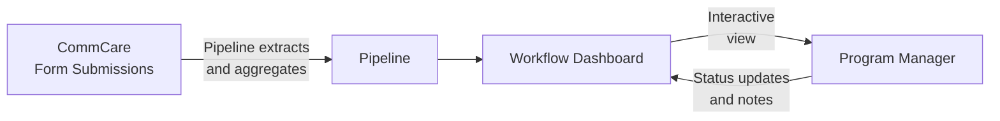

# Workflow Engine

The Workflow Engine lets program managers view configurable dashboards that pull live data directly from CommCare. Each workflow displays field worker performance metrics and supports drill-down into individual records, status tracking, and filtering.

---

## How Data Flows



**Pipelines** define what data to pull from CommCare and how to aggregate it — counts, sums, most recent values, percentages, and more. **Workflows** define what to display and how users interact with it.

---

## Finding Your Workflows

Click **Workflows** in the top navigation. You'll see a list of all workflows configured for your program.

Each row shows:

- Workflow name and type
- Last run time and data freshness
- Current status

Click any workflow to open its dashboard.

---

## Reading a Workflow Dashboard

A typical workflow dashboard shows a **table of field workers** with performance columns:

| Column type | What it shows                                |
| ----------- | -------------------------------------------- |
| Count       | Number of visits or activities in the period |
| Status      | Current enrollment or case status            |
| Last value  | Most recent recorded measurement             |
| Percentage  | Proportion of cases meeting a threshold      |

**Filtering and sorting:**

- Use the **date range picker** to focus on a specific period
- Click column headers to sort ascending or descending
- Use the **search box** to find a specific worker by name

**Drilling into a worker:**

Click any row to see that worker's detailed record — individual visit data, timeline of activities, and linked cases.

---

## Flags and Actions

### Flags column

Many per-opportunity reports include a **Flags** column. Flags are findings the system raises automatically based on the metrics — they represent concerns surfaced from the data, not judgments that a manager records manually.

When you open a report, the system reads the data and applies all relevant flags immediately on page load. There is nothing to click to trigger this — flags are already present by the time the dashboard is visible. A row with no concerns shows an em-dash (—).

Each active concern appears as a coloured pill in the Flags cell. The pill displays only the label text — there are no icons inside the pill. A row can carry more than one flag at the same time. Flag pills never break mid-phrase — the FLAGS column widens to fit the full label of whichever flags are active on that row.

### Actions column

Every row has an **Actions** column. What the Actions cell shows depends on whether an audit or task has already been created for that worker in the current run, and whether the run is still in progress or has been saved as completed.

**When no audit or task exists yet**, the cell shows two menu buttons: **Create Audit ▾** and **Create Task ▾**.

The dropdown menus display each option as an outlined button so every option is clearly clickable. The open menu has a coloured border and header band matching its trigger button — blue for **Create Audit**, purple for **Create Task** — so the menu is visually connected to the button that opened it.

**Menu positioning:** When a row is near the bottom of the screen, the Create Audit and Create Task dropdown menus open upward instead of downward, so the options are always fully visible and never hidden below the edge of the screen.

**Create Audit menu** always contains exactly two options:

- **New Audit** — opens a blank audit record for that worker
- **Audit Last 7 days** — opens an audit pre-scoped to the most recent seven days of that worker's visits

**Create Task menu** contains:

- **New Task** — opens a blank task record for that worker
- **Coach on Flag implications** — only appears when the row carries at least one flag; opens a coaching task whose prompt is composed from the specific flag labels active on that row, so the coaching prompt stays relevant whether the FLW tripped SAM-low, MAM-low, gender-skew, or any combination of those flags

**When an audit or task has already been created**, the create menus are replaced by plain links:

- **View Audit** — appears in place of the Create Audit menu when an audit already exists for that worker in this run; clicking it opens that audit record directly
- **View Task** — appears in place of the Create Task menu when a task already exists for that worker in this run; clicking it opens that task record directly

**On a completed (saved) run**, rows that have no existing audit or task show greyed-out, non-interactive Create Audit and Create Task buttons. A saved run is a historical record — no new work can be started from it. Rows that already produced an audit or task still show working **View Audit / View Task** links so you can always navigate back to those records.

This means the Actions cell always reflects the current state of the row: rows with no prior action offer the create menus (on an in-progress run) or greyed-out buttons (on a completed run), and rows where action has already been taken show direct links to those records. This applies whether you are viewing the current week's run or replaying a historical run.

### CHC Nutrition Analysis flags

The CHC Nutrition Analysis dashboard uses the following flag catalog:

| Flag                            | What it means                                                                                                                     |
| ------------------------------- | --------------------------------------------------------------------------------------------------------------------------------- |
| **SAM rate < 1%**               | The FLW's SAM case rate is below 1% — a signal they may be visiting easier-to-reach households and missing the most at-risk cases |
| **MAM rate < 3%**               | The FLW's MAM case rate is below 3% — same pattern as the SAM flag but for moderate acute malnutrition                            |
| **Gender split outside 40–60%** | The gender split of the FLW's caseload falls outside the 40–60% range, in either direction                                        |

!!! note "SAM/MAM flags signal too few at-risk cases, not too many"
These flags trigger when an FLW's rate is **below** the expected threshold. A very low SAM or MAM rate suggests the worker is not reaching the households most likely to have malnourished children, not that their caseload is unusually healthy.

!!! note "Flags appear immediately when opening a new weekly run"
    When you open a brand-new CHC Nutrition weekly review, auto-detected flags (SAM rate < 1%, MAM rate < 3%, gender split) appear on each row the moment the table loads. You do not need to reload the page to see the system's findings — they are ready as soon as the dashboard is visible.

---

## Workflow Statuses

Many workflows include a status column that tracks where a case is in a program process:

```mermaid
stateDiagram-v2
    [*] --> Active
    Active --> "Review Needed": Flag raised
    "Review Needed" --> "Action Taken": Intervention done
    "Action Taken" --> Closed: Case resolved
    Active --> Closed: Graduated
```

Program managers can update a case's status directly from the workflow view. Status changes are stored in Labs and visible to all team members with access to the program.

---

## Starter Templates

Labs includes pre-built workflow templates for common program types. Your program administrator can create a workflow from any of these templates and configure it for your opportunity.

| Template                   | Best for                                             |
| -------------------------- | ---------------------------------------------------- |
| **KMC Longitudinal**       | Kangaroo Mother Care — tracking cases over time      |
| **KMC FLW Flags**          | Flag workers needing supervisory follow-up           |
| **KMC Project Metrics**    | Program-level KPIs and summary statistics            |
| **MBW Monitoring**         | Mother and baby wellness visit tracking              |
| **Performance Review**     | FLW performance compared across programs             |
| **SAM Follow-up**          | Severe acute malnutrition case management            |
| **OCS Outreach**           | Community health outreach tracking                   |
| **Bulk Image Audit**       | Image-based QA combined with workflow status         |
| **CHC Nutrition Analysis** | Community health centre nutrition program monitoring |
| **MBW Auditing V4**        | MBW audit reviews with flag and task workflow        |
| **MBW Auditing V5**        | MBW audit reviews — faster loads and preserved runs  |
| **Program Admin Report**   | Cross-opportunity compliance view for program admins |

---

## Creating and Customizing Workflows

This section is for program administrators and technical staff who want to build or adapt a workflow for their program. End users who just want to read a workflow dashboard don't need to read this section.

### Templates vs. Instances

Every workflow you see in Labs is an **instance** — a copy attached to a specific CommCare opportunity. Instances are created from **templates**, which are reusable blueprints.

- A **template** never runs on its own. It defines the SQL pipelines and display logic that will be applied when a workflow is created for an opportunity.
- An **instance** is what you see in the Workflows list: a template applied to one opportunity, with real data flowing through it.

The recommended starting point: pick the closest existing template from the [Starter Templates](#starter-templates) list, have Claude Code derive a new template from it, deploy it to Labs, then create an instance for your opportunity.

### How Data Gets into a Workflow

All workflows follow the same core pattern — the same approach Superset uses:

1. CommCare form submissions are synced into a Connect Labs SQL database.
2. **Pipelines** run JSON-based SQL queries against that data to extract and aggregate it — one row per visit, one row per FLW, counts, percentages, and more.
3. The **workflow dashboard** renders the query results and lets users interact with them.

All aggregation belongs in SQL. If Claude Code ever suggests doing aggregation in Python instead, that is a signal the session has gone off track — ask in **#connect-labs** before continuing. Because the pipelines use the same JSON query approach as Superset, you can paste a pipeline's SQL directly into Superset to debug it if something looks wrong.

The `custom_analysis/` section of Labs predates the workflow engine. Most of those dashboards could now be rebuilt as workflows. Write custom Django or Python only for a genuinely complex multi-step UI — and even then, the better answer is usually to split the work into multiple simpler workflows.

### Generating Demo or Test Data from a Real Opportunity

If you need realistic data for testing, training, or demonstrations, Labs can generate a **synthetic dataset** based on the statistical profile of an existing opportunity — without any real patient data leaving the server.

This works by analysing the shape and distribution of real data (record counts, visit patterns, field value ranges, and so on) and producing a synthetic dataset that looks realistic but contains no actual records. The result can be used to populate a test workflow instance so you can demonstrate the dashboard or validate a new template without using live data.

Synthetic opportunities now support the complete program management loop, not just the dashboard view. This means a demo can include:

- **Audit drill-downs with MUAC photos** — so stakeholders can see what an image-based quality audit looks like end to end.
- **Task follow-ups** — showing how supervisors assign and track corrective actions after a flagged visit.
- **OCS coaching transcripts** — demonstrating the outreach coaching conversation flow within the synthetic opportunity.

This makes synthetic data suitable for full stakeholder and funder demonstrations without any real patient data being used.

#### Live manager-flow demos

If you want to record a walkthrough that shows a network manager actually conducting a weekly review — rather than clicking through a pre-decided run — you can request the **in-progress last week** seed flag when setting up a synthetic opportunity. When this flag is enabled:

- The most recent week's run is left in an **in-progress** state with no decisions, audits, or tasks already filled in.
- The manager performing the walkthrough makes real decisions during the recording, so the demo looks and feels like a genuine live review rather than a replay.

While the run is in progress, the manager has access to the full set of live actions in the dashboard:

- **Mark all No Issue** — a toolbar button displayed above the table (next to the table title) that bulk-clears all rows in one click, for cases where the manager wants to sign off on the whole cohort at once.
- **Mark No Issue** — a per-row button to approve an individual field worker without raising a flag. After clicking either the bulk or per-row button, the Decision column fills in with a green **No Issues** pill and the Actions cell for that row is cleared.
- **Create Audit** — opens an audit record with 5 unreviewed photos for that worker. The manager reviews each photo, passes or flags it, and then clicks **Complete Image Review** to record the verdict. The audit opens in an unreviewed state so the walkthrough shows the full review process rather than landing on an already-finished record.
- **Create Task with Coaching** — opens the **Initiate AI Assistant** modal on the task page, the same modal a real OCS user sees. The task page shows a short, readable description of what the coaching task is about. The prompt is framed as an instruction to the assistant — for example, "Coach [worker] about this week's nutrition screening. The report flagged: … A suspiciously low SAM/MAM rate usually means …" — and is rendered as a distinct **Instructions to assistant** banner above the conversation, separate from the assistant's own opening line. The full prompt is also pre-filled in the modal's prompt field, where the manager can read or edit it before clicking **Initiate AI** to start the coaching conversation.

All four actions are only available while the run is in an **in-progress** state. Once the run is concluded it becomes read-only, so the buttons are no longer shown — rows without an existing audit or task show greyed-out, non-interactive buttons, while rows that already produced an audit or task still show working **View Audit / View Task** links.

This is useful for training videos, funder demonstrations, or onboarding walkthroughs where you want the reviewer's actions to be part of the story. Ask your program administrator or raise a request in **#connect-labs** and specify that you need an in-progress run for the most recent week.

To use synthetic data capabilities, ask your program administrator or raise a request in **#connect-labs**. You will need to specify which opportunity to base the profile on and where the synthetic data should be loaded.

!!! note "No real data is used in the output"
    The synthetic profile captures statistical patterns only — it does not copy, export, or store any individual patient or field worker records. The generated data is entirely artificial.

!!! note "Nutrition metrics and other program-specific fields in synthetic data"
    Fields such as MUAC measurements, gender, and health status will now appear correctly in synthetic datasets used with the CHC Nutrition Analysis dashboard and similar templates. Previously, if a workflow's configuration used field paths that differed slightly from how CommCare named those questions in its app schema, those fields were silently left blank in the generated data — producing empty columns in the dashboard. This has been corrected, and synthetic data will now populate all fields specified in the workflow configuration.

!!! note "CHC Nutrition Analysis synthetic data and flag direction"
    Synthetic datasets for the CHC Nutrition Analysis dashboard now generate realistic SAM and MAM distributions that match the flag direction used in the live dashboard. Clean FLWs receive baseline SAM/MAM rates that sit comfortably above the flag thresholds, while FLWs meant to represent cherry-picking behaviour receive near-zero SAM/MAM rates that trigger the **SAM rate < 1%** and **MAM rate < 3%** flags as expected. If you re-seed an older CHC Nutrition Analysis demo, the FLW flagging pattern will change to reflect this corrected logic — the previously clean-looking FLWs will no longer auto-flag, and the intended problem FLWs will now flag correctly.

### MBW Auditing V5 — Tab 3 layout

The third tab of the **MBW Auditing V5** dashboard is laid out in two sections, in this order:

1. **Follow-up metrics table** — appears first, under the heading "Follow-up metrics based on latest performance categories set for each FLW." This table shows the per-FLW follow-up data broken down by their current performance category.

2. **% mothers still eligible to receive 5+ visits chart** — appears below the table. This chart plots the percentage of mothers still eligible to receive five or more visits over time, with two lines:
    - **Green line** — FLWs marked eligible for renewal
    - **Yellow line** — FLWs marked as requiring improvement

The chart shows only the eligibility percentage lines. Follow-up rate lines and the focused view chart that appeared in earlier versions of this tab have been removed.

The chart begins with a **February 2026 baseline bar** showing 100% of FLWs as eligible for renewal (green). This bar reflects the starting state before the first official auditing run in March 2026, when all FLWs were considered eligible. Subsequent months show the eligibility percentages as weekly audit runs produce performance categories.

!!! note "If you previously saw additional lines on this chart"
    Earlier versions of the Tab 3 chart included solid follow-up rate
