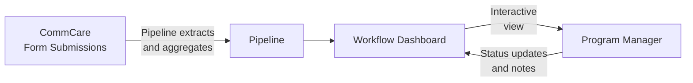

# Workflow Engine

The Workflow Engine lets program managers view configurable dashboards that pull live data directly from CommCare. Each workflow displays field worker performance metrics and supports drill-down into individual records, status tracking, and filtering.

---

## How Data Flows



**Pipelines** define what data to pull from CommCare and how to aggregate it — counts, sums, most recent values, percentages, and more. **Workflows** define what to display and how users interact with it.

---

## Finding Your Workflows

Click **Workflows** in the top navigation. You'll see a list of all workflows configured for your program.

Each row shows:

- Workflow name and type
- Last run time and data freshness
- Current status

Click any workflow to open its dashboard.

---

## Reading a Workflow Dashboard

A typical workflow dashboard shows a **table of field workers** with performance columns:

| Column type | What it shows                                |
| ----------- | -------------------------------------------- |
| Count       | Number of visits or activities in the period |
| Status      | Current enrollment or case status            |
| Last value  | Most recent recorded measurement             |
| Percentage  | Proportion of cases meeting a threshold      |

**Filtering and sorting:**

- Use the **date range picker** to focus on a specific period
- Click column headers to sort ascending or descending
- Use the **search box** to find a specific worker by name

**Drilling into a worker:**

Click any row to see that worker's detailed record — individual visit data, timeline of activities, and linked cases.

---

## Flags and Actions

### Flags column

Many per-opportunity reports include a **Flags** column. Flags are findings the system raises automatically based on the metrics — they represent concerns surfaced from the data, not judgments that a manager records manually.

When you open a report, the system reads the data and applies all relevant flags immediately on page load. There is nothing to click to trigger this — flags are already present by the time the dashboard is visible. A row with no concerns shows an em-dash (—).

Each active concern appears as a coloured pill in the Flags cell. The pill displays only the label text — there are no icons inside the pill. A row can carry more than one flag at the same time. Flag pills never break mid-phrase — the FLAGS column widens to fit the full label of whichever flags are active on that row.

### Actions column

Every row has an **Actions** column. What the Actions cell shows depends on whether an audit or task has already been created for that worker in the current run, and whether the run is still in progress or has been saved as completed.

**When no audit or task exists yet**, the cell shows two menu buttons: **Create Audit ▾** and **Create Task ▾**.

The dropdown menus display each option as an outlined button so every option is clearly clickable. The open menu has a coloured border and header band matching its trigger button — blue for **Create Audit**, purple for **Create Task** — so the menu is visually connected to the button that opened it.

**Menu positioning:** When a row is near the bottom of the screen, the Create Audit and Create Task dropdown menus open upward instead of downward, so the options are always fully visible and never hidden below the edge of the screen.

**Create Audit menu** always contains exactly two options:

- **New Audit** — opens a blank audit record for that worker
- **Audit Last 7 days** — opens an audit pre-scoped to the most recent seven days of that worker's visits

**Create Task menu** contains:

- **New Task** — opens a blank task record for that worker
- **Coach on Flag implications** — only appears when the row carries at least one flag; opens a coaching task whose prompt is composed from the specific flag labels active on that row, so the coaching prompt stays relevant whether the FLW tripped SAM-low, MAM-low, gender-skew, or any combination of those flags

**When an audit or task has already been created**, the create menus are replaced by plain links:

- **View Audit** — appears in place of the Create Audit menu when an audit already exists for that worker in this run; clicking it opens that audit record directly
- **View Task** — appears in place of the Create Task menu when a task already exists for that worker in this run; clicking it opens that task record directly

**On a completed (saved) run**, rows that have no existing audit or task show greyed-out, non-interactive Create Audit and Create Task buttons. A saved run is a historical record — no new work can be started from it. Rows that already produced an audit or task still show working **View Audit / View Task** links so you can always navigate back to those records.

This means the Actions cell always reflects the current state of the row: rows with no prior action offer the create menus (on an in-progress run) or greyed-out buttons (on a completed run), and rows where action has already been taken show direct links to those records. This applies whether you are viewing the current week's run or replaying a historical run.

### CHC Nutrition Analysis flags

The CHC Nutrition Analysis dashboard uses the following flag catalog:

| Flag                            | What it means                                                                                                                     |
| ------------------------------- | --------------------------------------------------------------------------------------------------------------------------------- |
| **SAM rate < 1%**               | The FLW's SAM case rate is below 1% — a signal they may be visiting easier-to-reach households and missing the most at-risk cases |
| **MAM rate < 3%**               | The FLW's MAM case rate is below 3% — same pattern as the SAM flag but for moderate acute malnutrition                            |
| **Gender split outside 40–60%** | The gender split of the FLW's caseload falls outside the 40–60% range, in either direction                                        |

!!! note "SAM/MAM flags signal too few at-risk cases, not too many"
These flags trigger when an FLW's rate is **below** the expected threshold. A very low SAM or MAM rate suggests the worker is not reaching the households most likely to have malnourished children, not that their caseload is unusually healthy.

!!! note "Flags appear immediately when opening a new weekly run"
    When you open a brand-new CHC Nutrition weekly review, auto-detected flags (SAM rate < 1%, MAM rate < 3%, gender split) appear on each row the moment the table loads. You do not need to reload the page to see the system's findings — they are ready as soon as the dashboard is visible.

---

## Workflow Statuses

Many workflows include a status column that tracks where a case is in a program process:

```mermaid
stateDiagram-v2
    [*] --> Active
    Active --> "Review Needed": Flag raised
    "Review Needed" --> "Action Taken": Intervention done
    "Action Taken" --> Closed: Case resolved
    Active --> Closed: Graduated
```

Program managers can update a case's status directly from the workflow view. Status changes are stored in Labs and visible to all team members with access to the program.

---

## Starter Templates

Labs includes pre-built workflow templates for common program types. Your program administrator can create a workflow from any of these templates and configure it for your opportunity.

| Template                   | Best for                                             |
| -------------------------- | ---------------------------------------------------- |
| **KMC Longitudinal**       | Kangaroo Mother Care — tracking cases over time      |
| **KMC FLW Flags**          | Flag workers needing supervisory follow-up           |
| **KMC Project Metrics**    | Program-level KPIs and summary statistics            |
| **MBW Monitoring**         | Mother and baby wellness visit tracking              |
| **Performance Review**     | FLW performance compared across programs             |
| **SAM Follow-up**          | Severe acute malnutrition case management            |
| **OCS Outreach**           | Community health outreach tracking                   |
| **Bulk Image Audit**       | Image-based QA combined with workflow status         |
| **CHC Nutrition Analysis** | Community health centre nutrition program monitoring |
| **MBW Auditing V4**        | MBW audit reviews with flag and task workflow        |
| **MBW Auditing V5**        | MBW audit reviews — faster loads and preserved runs  |
| **Program Admin Report**   | Cross-opportunity compliance view for program admins |
| **Verified Monitoring**    | Funder-facing view of independently-surveyed program coverage, contrasting implementer-reported and verified results |
| **LLO Weekly FLW Review**  | Weekly per-FLW KPI scorecard for LLO programs        |

---

## Creating and Customizing Workflows

This section is for program administrators and technical staff who want to build or adapt a workflow for their program. End users who just want to read a workflow dashboard don't need to read this section.

### Templates vs. Instances

Every workflow you see in Labs is an **instance** — a copy attached to a specific CommCare opportunity. Instances are created from **templates**, which are reusable blueprints.

- A **template** never runs on its own. It defines the SQL pipelines and display logic that will be applied when a workflow is created for an opportunity.
- An **instance** is what you see in the Workflows list: a template applied to one opportunity, with real data flowing through it.

The recommended starting point: pick the closest existing template from the [Starter Templates](#starter-templates) list, have Claude Code derive a new template from it, deploy it to Labs, then create an instance for your opportunity.

### How Data Gets into a Workflow

All workflows follow the same core pattern — the same approach Superset uses:

1. CommCare form submissions are synced into a Connect Labs SQL database.
2. **Pipelines** run JSON-based SQL queries against that data to extract and aggregate it — one row per visit, one row per FLW, counts, percentages, and more.
3. The **workflow dashboard** renders the query results and lets users interact with them.

All aggregation belongs in SQL. If Claude Code ever suggests doing aggregation in Python instead, that is a signal the session has gone off track — ask in **#connect-labs** before continuing. Because the pipelines use the same JSON query approach as Superset, you can paste a pipeline's SQL directly into Superset to debug it if something looks wrong.

The `custom_analysis/` section of Labs predates the workflow engine. Most of those dashboards could now be rebuilt as workflows. Write custom Django or Python only for a genuinely complex multi-step UI — and even then, the better answer is usually to split the work into multiple simpler workflows.

### Verified Monitoring dashboard

The **Verified Monitoring** template is designed for programs that commission independent surveys to verify their own coverage numbers — for example, a vitamin-A home-visit program where an outside team surveys households to confirm whether a visit actually occurred.

The dashboard leads with the finding a funder can actually rely on: **independent verification**. The headline panel shows a single gap chart with a one-line plain-English summary — for example, *"The implementer reported 88.0% coverage; an independent rooftop survey verified 68.1% (95% CI ±5.4) — a 19.9-point overstatement."* The verified figure, the self-reported figure, and the gap between them are each clearly labelled so nothing requires interpretation.

The treatment-vs-comparison ward section is presented below the headline and is explicitly labelled as **descriptive**. A note on that section states that the comparison ward is an observational neighbour, not a randomised control, so the dashboard never implies a causal-impact claim its design cannot support. Any technical terms (such as confidence interval) are glossed in plain English the first time they appear, and the survey's data quality indicators are labelled as exactly that — survey quality — rather than being left as unexplained numbers.

The dashboard presents results neutrally and lets the viewer draw their own conclusions. Everything it shows is read from its saved run state — it never fetches live data during a viewing session, so every viewing of the same run produces exactly the same screen.

A single screen contains four panels:

- **Verification headline panel** — the gap chart and plain-English summary described above; this is the first thing a viewer sees.
- **Per-ward coverage table** — one row per ward, showing verified coverage for a treatment ward and an adjacent comparison ward (labelled observational, not a randomised control). Each row includes per-round sparklines and a neutral "measured difference" figure between the two wards.
- **Six-round bi-monthly trend chart** — tracks verified coverage across up to six survey rounds, showing how coverage has moved over time.
- **Two-ward map** — the program's own logged service-delivery visits are shown as a layer of solid, larger green dots that saturate the intervention ward; the control ward remains visibly free of green, so a funder can see the delivery gap at a glance. Independent survey points are drawn as faint, smaller pins on a separate layer, keeping the two types of data visually distinct. The map is drawn over a real CARTO basemap of Kaduna State, Nigeria, so actual administrative boundaries and real place names (Kafanchan, Manchok, and the two programme wards — Kaura and Gedawa) are visible underneath the data layers. Independent survey pins can be toggled on top of the delivery layer to show where verifying interviews took place. Labels use funder-plain language rather than technical field names.

**Reading the per-surveyor GPS drill-down:** When you expand a surveyor's row to inspect their GPS data, the distance column displays as a bar chart anchored to each household and scaled to metres — not as a plain table. This makes it easy to compare distances at a glance without interpreting raw numbers.

**Scrolling and sticky headers:** The scorecard and back-check sections each keep their header row visible as you scroll. The headers are positioned so they remain fully visible and are not obscured by the sticky top navigation bar.

**Back-check method tooltip:** Clicking the info icon next to the back-check method label opens a tooltip beside the icon. The tooltip does not cover the re-survey rows it is explaining, so you can read the method description and the data at the same time.

### LLO Weekly FLW Review dashboard

The **LLO Weekly FLW Review** template provides a weekly per-FLW KPI scorecard for LLO programs. Each row shows a field worker's key performance indicators for the current week.

!!! note "KPI cells show real numbers, not dashes"
    If you previously saw every KPI cell display as a dash ("—") for all field workers, this has been fixed. The scorecard now shows the actual figures for each worker both while a review is in progress and after it is marked complete. Completed runs also preserve those numbers in their saved snapshot, so historical reviews remain readable.

### Generating Demo or Test Data from a Real Opportunity

If you need realistic data for testing, training, or demonstrations, Labs can generate a **synthetic dataset** based on the statistical profile of an existing opportunity — without any real patient data leaving the server.

This works by analysing the shape and distribution of real data (record counts, visit patterns, field value ranges, and so on) and producing a synthetic dataset that looks realistic but contains no actual records. The result can be used to populate a test workflow instance so you can demonstrate the dashboard or validate a new template without using live data.

Synthetic opportunities now support the complete program management loop, not just the dashboard view. This means a demo can include:

- **Audit drill-downs with MUAC photos** — so stakeholders can see what an image-based quality audit looks like end to end.
- **Task follow-ups** — showing how supervisors assign and track corrective actions after a flagged visit.
- **OCS coaching transcripts** — demonstrating the outreach coaching conversation flow within the synthetic opportunity.

This makes synthetic data suitable for full stakeholder and funder demonstrations without any real patient data being used.

#### Binary-outcome fields in synthetic data

The synthetic-data generator supports a **binary-outcome field** type for yes/no or present/absent fields whose positive rate should vary by survey round or time period.

When you request a synthetic dataset for a dashboard that includes a binary outcome — for example, a "household confirmed visit" field in a Verified Monitoring demo — you can specify a per-period positive rate for that field. The generator will produce values that match the requested rate in each period, so coverage trends and differences between groups (such as treatment vs. comparison ward) appear realistic across rounds rather than being drawn from a single flat rate.

This is useful for any template where a key metric is a proportion that changes over time, not just a static count.

#### Live manager-flow demos

If you want to record a walkthrough that shows a network manager actually conducting a weekly review — rather than clicking through a pre-decided run — you can request the **in-progress last week** seed flag when setting up a synthetic opportunity. When this flag is enabled:

- The most recent week's run is left in an **in-progress** state with no decisions, audits, or tasks already filled in.
- The manager performing the walkthrough makes real decisions during the recording, so the demo looks and feels like a genuine live review rather than a replay.
- The recording keeps the full CommCare Connect UI in frame — the top bar, navigation, and breadcrumb are visible — so the demo reads unmistakably as running inside Connect
