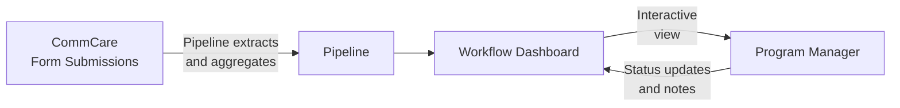

# Workflow Engine

The Workflow Engine lets program managers view configurable dashboards that pull live data directly from CommCare. Each workflow displays field worker performance metrics and supports drill-down into individual records, status tracking, and filtering.

---

## How Data Flows



**Pipelines** define what data to pull from CommCare and how to aggregate it — counts, sums, most recent values, percentages, and more. **Workflows** define what to display and how users interact with it.

---

## Finding Your Workflows

Click **Workflows** in the top navigation. You'll see a list of all workflows configured for your program.

Each row shows:

- Workflow name and type
- Last run time and data freshness
- Current status

Click any workflow to open its dashboard.

---

## Opening a Workflow Run from a Link

If someone shares a direct link to a workflow run, the system will open it automatically — you do not need to select the opportunity from a context picker first. The run page reads the opportunity from the link and goes straight to the dashboard.

If a link was copy-pasted with extra text accidentally appended to it (for example, `?opportunity_id=1251 stacked bar chart`), the system will still recover the correct opportunity and clean up the address bar so everything works normally from that point on.

If the opportunity genuinely cannot be determined from the link, you will see a message explaining exactly what the system could not read, so it is clear the link itself is the problem rather than your access or context settings.

If the workflow belongs to an opportunity you are not a member of, you will see a message telling you exactly that — for example, *"This workflow belongs to opportunity 1251, which isn't one of your opportunities. Ask whoever shared it to give you access, then reopen the link."* This is different from a broken link: the link is valid, but you need to be added to that opportunity before you can open it. Contact whoever shared the link and ask them to give you access.

If the workflow cannot be loaded at all — for example, because your account has no opportunities listed or you are not a member of the organisation that owns the workflow — you will see a clear message such as: *"This workflow couldn't be loaded for opportunity 1251. You may not have access to that opportunity, or the workflow may have been removed. Ask whoever shared the link to confirm you have access to its opportunity."* If you see this, contact whoever shared the link and ask them to confirm your access. You will not see a raw technical error or an internal web address.

---

## Reading a Workflow Dashboard

A typical workflow dashboard shows a **table of field workers** with performance columns:

| Column type | What it shows                                |
| ----------- | -------------------------------------------- |
| Count       | Number of visits or activities in the period |
| Status      | Current enrollment or case status            |
| Last value  | Most recent recorded measurement             |
| Percentage  | Proportion of cases meeting a threshold      |

**Filtering and sorting:**

- Use the **date range picker** to focus on a specific period
- Click column headers to sort ascending or descending
- Use the **search box** to find a specific worker by name

**Drilling into a worker:**

Click any row to see that worker's detailed record — individual visit data, timeline of activities, and linked cases.

---

## Flags and Actions

### Flags column

Many per-opportunity reports include a **Flags** column. Flags are findings the system raises automatically based on the metrics — they represent concerns surfaced from the data, not judgments that a manager records manually.

When you open a report, the system reads the data and applies all relevant flags immediately on page load. There is nothing to click to trigger this — flags are already present by the time the dashboard is visible. A row with no concerns shows an em-dash (—).

Each active concern appears as a coloured pill in the Flags cell. The pill displays only the label text — there are no icons inside the pill. A row can carry more than one flag at the same time. Flag pills never break mid-phrase — the FLAGS column widens to fit the full label of whichever flags are active on that row.

**Flagged rows are lightly tinted** so that workers with active flags stand out in the table at a glance, rather than being visually indistinguishable from unflagged rows.

### Actions column

Every row has an **Actions** column. What the Actions cell shows depends on whether an audit or task has already been created for that worker in the current run, and whether the run is still in progress or has been saved as completed.

**When no audit or task exists yet**, the cell shows two menu buttons: **Create Audit ▾** and **Create Task ▾**.

The dropdown menus display each option as an outlined button so every option is clearly clickable. The open menu has a coloured border and header band matching its trigger button — blue for **Create Audit**, purple for **Create Task** — so the menu is visually connected to the button that opened it.

**Menu positioning:** When a row is near the bottom of the screen, the Create Audit and Create Task dropdown menus open upward instead of downward, so the options are always fully visible and never hidden below the edge of the screen.

**Create Audit menu** always contains exactly two options:

- **New Audit** — opens a blank audit record for that worker
- **Audit Last 7 days** — opens an audit pre-scoped to the most recent seven days of that worker's visits

**Create Task menu** contains:

- **New Task** — opens a blank task record for that worker
- **Coach on Flag implications** — only appears when the row carries at least one flag; opens a coaching task whose prompt is composed from the specific flag labels active on that row, so the coaching prompt stays relevant whether the FLW tripped SAM-low, MAM-low, gender-skew, or any combination of those flags

**When an audit or task has already been created**, the create menus are replaced by plain links:

- **View Audit** — appears in place of the Create Audit menu when an audit already exists for that worker in this run; clicking it opens that audit record directly
- **View Task** — appears in place of the Create Task menu when a task already exists for that worker in this run; clicking it opens that task record directly

**On a completed (saved) run**, rows that have no existing audit or task show greyed-out, non-interactive Create Audit and Create Task buttons. A saved run is a historical record — no new work can be started from it. Rows that already produced an audit or task still show working **View Audit / View Task** links so you can always navigate back to those records.

This means the Actions cell always reflects the current state of the row: rows with no prior action offer the create menus (on an in-progress run) or greyed-out buttons (on a completed run), and rows where action has already been taken show direct links to those records. This applies whether you are viewing the current week's run or replaying a historical run.

### CHC Nutrition Analysis flags

The CHC Nutrition Analysis dashboard uses the following flag catalog:

| Flag                            | What it means                                                                                                                     |
| ------------------------------- | --------------------------------------------------------------------------------------------------------------------------------- |
| **SAM rate < 1%**               | The FLW's SAM case rate is below 1% — a signal they may be visiting easier-to-reach households and missing the most at-risk cases |
| **MAM rate < 3%**               | The FLW's MAM case rate is below 3% — same pattern as the SAM flag but for moderate acute malnutrition                            |
| **Gender split outside 40–60%** | The gender split of the FLW's caseload falls outside the 40–60% range, in either direction                                        |

Percentage values in the CHC Nutrition table are formatted consistently throughout: one decimal place with the underlying counts shown in parentheses — for example, **92.0% (27/30)**. This applies to every percentage column in the table so figures are always directly comparable.

Worker names appear as full display names (for example, "Jumoke Balogun") everywhere in the CHC Nutrition table, in task and audit headers, and in the PAR drill-down — not as raw system usernames.

!!! note "SAM/MAM flags signal too few at-risk cases, not too many"
These flags trigger when an FLW's rate is **below** the expected threshold. A very low SAM or MAM rate suggests the worker is not reaching the households most likely to have malnourished children, not that their caseload is unusually healthy.

!!! note "Flags appear immediately when opening a new weekly run"
    When you open a brand-new CHC Nutrition weekly review, auto-detected flags (SAM rate < 1%, MAM rate < 3%, gender split) appear on each row the moment the table loads. You do not need to reload the page to see the system's findings — they are ready as soon as the dashboard is visible.

---

## Workflow Statuses

Many workflows include a status column that tracks where a case is in a program process:

```mermaid
stateDiagram-v2
    [*] --> Active
    Active --> "Review Needed": Flag raised
    "Review Needed" --> "Action Taken": Intervention done
    "Action Taken" --> Closed: Case resolved
    Active --> Closed: Graduated
```

Program managers can update a case's status directly from the workflow view. Status changes are stored in Labs and visible to all team members with access to the program.

---

## Concluding a Run

When you are ready to save a run as complete, click **Conclude** on the workflow run. The system freezes exactly the dashboard you were looking at — the data already on your screen — and saves it as a locked historical record. Conclude never refetches or recomputes data behind your back, so on large opportunities it completes in seconds rather than waiting for a server-side rebuild.

!!! note "Make sure the dashboard has finished loading before you conclude"
    Because Conclude saves what is on screen, the dashboard must be fully loaded before you click the button. If the page is still loading data when you click Conclude, you will see a message asking you to reload the run page, let the dashboard finish loading, and then conclude again. This ensures the snapshot captures a complete picture rather than a partial one.

When a run is concluded, the snapshot captures what **that workflow** is currently set up to track at the time you click Conclude. This means:

- If your team has added new data pipelines or tracking fields to the workflow since it was first created, those additions will be included in the snapshot — as long as the workflow's manifest has been updated to reflect them.
- Workflows that were built from scratch rather than from a starter template can also use the conclude-and-save flow in the same way.

**For recurring periodic reviews** (such as the LLO Weekly FLW Review), each concluded run saves only the figures for its own period. Week 1's snapshot shows Week 1 visits, Week 2's snapshot shows Week 2 visits, and so on. This means you can open any past weekly run and see exactly what that week looked like, and week-over-week comparisons reflect genuine change rather than the same all-time totals repeated across every run.

!!! note "Keeping snapshots current after workflow changes"
    If your program administrator adds new pipelines or columns to a workflow, those changes will appear in future concluded runs automatically once the workflow's manifest is updated. Runs that were already concluded before the change are unaffected — they remain exactly as they were saved.

!!! note "If Conclude fails with a template error"
    In rare cases — most commonly seen on MBW Auditing workflows — Conclude may show an error such as *"Failed to complete run: Workflow has no template_type; cannot resolve completion handler."* This happens when the workflow's internal definition is missing its template link.

    The system now recovers from this automatically: if the workflow's name matches a known template, Conclude will succeed and the workflow will repair itself in the process. If the name does not match any known template, the error message will tell you exactly what needs to be corrected. In that case, contact your program administrator or post in **#connect-labs** with the workflow name and run number so the link can be restored.

!!! note "If Conclude fails with a snapshot size error"
    On very large opportunities, Conclude may show an error indicating the snapshot is too large to save. This is a safeguard to protect system stability. Contact your program administrator or post in **#connect-labs** with the workflow name and run number so the snapshot scope can be reviewed and adjusted.

### MBW Auditing V5 — conclude requirements

The **MBW Auditing V5** template uses a checklist-style conclude dialog that reflects how the MBW program team actually works. Before the run can be saved, the following two conditions must be met:

1. **All triggered tasks are resolved** — every task that was created during the run must be marked as complete.
2. **Every yellow-flagged FLW has an audit status set** — each worker whose row carries a yellow flag must have an audit status recorded before the run can close.

These are the only two items the conclude dialog checks. Specifically:

- Red-flagged FLWs do **not** require a task to be created before concluding.
- Rows where the audit outcome is **"audit not required"** do **not** require a written reason to be entered.

If either condition is unmet when you click Conclude, the dialog will highlight which rows still need attention. Once both conditions are satisfied, the Conclude button becomes active and you can save the run as a locked historical record.

---

## Starter Templates

Labs includes pre-built workflow templates for common program types. Your program administrator can create a workflow from any of these templates and configure it for your opportunity.

| Template                              | Best for                                                                                                                    |
| ------------------------------------- | --------------------------------------------------------------------------------------------------------------------------- |
| **KMC Longitudinal**                  | Kangaroo Mother Care — tracking cases over time                                                                             |
| **KMC FLW Flags**                     | Flag workers needing supervisory follow-up                                                                                  |
| **KMC Project Metrics**               | Program-level KPIs and summary statistics                                                                                   |
| **MBW Monitoring**                    | Mother and baby wellness visit tracking                                                                                     |
| **Performance Review**                | FLW performance compared across programs                                                                                    |
| **SAM Follow-up**                     | Severe acute malnutrition case management                                                                                   |
| **OCS Outreach**                      | Community health outreach tracking                                                                                          |
| **Bulk Image Audit**                  | Image-based QA combined with workflow status                                                                                |
| **CHC Nutrition Analysis**            | Community health centre nutrition program monitoring                                                                        |
| **MBW Auditing V5**                   | MBW audit reviews — faster loads and preserved runs                                                                         |
| **Program Admin Report**              | Cross-opportunity compliance view for program admins                                                                        |
| **Verified Monitoring**               | Funder-facing view of independently-surveyed program coverage, contrasting implementer-reported and verified results        |
| **LLO Weekly FLW Review**             | Weekly per-FLW KPI scorecard for LLO programs                                                                               |
| **Connect Interviews Reporting V2**   | Live funnel dashboard showing Triggered / Started / Completed counts per interview for any cohort                           |
| **CHC Audit History**                 | Historical view of CHC audit records across multiple opportunities                                                          |

### Bulk Image Audit — AI Review Agent

The Bulk Image Audit template includes an optional **AI Review Agent** step. When a MUAC or weight image type is selected during configuration, an **AI Review Agent** dropdown appears. The dropdown shows only the agents relevant to the image types you have chosen:

| Agent | When it appears | What it does |
| ----- | --------------- | ------------ |
| **Scale Image Validation** | A weight-related image type is selected | Compares scale photos against the reading that was entered |
| **MUAC OverZoom** | A MUAC image type is selected | Classifies photos for excessive zoom; any image identified as overzoomed is automatically pre-tagged **fail** before the reviewer opens the session |

When **MUAC OverZoom** pre-tags an image as fail, the reviewer opens the session with those images already marked — they only need to confirm or override the pre-tagged result rather than assess every image from scratch.

If no AI agent is selected, the workflow behaves exactly as it did before this feature was introduced.

### CHC Audit History dashboard

The **CHC Audit History** dashboard provides a historical view of CHC audit records spanning multiple opportunities. Because programs often run across many opportunities, this dashboard is set up to cover more than one at a time.

**Selecting opportunities when creating a run:**

When your program administrator creates a new CHC Audit History run, Step 3 of the setup dialog asks which opportunities to include. If your program has a large number of opportunities (500 or more), the list is searchable: type any part of an opportunity name or its ID into the search box and the list filters down immediately. Select as many opportunities as needed, then continue.

**Editing opportunities on an existing
