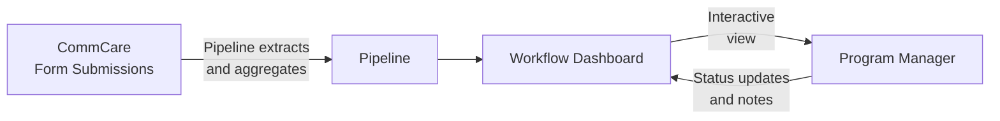

# Workflow Engine

The Workflow Engine lets program managers view configurable dashboards that pull live data directly from CommCare. Each workflow displays field worker performance metrics and supports drill-down into individual records, status tracking, and filtering.

---

## How Data Flows



**Pipelines** define what data to pull from CommCare and how to aggregate it — counts, sums, most recent values, percentages, and more. **Workflows** define what to display and how users interact with it.

---

## Finding Your Workflows

Click **Workflows** in the top navigation. You'll see a list of all workflows configured for your program.

Each row shows:

- Workflow name and type
- Last run time and data freshness
- Current status

Click any workflow to open its dashboard.

---

## Reading a Workflow Dashboard

A typical workflow dashboard shows a **table of field workers** with performance columns:

| Column type | What it shows                                |
| ----------- | -------------------------------------------- |
| Count       | Number of visits or activities in the period |
| Status      | Current enrollment or case status            |
| Last value  | Most recent recorded measurement             |
| Percentage  | Proportion of cases meeting a threshold      |

**Filtering and sorting:**

- Use the **date range picker** to focus on a specific period
- Click column headers to sort ascending or descending
- Use the **search box** to find a specific worker by name

**Drilling into a worker:**

Click any row to see that worker's detailed record — individual visit data, timeline of activities, and linked cases.

---

## Workflow Statuses

Many workflows include a status column that tracks where a case is in a program process:

```mermaid
stateDiagram-v2
    [*] --> Active
    Active --> "Review Needed": Flag raised
    "Review Needed" --> "Action Taken": Intervention done
    "Action Taken" --> Closed: Case resolved
    Active --> Closed: Graduated
```

Program managers can update a case's status directly from the workflow view. Status changes are stored in Labs and visible to all team members with access to the program.

---

## Starter Templates

Labs includes pre-built workflow templates for common program types. Your program administrator can create a workflow from any of these templates and configure it for your opportunity.

| Template                | Best for                                        |
| ----------------------- | ----------------------------------------------- |
| **KMC Longitudinal**    | Kangaroo Mother Care — tracking cases over time |
| **KMC FLW Flags**       | Flag workers needing supervisory follow-up      |
| **KMC Project Metrics** | Program-level KPIs and summary statistics       |
| **MBW Monitoring**      | Mother and baby wellness visit tracking         |
| **Performance Review**  | FLW performance compared across programs        |
| **SAM Follow-up**       | Severe acute malnutrition case management       |
| **OCS Outreach**        | Community health outreach tracking              |
| **Bulk Image Audit**    | Image-based QA combined with workflow status    |

---

## MBW Monitoring Dashboard

The **MBW Monitoring** template has five tabs. The sections below describe what each tab shows and how its numbers are calculated, so you know what to expect when reviewing data.

### Overview tab

- **Eligible mothers** counts only mothers who qualify for the full intervention bonus — this is the same eligibility rule used in the Performance tab and the drilldown, so all three figures stay consistent with each other.
- **Expected visits** (shown as _total_cases_ in exports) is the count of visits that were expected in the selected period, matching the original MBW v1 definition.

### Followups tab

- **Completion rate** is calculated using the same eligibility filter as MBW v1, and includes a 5-day grace window so visits completed slightly after their due date are not counted as missed.
- **Worker attribution**: if no visits have been recorded for a mother yet, the dashboard attributes her to the field worker who submitted her registration form, rather than leaving the row blank.
- **Visit status** uses six categories: _Completed – On Time_, _Completed – Late_, _Due – On Time_, _Due – Late_, _Missed_, and _Not Due Yet_. The visit-type breakdown chart will render correctly with this data.

### GPS tab

- **Flagged visits** and **total flagged** are now calculated using the 5 km distance threshold.
- **Cases with revisits** counts distinct mothers, not the total number of distance log entries.
- **Visits with GPS**, **unique cases**, and **average daily travel (km)** are all produced and visible in the tab.

### Performance tab

Field workers are grouped into four categories, matching the original MBW v1 logic:

| Category             | What it means                                            |
| -------------------- | -------------------------------------------------------- |
| Eligible for Renewal | Worker meets the still-eligible business rule            |
| Probation            | Worker is at risk — missed visits above the threshold    |
| Suspended            | Worker has exceeded the allowable missed-visit threshold |
| No Category          | Insufficient data to place the worker in a category      |

The tab also shows the percentage of workers who missed one visit or fewer (_pct_missed_1_or_less_) and milestone percentages.

---

## MBW Auditing V4 Dashboard

### % Still Eligible

The **% Still Eligible** figure answers the question: of mothers who are bonus-eligible AND have a completed ANC visit, how many have missed at most 1 of their post-ANC visits within their expiry window?

A mother is included in the denominator only if she meets both of the following conditions:

1. She qualifies for the full intervention bonus.
2. Her antenatal visit completion is recorded as complete on her visit form.

The missed-visit check then looks only at the five post-ANC visit types — **Postnatal Delivery, 1 Week, 1 Month, 3 Month, and 6 Month** — within the mother's expiry window. The ANC visit itself is not counted in this check, because it is already required just to be included in the denominator.

If you see this figure change compared to an earlier version of the dashboard, it is because the calculation now correctly matches visit records to their scheduled visit types and applies both eligibility filters together before checking for missed visits.

### Mother counts per field worker

Each field worker row shows two mother counts: a **total** and an **eligible** figure (shown in parentheses). Both numbers are drawn from the same source — the set of mothers linked to that worker through visit records. This means the eligible count will always be equal to or less than the total, and you should never see the eligible figure exceed the total.

### Prev column

The **Prev** column shows the performance category assigned to each field worker in the most recent previous run. This lets you compare a worker's current category against where they stood last time. The column looks back across previous workflow versions as well, so a worker's prior category will appear even if the workflow has been updated since that run. If the column was showing "—" for all workers even when previous runs existed, that display issue has been corrected — the column now correctly loads categories from the most recent run where categories were set.

---

## Common Questions

**Why is a worker's data missing or outdated?**
Pipelines refresh data on a schedule. If a CommCare form was submitted recently, it may take up to 30 minutes to appear. Look for the "Last refreshed" timestamp at the top of the workflow.

**Can I export the workflow data?**
Some workflows include an export button in the top toolbar. If yours doesn't, ask your program administrator — this can be configured.

**Can I edit what a workflow displays?**
Program administrators can edit workflow layouts using the AI-powered workflow editor. See [AI Features](ai-features.md) for details.

**The dashboard looks different from yesterday — what changed?**
Workflow dashboards are actively developed. Check the [weekly changelog](https://dimagi.atlassian.net/wiki/spaces/connect/pages/3918528513/Connect+Labs+Changelog) for recent updates.

**The MBW Monitoring numbers look different from what I saw before — is something wrong?**
Several calculations in the MBW Monitoring dashboard were updated to match the original MBW v1 definitions more precisely. In particular, eligible mother counts, completion rates, performance categories, and GPS figures may shift slightly compared to earlier versions of the dashboard. The new numbers are more accurate. If a figure still looks unexpected, check the "Last refreshed" timestamp and contact your program administrator if the discrepancy persists.

**The MBW Auditing V4 dashboard was showing an error on load — is that fixed?**
Yes. A loading error that caused the dashboard to crash before displaying any data has been resolved. If you continue to see an error, try refreshing the page. If the problem persists, contact your program administrator.

**The % Still Eligible figure in MBW Auditing V4 looks much lower than expected — is something wrong?**
This figure was previously undercounting eligible mothers due to two issues: certain visit types were not being matched correctly to their scheduled entries, and the ANC visit was being included in the missed-visit check even though it is already a requirement for entering the denominator. Both issues have been corrected. If the number still looks unexpected after a data refresh, contact your program administrator.

**The MBW Auditing V4 data looks incomplete or like it isn't accounting for all cases — is something wrong?**
This was caused by a background processing issue where open tasks were silently not being loaded, resulting in the auditing job running against an incomplete set of records. The issue has been fixed — open tasks now load through a dedicated pathway that is more reliable, so task indicators should appear correctly on the dashboard. If your data still looks incomplete after a refresh, check the "Last refreshed" timestamp and contact your program administrator if the problem continues.

**In MBW Auditing V4, the eligible mother count shown in parentheses was higher than the total mother count — is that fixed?**
Yes. This was a display bug caused by the two figures drawing from different data sources. Both the total and eligible mother counts now come from the same source — mothers attributed to each field worker through visit records — so the eligible figure will always be equal to or less than the total. If you still see the eligible count exceed the total after a refresh, contact your program administrator.

**In MBW Auditing V4, the Prev column was always showing "—" even for workers with previous categories — is that fixed?**
Yes. The Prev column now correctly loads performance categories from the most recent run where categories were set, including categories recorded under previous versions of the workflow. If the column still appears blank after a data refresh, contact your program administrator.
