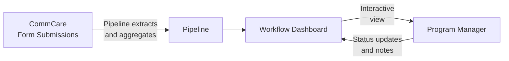

# Workflow Engine

The Workflow Engine lets program managers view configurable dashboards that pull live data directly from CommCare. Each workflow displays field worker performance metrics and supports drill-down into individual records, status tracking, and filtering.

---

## How Data Flows



**Pipelines** define what data to pull from CommCare and how to aggregate it — counts, sums, most recent values, percentages, and more. **Workflows** define what to display and how users interact with it.

---

## Finding Your Workflows

Click **Workflows** in the top navigation. You'll see a list of all workflows configured for your program.

Each row shows:

- Workflow name and type
- Last run time and data freshness
- Current status

Click any workflow to open its dashboard.

---

## Reading a Workflow Dashboard

A typical workflow dashboard shows a **table of field workers** with performance columns:

| Column type | What it shows                                |
| ----------- | -------------------------------------------- |
| Count       | Number of visits or activities in the period |
| Status      | Current enrollment or case status            |
| Last value  | Most recent recorded measurement             |
| Percentage  | Proportion of cases meeting a threshold      |

**Filtering and sorting:**

- Use the **date range picker** to focus on a specific period
- Click column headers to sort ascending or descending
- Use the **search box** to find a specific worker by name

**Drilling into a worker:**

Click any row to see that worker's detailed record — individual visit data, timeline of activities, and linked cases.

---

## Workflow Statuses

Many workflows include a status column that tracks where a case is in a program process:

```mermaid
stateDiagram-v2
    [*] --> Active
    Active --> "Review Needed": Flag raised
    "Review Needed" --> "Action Taken": Intervention done
    "Action Taken" --> Closed: Case resolved
    Active --> Closed: Graduated
```

Program managers can update a case's status directly from the workflow view. Status changes are stored in Labs and visible to all team members with access to the program.

---

## Starter Templates

Labs includes pre-built workflow templates for common program types. Your program administrator can create a workflow from any of these templates and configure it for your opportunity.

| Template                | Best for                                        |
| ----------------------- | ----------------------------------------------- |
| **KMC Longitudinal**    | Kangaroo Mother Care — tracking cases over time |
| **KMC FLW Flags**       | Flag workers needing supervisory follow-up      |
| **KMC Project Metrics** | Program-level KPIs and summary statistics       |
| **MBW Monitoring**      | Mother and baby wellness visit tracking         |
| **Performance Review**  | FLW performance compared across programs        |
| **SAM Follow-up**       | Severe acute malnutrition case management       |
| **OCS Outreach**        | Community health outreach tracking              |
| **Bulk Image Audit**    | Image-based QA combined with workflow status    |

---

## Common Questions

**Why is a worker's data missing or outdated?**
Pipelines refresh data on a schedule. If a CommCare form was submitted recently, it may take up to 30 minutes to appear. Look for the "Last refreshed" timestamp at the top of the workflow.

**Can I export the workflow data?**
Some workflows include an export button in the top toolbar. If yours doesn't, ask your program administrator — this can be configured.

**Can I edit what a workflow displays?**
Program administrators can edit workflow layouts using the AI-powered workflow editor. See [AI Features](ai-features.md) for details.

**The dashboard looks different from yesterday — what changed?**
Workflow dashboards are actively developed. Check the [weekly changelog](https://dimagi.atlassian.net/wiki/spaces/connect/pages/3918528513/Connect+Labs+Changelog) for recent updates.
