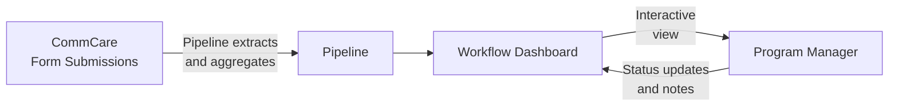

# Workflow Engine

The Workflow Engine lets program managers view configurable dashboards that pull live data directly from CommCare. Each workflow displays field worker performance metrics and supports drill-down into individual records, status tracking, and filtering.

---

## How Data Flows

```mermaid
flowchart LR
    CC[CommCare\nForm Submissions] -->|Pipeline extracts\nand aggregates| P[Pipeline]
    P --> W[Workflow Dashboard]
    W -->|Interactive\nview| PM[Program Manager]
    PM -->|Status updates\nand notes| W
```

**Pipelines** define what data to pull from CommCare and how to aggregate it — counts, sums, most recent values, percentages, and more. **Workflows** define what to display and how users interact with it.

---

## Finding Your Workflows

Click **Workflows** in the top navigation. You'll see a list of all workflows configured for your program.

Each row shows:

- Workflow name and type
- Last run time and data freshness
- Current status
- A schedule badge (for example, **⏱ Weekly**) if the workflow is running on an automatic schedule

Click any workflow to open its dashboard.

### The PERIOD column

The **PERIOD** column in the workflow list shows the date window that was actually audited for each run. Once a run has fired and audited data, this reflects the real window that was processed — which may differ from the date range that was set when the run was first created (for example, when you used the generic **Create Run** button).

When the audited window differs from the original creation-time range, the column shows an **ⓘ info icon** next to the date. Hovering over or tapping the icon shows the original creation-time range for reference. If the two windows are the same, no icon appears.

This means the PERIOD column is the authoritative record of what was actually covered by a run, not just what was intended when it was set up.

### Data freshness on scheduled reports

Scheduled reports can display when their data was actually last synced — and every reader sees the same figure regardless of which device they are on or when they last refreshed their browser.

Previously, the only freshness signal a report could show came from the reader's own browser, so it described when *that browser* last pulled data rather than when the underlying data was refreshed. On a report like the Ward Progress Tracker, this meant a reader on a second device — or one who simply had not refreshed in a while — might see "18h 36m ago" even though the data had in fact been refreshed at 04:21 that morning.

Scheduled reports that display a "last synced" or "last refreshed" time now draw that figure from the schedule itself, so it reflects the real sync time and is consistent across all readers.

### Run failure reasons

If a scheduled or unattended run fails, the run now records the reason for the failure alongside the failed status. Previously, a failure was logged with no error message, making it impossible to diagnose the problem without accessing production logs. You can now see what went wrong directly on the run record, which makes it easier to decide whether to retry, adjust settings, or contact support.

### Deep-linking to a specific workflow card

If someone shares a direct link to a specific workflow card — for example, a URL ending in `#workflow-5110` — the page will smoothly scroll to that card and briefly highlight it so you can spot it immediately, even on a long list. This works the same way in both the program view and the opportunity view.

### Program-level vs. opportunity-level workflows

Workflows in Connect Labs are owned by either a **program** or a specific **opportunity**:

- **Program-owned workflows** are scoped directly to the program — they have no owning opportunity at all. They appear in the program view only, cover the program as a whole — for example, the Program Audit Creator and Program Audit Report — and do not appear under any individual opportunity. All operations on these workflows (opening them, creating a run, viewing a run page) work entirely within the program context; no opportunity is needed. When you open a program-owned workflow, it verifies your access at the program level and loads its pipeline data across all the opportunities the workflow spans — you do not need to select an individual opportunity first.
- **Opportunity-owned workflows** appear under their specific opportunity only. They will not appear in the program-level workflow list.

This means each workflow appears in exactly one place. If you cannot find a workflow you expect to see, check whether you are viewing the program level or the relevant opportunity level.

!!! note "The opp: badge is not shown in the program view"
    When you are browsing the program-level workflow list, opportunity identifiers are not displayed next to workflow names. Only workflows that are explicitly owned by the program appear there, so the badge carries no useful information at that level and is hidden to keep the list uncluttered.

!!! note "Creating a run from the program view"
    Clicking **Create Run** on a program-owned workflow works the same as creating a run from any other context. Because these workflows are genuinely scoped to the program rather than to any opportunity, Create Run resolves correctly from the program view with no extra steps required.

    If you have recently opened a per-opportunity run in another tab (for example, by clicking an "open run ↗" link"), that should no longer affect Create Run on program-owned workflows. The program view keeps the program context in place, so Create Run on a program-owned workflow will always create the run under the program — not under whichever opportunity you last visited. If you do see a "Workflow not found" error, try refreshing the program workflow list page and clicking Create Run again.

---

## Creating a Workflow from a Template

You can create new workflows from ready-made templates rather than building them from scratch. The template picker is available from the program's own Workflows page (the URL includes `?program_id=…`) via the **Create Workflow** button. Using the program-level page means you can create whole-program reports — such as the KMC Programme Metrics report — without having to start from an individual opportunity.

### Choosing a template

Clicking **Create Workflow** opens the **Choose a template** modal. The modal is designed to fit a standard desktop screen without scrolling. Templates are presented one per row, grouped by what they produce:

| Group | Examples |
|---|---|
| Programme reports | KMC Programme Metrics, Photo Audit Report |
| Automatic reports | Scheduled summary reports |
| Worker reviews | KMC Worker Review |
| Audits | Weekly Dual-Track Image Audit, Muac Picture Audit |
| Beneficiary tracking | Beneficiary-level dashboards |
| Outreach & demos | Outreach and demonstration reports |
| Visit verification | MBW Visit Verification |

A **filter box** at the top of the modal lets you type to narrow the list. Each row shows the template's full name — names are never cut short — alongside a coloured icon and a short description on the line below. If a template is always created together with another template, both rows say so, so you know what you will get before you confirm.

!!! note "Template icons and names"
    Every template displays a coloured icon. Previously, some icons appeared in the wrong colour or did not appear at all (for example, Verified Monitoring showed no icon). This has been corrected — all icons now draw in their intended colour, and every template has one.

### Templates that create linked workflows together

Some templates produce more than one workflow in a single action. The **KMC Programme Metrics** template is the main example: selecting it creates both the **KMC Programme Metrics** report and the **KMC Worker Review** page at the same time, over the same set of opportunities, with a run ready on each and the two pages already linked to each other. Worker rows on the programme metrics report open directly into the worker review — no manual linking step is needed.

Before this change, creating the KMC Programme Metrics report by hand left worker rows that were plain text rather than links; a separate API step was required to connect the two workflows. That step is no longer needed.

!!! note "The opportunity picker spans all programmes you can access"
    When you create a workflow from the programme-level Workflows page, the opportunity picker shows **every opportunity you have access to**, not only those belonging to the current programme. The current programme's own opportunities appear at the top of the list and are pre-ticked, so the default selection is correct for most reports. If your KMC report needs to span opportunities from several programmes — which is common for whole-programme KMC metrics — you can tick the additional opportunities from the same picker without navigating away.

### Photo Audit Report

The **Photo Audit Report** shows the photo verification success rate from the bulk image audits your team runs — that is, the percentage of audited photos that passed review. Create it from **Workflows → Create Workflow → "Photo Audit Report"** (listed under *Programme reports*).

#### Choosing what the report covers

The report follows the top-right context selector:

- **Select a program** — the report shows the program-wide success rate (all its opportunities pooled together) plus a per-opportunity breakdown table. A dropdown lets you drill into any single opportunity from that same view.
- **Select a single opportunity** — the report shows data for that opportunity only.

Because the report is tied to your access permissions rather than to a fixed program or opportunity, the same report can be reused across any program or opportunity you have access to.

#### Key metrics

The report surfaces two headline figures:

- **Overall success rate** — the percentage of audited photos that passed.
- **Photos not yet reviewed** — the count of photos that have been submitted but not yet reviewed. These are kept out of the success rate calculation entirely.

**How the success rate is calculated:** pass ÷ (pass + fail + duplicate/fake). Photos marked as duplicate or fake count as failures. Unreviewed photos are excluded from both the numerator and denominator.

#### Per-opportunity breakdown table

When viewing at program level, a table lists each opportunity with:

- **Auditor(s)** — who carried out the audit for that opportunity
- Underlying counts: **pass**, **fail**, **duplicate/fake**, **reviewed**, **not reviewed**, and **audits**

#### Filters

All filters are chosen from the values already present in your data — there is no free-text typing required:

- **Auditors** multi-select
- **Audits** multi-select
- **Date range**

Your filter selections are saved on the report, so they persist between sessions.

### MBW Visit Verification template

The **MBW Visit Verification** template creates a single-table dashboard for opportunity 765. Each row represents one visit and shows whether GPS location, QR code scan, mother's signature, ANC card capture, and the mother-questions check each came back **Pass**, **Fail**, or **NA**, along with the visit's overall verification outcome and the field worker's pass rate on that mother's earlier visits. Only field workers flagged with the `visit_verification` property in CommCare appear as rows in the table.

The dashboard has three tabs:

- **Dashboard** — the main visit-by-visit table described above.
- **Verification Summary** — aggregated pass rates and a stacked bar chart showing how verification outcomes break down across field workers or visits.
- **Definitions** — a reference tab that documents exactly how every column and metric in the dashboard is calculated. This includes which visits are included (the field worker must be flagged for verification and the visit's form must contain the verification questions), what each of the 15 table columns means, the exact logic behind each Pass / Fail / NA / Not available / ERROR outcome for GPS, QR code, signature, mother questions, and ANC card checks, what counts as an "attempted" verification method, the colour legend, and how the three Verification Summary percentages and the stacked bar chart are computed. For each column or metric, the Definitions tab also shows the exact pipeline field name(s) and the underlying CommCare form path(s) — such as `form.where_is_the_visit_being_conducted` — that are used to calculate it, displayed below the plain-English description. Columns that are computed inside the dashboard itself rather than read from a raw form field — such as **Visit #**, **Previous verification pass rate**, and **Final verification method(s)** — are clearly labelled as client-side calculated rather than implying a raw CommCare value. If you are unsure what a result means or where the data comes from, the Definitions tab is the first place to check.

!!! warning "This template currently reads from a test app, not the live production app"
    The verification questions that this dashboard depends on have not yet been deployed to opportunity 765's live production app — they exist only in a test CommCare app. Until the live app is updated, this template reads from that test app rather than live field data.

    Once the verification questions are added to the live app, the dashboard will automatically show production data:

    - For the **ANC Visit** form, which already has the verification questions, this happens as soon as the live app is updated — no further action needed.
    - For the other five visit types (**Post delivery**, **1-week**, **1-month**, **3-month**, and **6-month**), production data appears as soon as those forms receive the same verification questions.

    No engineering work is required for that transition. A small follow-up to re-point the template directly at the production domain (removing the need for test-domain access) is recommended once the live app is fully updated, but is not required for the dashboard to function.

!!! note "Empty table fix"
    A previous issue caused the MBW Visit Verification dashboard to display an empty table even when real visit data was available. This has been corrected — visits now appear as expected.

### KMC Worker Review

The **KMC Worker Review** page opens when you click a worker row on the KMC Programme Metrics report. It shows that worker's full caseload: each case's weight series, growth chart, and a set of live columns — danger signs, referrals, discharge, skin-to-skin, alive-at-last-visit, gain, rounded, and implausible.

**If you previously saw cases listed but with empty dashes in every live column and a "No weighings recorded." message on the growth chart**, this was caused by issues with how the page retrieved per-case data. Three separate causes have now been identified and corrected:

1. A page error was displaying as missing data rather than as a clear error message.
2. Scheduled runs were recomputing data for all of the report's opportunities on every load and discarding the result, causing unnecessary load and collisions.
3. Per-case detail data was being looked up in the wrong location — the page was not reading from the pipeline where the referenced data actually lives.

With all three fixes in place, opening a case on the Worker Review page shows the baby's full weight series and growth chart, and all live columns — danger signs, referrals, discharge, skin-to-skin, alive-at-last-visit, gain, rounded, and implausible — populate as expected. The underlying data was always there; it was simply not being retrieved correctly. If a live data request does fail, the page will say so rather than showing an empty cohort.

Two further improvements that you will notice on the Worker Review page:

- **The page now loads in seconds rather than minutes.** It was previously recomputing data for all of the report's opportunities on every load and discarding the result. That wasted work has been removed.
- **The red "Another pipeline run for this opportunity is already in progress" banner should no longer appear.** That banner was a side effect of the same unnecessary recompute colliding with the programme report. With the recompute removed, the banner no longer fires.

!!! note "Cases table and growth chart briefly unavailable after a recent update"
    A short-lived issue caused the Worker Review page to show **"Could not load this worker's cases"** in place of the cases table and growth chart — even for workers who had data. This affected both the table and the progress indicator that streams case rows as they load. Both have been corrected and the page displays case data as expected again.

#### Sorting columns on the KMC reports

Every column on the KMC Programme Report, the KMC Opportunity Report, and the KMC Worker Review can be sorted. Click the **↕** arrow beside any column name to sort that column:

- **▼** sorts highest first
- **▲** sorts lowest first

This applies to all column types — worker name, organisation, opportunity, case, date, Attention, and indicator columns. Cells that are blank or withheld (for example, cells showing **n<20**) always appear at the bottom of the sorted list regardless of sort direction.

On the programme report's worker table, sorting ranks **all** workers across the full dataset before the "first 25" display cut is applied. This means the top 25 you see after sorting are the true top 25 for that indicator across the whole programme, not just the top 25 among the busiest workers.

#### Looking up what an indicator means

Click any **indicator column heading** on the KMC Programme Report, KMC Opportunity Report, or KMC Worker Review to open a definition popup for that indicator. The popup shows, in order from top to bottom:

- A **plain-English sentence** describing what the indicator measures
- **How it's counted** — which babies the indicator is *out of*, what it *counts* among them, and when it is shown (for example: out of babies who qualify for growth review, counts those whose growth class is fast, shown when at least 20 qualify)
- **Terms** — each concept the indicator relies on, explained in plain words (for example: "Qualifies for growth review: followed 42+ days with 2+ visits, birthweight band known, and early weight gain computable")
