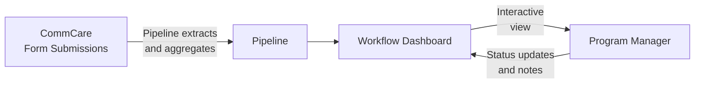

# Workflow Engine

The Workflow Engine lets program managers view configurable dashboards that pull live data directly from CommCare. Each workflow displays field worker performance metrics and supports drill-down into individual records, status tracking, and filtering.

---

## How Data Flows

```mermaid
flowchart LR
    CC[CommCare\nForm Submissions] -->|Pipeline extracts\nand aggregates| P[Pipeline]
    P --> W[Workflow Dashboard]
    W -->|Interactive\nview| PM[Program Manager]
    PM -->|Status updates\nand notes| W
```

**Pipelines** define what data to pull from CommCare and how to aggregate it — counts, sums, most recent values, percentages, and more. **Workflows** define what to display and how users interact with it.

---

## Finding Your Workflows

Click **Workflows** in the top navigation. You'll see a list of all workflows configured for your program.

Each row shows:

- Workflow name and type
- Last run time and data freshness
- Current status
- A schedule badge (for example, **⏱ Weekly**) if the workflow is running on an automatic schedule

Click any workflow to open its dashboard.

### The PERIOD column

The **PERIOD** column in the workflow list shows the date window that was actually audited for each run. Once a run has fired and audited data, this reflects the real window that was processed — which may differ from the date range that was set when the run was first created (for example, when you used the generic **Create Run** button).

When the audited window differs from the original creation-time range, the column shows an **ⓘ info icon** next to the date. Hovering over or tapping the icon shows the original creation-time range for reference. If the two windows are the same, no icon appears.

This means the PERIOD column is the authoritative record of what was actually covered by a run, not just what was intended when it was set up.

### Run failure reasons

If a scheduled or unattended run fails, the run now records the reason for the failure alongside the failed status. Previously, a failure was logged with no error message, making it impossible to diagnose the problem without accessing production logs. You can now see what went wrong directly on the run record, which makes it easier to decide whether to retry, adjust settings, or contact support.

### Deep-linking to a specific workflow card

If someone shares a direct link to a specific workflow card — for example, a URL ending in `#workflow-5110` — the page will smoothly scroll to that card and briefly highlight it so you can spot it immediately, even on a long list. This works the same way in both the program view and the opportunity view.

### Program-level vs. opportunity-level workflows

Workflows in Connect Labs are owned by either a **program** or a specific **opportunity**:

- **Program-owned workflows** are scoped directly to the program — they have no owning opportunity at all. They appear in the program view only, cover the program as a whole — for example, the Program Audit Creator and Program Audit Report — and do not appear under any individual opportunity. All operations on these workflows (opening them, creating a run, viewing a run page) work entirely within the program context; no opportunity is needed. When you open a program-owned workflow, it verifies your access at the program level and loads its pipeline data across all the opportunities the workflow spans — you do not need to select an individual opportunity first.
- **Opportunity-owned workflows** appear under their specific opportunity only. They will not appear in the program-level workflow list.

This means each workflow appears in exactly one place. If you cannot find a workflow you expect to see, check whether you are viewing the program level or the relevant opportunity level.

!!! note "The opp: badge is not shown in the program view"
    When you are browsing the program-level workflow list, opportunity identifiers are not displayed next to workflow names. Only workflows that are explicitly owned by the program appear there, so the badge carries no useful information at that level and is hidden to keep the list uncluttered.

!!! note "Creating a run from the program view"
    Clicking **Create Run** on a program-owned workflow works the same as creating a run from any other context. Because these workflows are genuinely scoped to the program rather than to any opportunity, Create Run resolves correctly from the program view with no extra steps required.

    If you have recently opened a per-opportunity run in another tab (for example, by clicking an "open run ↗" link"), that should no longer affect Create Run on program-owned workflows. The program view keeps the program context in place, so Create Run on a program-owned workflow will always create the run under the program — not under whichever opportunity you last visited. If you do see a "Workflow not found" error, try refreshing the program workflow list page and clicking Create Run again.

---

## Creating a Workflow from a Template

You can create new workflows from ready-made templates rather than building them from scratch. The template picker is available from the program's own Workflows page (the URL includes `?program_id=…`) via the **Create Workflow** button. Using the program-level page means you can create whole-program reports — such as the KMC Programme Metrics report — without having to start from an individual opportunity.

### Choosing a template

Clicking **Create Workflow** opens the **Choose a template** modal. The modal is designed to fit a standard desktop screen without scrolling. Templates are presented one per row, grouped by what they produce:

| Group | Examples |
|---|---|
| Programme reports | KMC Programme Metrics |
| Automatic reports | Scheduled summary reports |
| Worker reviews | KMC Worker Review |
| Audits | Weekly Dual-Track Image Audit, Muac Picture Audit |
| Beneficiary tracking | Beneficiary-level dashboards |
| Outreach & demos | Outreach and demonstration reports |
| Visit verification | MBW Visit Verification |

A **filter box** at the top of the modal lets you type to narrow the list. Each row shows the template's full name — names are never cut short — alongside a coloured icon and a short description on the line below. If a template is always created together with another template, both rows say so, so you know what you will get before you confirm.

!!! note "Template icons and names"
    Every template displays a coloured icon. Previously, some icons appeared in the wrong colour or did not appear at all (for example, Verified Monitoring showed no icon). This has been corrected — all icons now draw in their intended colour, and every template has one.

### Templates that create linked workflows together

Some templates produce more than one workflow in a single action. The **KMC Programme Metrics** template is the main example: selecting it creates both the **KMC Programme Metrics** report and the **KMC Worker Review** page at the same time, over the same set of opportunities, with a run ready on each and the two pages already linked to each other. Worker rows on the programme metrics report open directly into the worker review — no manual linking step is needed.

Before this change, creating the KMC Programme Metrics report by hand left worker rows that were plain text rather than links; a separate API step was required to connect the two workflows. That step is no longer needed.

!!! note "The opportunity picker spans all programmes you can access"
    When you create a workflow from the programme-level Workflows page, the opportunity picker shows **every opportunity you have access to**, not only those belonging to the current programme. The current programme's own opportunities appear at the top of the list and are pre-ticked, so the default selection is correct for most reports. If your KMC report needs to span opportunities from several programmes — which is common for whole-programme KMC metrics — you can tick the additional opportunities from the same picker without navigating away.

### MBW Visit Verification template

The **MBW Visit Verification** template creates a single-table dashboard for opportunity 765. Each row represents one visit and shows whether GPS location, QR code scan, mother's signature, ANC card capture, and the mother-questions check each came back **Pass**, **Fail**, or **NA**, along with the visit's overall verification outcome and the field worker's pass rate on that mother's earlier visits. Only field workers flagged with the `visit_verification` property in CommCare appear as rows in the table.

!!! warning "This template currently reads from a test app, not the live production app"
    The verification questions that this dashboard depends on have not yet been deployed to opportunity 765's live production app — they exist only in a test CommCare app. Until the live app is updated, this template reads from that test app rather than live field data.

    Once the verification questions are added to the live app, the dashboard will automatically show production data:

    - For the **ANC Visit** form, which already has the verification questions, this happens as soon as the live app is updated — no further action needed.
    - For the other five visit types (**Post delivery**, **1-week**, **1-month**, **3-month**, and **6-month**), production data appears as soon as those forms receive the same verification questions.

    No engineering work is required for that transition. A small follow-up to re-point the template directly at the production domain (removing the need for test-domain access) is recommended once the live app is fully updated, but is not required for the dashboard to function.

!!! note "Empty table fix"
    A previous issue caused the MBW Visit Verification dashboard to display an empty table even when real visit data was available. This has been corrected — visits now appear as expected.

### Selecting opportunities with the multi-opportunity picker

When a template asks you to choose which opportunities to include, the picker offers several ways to build your selection quickly.

**Typing a name** filters the list to matching opportunities. When a name filter is active, two extra controls appear:

- **Select all shown** — ticks every opportunity currently visible in the filtered list
- **Clear shown** — unticks every opportunity currently visible in the filtered list

A count of how many opportunities are currently selected is shown at all times so you can confirm your selection before proceeding.

**Pasting a list of IDs** is the fastest way to select a specific set of opportunities across programmes. Click into the picker's search box and paste a comma-separated list of opportunity IDs — for example:

> 523, 524, 675, 874, 938, 1234, 1236, 1487, 1488, 1739, 1790, 2166

The picker immediately switches to ID mode: it lists exactly those opportunities in the order you pasted them and ticks them all. If any ID in your list cannot be found — because it does not exist or you do not have access to it — those IDs are named in an amber notice at the top of the list rather than silently dropped, so you can check whether something is missing before saving.

Typing a single number works as a plain name filter as before; the picker only switches to ID mode when it detects a comma-separated list.

### Computing and saving a program-owned KMC Programme Metrics report

A KMC Programme Metrics report created from the programme's Workflows page (a program-owned report) can now compute and save its weekly figures normally. Previously, every preview and Save on such a report failed with **"Indicators could not be computed"**, even though the same report created from an individual opportunity page worked without issue. This has been corrected — program-owned KMC reports compute and save in exactly the same way as opportunity-owned ones.

If you previously avoided creating KMC Programme Metrics reports from the programme page because of this error, you can now do so without issue.

---

## Scheduling a Workflow to Run Automatically

Any workflow that supports a one-click default run can be put on a recurring schedule so it runs itself automatically — no one has to log in and click "run" each week.

### Setting up a schedule

On the workflow list screen, workflows that support scheduling show a **Schedule** button. Click it to configure:

- **Cadence** — choose from **Daily**, **Weekdays (Mon–Fri)**, **Weekly** (pick a day of the week), or **Monthly** (pick a day from 1–28)
- **Hour** — the time of day the workflow should run

Once saved, the workflow card shows a badge such as **⏱ Weekly** so you can see at a glance that it is scheduled. You can edit or remove the schedule from the same **Schedule** button at any time.

Scheduled runs use the same default run the workflow already supports, so nothing new needs to be configured on the workflow itself.

### How the data window is chosen for each cadence

For **Weekly Dual-Track Audits**, the cadence you choose affects which visits the scheduled run covers:

| Cadence | Data window used |
|---|---|
| **Daily** | Yesterday only — each run audits the previous day's visits, so no day is audited twice |
| **Weekdays (Mon–Fri)** | Yesterday only — same rolling-window behaviour as Daily |
| **Weekly** | The standard week window the workflow is configured for — unchanged |
| **Monthly** | The standard month window the workflow is configured for — unchanged |

!!! note "Why Daily and Weekdays use a rolling yesterday window"
    Before this change, scheduling a Weekly Dual-Track Audit to run daily caused the same fixed week to be re-audited on every fire, creating duplicate work. Daily and Weekdays cadences now automatically shift the window forward each day so each scheduled run covers only new visits.

### Visit-clustering settings are honoured by scheduled runs

If your Weekly Dual-Track Audit workflow has pinned visit-clustering settings — time-gap window, GPS distance threshold, or duplicate detection — those settings are now applied automatically whenever a scheduled run fires. Previously, scheduled runs ignored these settings entirely and only picked up whatever state was left over from the last manual run.

No action is needed to enable this: if the settings are pinned on the workflow, they will be used. If you have not pinned any clustering settings, the workflow's defaults continue to apply as before.

### Managing all schedules (Connect Labs Admin)

A dedicated **Scheduled Workflows** page in **Connect Labs Admin** lists every schedule across all users. For each entry you can see:

| Column | What it shows |
|---|---|
| Workflow | The workflow being scheduled |
| Owner | Who set the schedule up |
| Cadence | How often it runs |
| Next run | When it will run next |
| Last run status | Whether the most recent scheduled run succeeded |

From this page, administrators can **Disable** or **Delete** any schedule with a single click.

If a schedule can no longer run because the owner's login has expired, it shows **"Needs re-login"** and pauses itself automatically instead of failing silently. The owner will need to log back in, after which the schedule can be re-enabled.

---

## Opening a Workflow Run from a Link

If someone shares a direct link to a workflow run, the system will open it automatically — you do not need to select the opportunity from a context picker first. The run page reads the opportunity from the link and goes straight to the dashboard.

If a link was copy-pasted with extra text accidentally appended to it (for example, `?opportunity_id=1251 stacked bar chart`), the system will still recover the correct opportunity and clean up the address bar so everything works normally from that point on.

If the opportunity genuinely cannot be determined from the link, you will see a message explaining exactly what the system could not read, so it is clear the link itself is the problem rather than your access or context settings.

If the workflow belongs to an opportunity you are not a member of, you will see a message telling you exactly that — for example, *"This workflow belongs to opportunity 1251, which isn't one of your opportunities. Ask whoever shared it to give you access, then reopen the link."* This is different from a broken link: the link is valid, but you need to be added to that opportunity before you can open it. Contact whoever shared the link and ask them to give you access.

If the workflow cannot be loaded at all — for example, because your account has no opportunities listed or you are not a member of the organisation that owns the workflow — you will see a clear message such as: *"This workflow couldn't be loaded for opportunity 1251. You may not have access to that opportunity, or the workflow may have been removed. Ask whoever shared the link to confirm you have access to its opportunity."* If you see this, contact whoever shared the link and ask them to confirm your access. You will not see a raw technical error or an internal web address.

If you open a workflow run page without a specific run selected — for example, by following a partial link — you will be taken straight to the **workflow list** with that workflow's card highlighted. From there you can select an existing run or create a new one. There is no separate "pick a run" landing screen.

---

## Renaming a Run

By default, every run is labelled with a generic identifier such as **Run #5110**. You can replace this with a meaningful name — for example, **Week 30 Audit** — so that runs are easier to identify in lists and on individual run pages such as the Muac Picture Audit.

To rename a run:

1. Open the run you want to rename.
2. Click the **Rename** action (available in the run's action menu or alongside the run title).
3. Type the new name and confirm.

The custom name replaces the generic label everywhere the run appears: the workflow list page and any template that displays individual runs. Renaming is allowed regardless of whether the run is in progress or has already been completed.

!!! note "Renaming does not affect the run's data or status"
    Giving a run a custom name is purely a display change. The underlying data, audit records, and status of the run are not affected.

---

## Creating a Run
