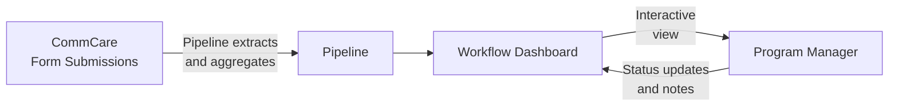

# Workflow Engine

The Workflow Engine lets program managers view configurable dashboards that pull live data directly from CommCare. Each workflow displays field worker performance metrics and supports drill-down into individual records, status tracking, and filtering.

---

## How Data Flows

```mermaid
flowchart LR
    CC[CommCare\nForm Submissions] -->|Pipeline extracts\nand aggregates| P[Pipeline]
    P --> W[Workflow Dashboard]
    W -->|Interactive\nview| PM[Program Manager]
    PM -->|Status updates\nand notes| W
```

**Pipelines** define what data to pull from CommCare and how to aggregate it — counts, sums, most recent values, percentages, and more. **Workflows** define what to display and how users interact with it.

---

## Finding Your Workflows

Click **Workflows** in the top navigation. You'll see a list of all workflows configured for your program.

Each row shows:

- Workflow name and type
- Last run time and data freshness
- Current status
- A schedule badge (for example, **⏱ Weekly**) if the workflow is running on an automatic schedule

Click any workflow to open its dashboard.

### The PERIOD column

The **PERIOD** column in the workflow list shows the date window that was actually audited for each run. Once a run has fired and audited data, this reflects the real window that was processed — which may differ from the date range that was set when the run was first created (for example, when you used the generic **Create Run** button).

When the audited window differs from the original creation-time range, the column shows an **ⓘ info icon** next to the date. Hovering over or tapping the icon shows the original creation-time range for reference. If the two windows are the same, no icon appears.

This means the PERIOD column is the authoritative record of what was actually covered by a run, not just what was intended when it was set up.

### Run failure reasons

If a scheduled or unattended run fails, the run now records the reason for the failure alongside the failed status. Previously, a failure was logged with no error message, making it impossible to diagnose the problem without accessing production logs. You can now see what went wrong directly on the run record, which makes it easier to decide whether to retry, adjust settings, or contact support.

### Deep-linking to a specific workflow card

If someone shares a direct link to a specific workflow card — for example, a URL ending in `#workflow-5110` — the page will smoothly scroll to that card and briefly highlight it so you can spot it immediately, even on a long list. This works the same way in both the program view and the opportunity view.

### Program-level vs. opportunity-level workflows

Workflows in Connect Labs are owned by either a **program** or a specific **opportunity**:

- **Program-owned workflows** are scoped directly to the program — they have no owning opportunity at all. They appear in the program view only, cover the program as a whole — for example, the Program Audit Creator and Program Audit Report — and do not appear under any individual opportunity. All operations on these workflows (opening them, creating a run, viewing a run page) work entirely within the program context; no opportunity is needed. When you open a program-owned workflow, it verifies your access at the program level and loads its pipeline data across all the opportunities the workflow spans — you do not need to select an individual opportunity first.
- **Opportunity-owned workflows** appear under their specific opportunity only. They will not appear in the program-level workflow list.

This means each workflow appears in exactly one place. If you cannot find a workflow you expect to see, check whether you are viewing the program level or the relevant opportunity level.

!!! note "The opp: badge is not shown in the program view"
    When you are browsing the program-level workflow list, opportunity identifiers are not displayed next to workflow names. Only workflows that are explicitly owned by the program appear there, so the badge carries no useful information at that level and is hidden to keep the list uncluttered.

!!! note "Creating a run from the program view"
    Clicking **Create Run** on a program-owned workflow works the same as creating a run from any other context. Because these workflows are genuinely scoped to the program rather than to any opportunity, Create Run resolves correctly from the program view with no extra steps required.

    If you have recently opened a per-opportunity run in another tab (for example, by clicking an "open run ↗" link"), that should no longer affect Create Run on program-owned workflows. The program view keeps the program context in place, so Create Run on a program-owned workflow will always create the run under the program — not under whichever opportunity you last visited. If you do see a "Workflow not found" error, try refreshing the program workflow list page and clicking Create Run again.

---

## Scheduling a Workflow to Run Automatically

Any workflow that supports a one-click default run can be put on a recurring schedule so it runs itself automatically — no one has to log in and click "run" each week.

### Setting up a schedule

On the workflow list screen, workflows that support scheduling show a **Schedule** button. Click it to configure:

- **Cadence** — choose from **Daily**, **Weekdays (Mon–Fri)**, **Weekly** (pick a day of the week), or **Monthly** (pick a day from 1–28)
- **Hour** — the time of day the workflow should run

Once saved, the workflow card shows a badge such as **⏱ Weekly** so you can see at a glance that it is scheduled. You can edit or remove the schedule from the same **Schedule** button at any time.

Scheduled runs use the same default run the workflow already supports, so nothing new needs to be configured on the workflow itself.

### How the data window is chosen for each cadence

For **Weekly Dual-Track Audits**, the cadence you choose affects which visits the scheduled run covers:

| Cadence | Data window used |
|---|---|
| **Daily** | Yesterday only — each run audits the previous day's visits, so no day is audited twice |
| **Weekdays (Mon–Fri)** | Yesterday only — same rolling-window behaviour as Daily |
| **Weekly** | The standard week window the workflow is configured for — unchanged |
| **Monthly** | The standard month window the workflow is configured for — unchanged |

!!! note "Why Daily and Weekdays use a rolling yesterday window"
    Before this change, scheduling a Weekly Dual-Track Audit to run daily caused the same fixed week to be re-audited on every fire, creating duplicate work. Daily and Weekdays cadences now automatically shift the window forward each day so each scheduled run covers only new visits.

### Visit-clustering settings are honoured by scheduled runs

If your Weekly Dual-Track Audit workflow has pinned visit-clustering settings — time-gap window, GPS distance threshold, or duplicate detection — those settings are now applied automatically whenever a scheduled run fires. Previously, scheduled runs ignored these settings entirely and only picked up whatever state was left over from the last manual run.

No action is needed to enable this: if the settings are pinned on the workflow, they will be used. If you have not pinned any clustering settings, the workflow's defaults continue to apply as before.

### Managing all schedules (Connect Labs Admin)

A dedicated **Scheduled Workflows** page in **Connect Labs Admin** lists every schedule across all users. For each entry you can see:

| Column | What it shows |
|---|---|
| Workflow | The workflow being scheduled |
| Owner | Who set the schedule up |
| Cadence | How often it runs |
| Next run | When it will run next |
| Last run status | Whether the most recent scheduled run succeeded |

From this page, administrators can **Disable** or **Delete** any schedule with a single click.

If a schedule can no longer run because the owner's login has expired, it shows **"Needs re-login"** and pauses itself automatically instead of failing silently. The owner will need to log back in, after which the schedule can be re-enabled.

---

## Opening a Workflow Run from a Link

If someone shares a direct link to a workflow run, the system will open it automatically — you do not need to select the opportunity from a context picker first. The run page reads the opportunity from the link and goes straight to the dashboard.

If a link was copy-pasted with extra text accidentally appended to it (for example, `?opportunity_id=1251 stacked bar chart`), the system will still recover the correct opportunity and clean up the address bar so everything works normally from that point on.

If the opportunity genuinely cannot be determined from the link, you will see a message explaining exactly what the system could not read, so it is clear the link itself is the problem rather than your access or context settings.

If the workflow belongs to an opportunity you are not a member of, you will see a message telling you exactly that — for example, *"This workflow belongs to opportunity 1251, which isn't one of your opportunities. Ask whoever shared it to give you access, then reopen the link."* This is different from a broken link: the link is valid, but you need to be added to that opportunity before you can open it. Contact whoever shared the link and ask them to give you access.

If the workflow cannot be loaded at all — for example, because your account has no opportunities listed or you are not a member of the organisation that owns the workflow — you will see a clear message such as: *"This workflow couldn't be loaded for opportunity 1251. You may not have access to that opportunity, or the workflow may have been removed. Ask whoever shared the link to confirm you have access to its opportunity."* If you see this, contact whoever shared the link and ask them to confirm your access. You will not see a raw technical error or an internal web address.

If you open a workflow run page without a specific run selected — for example, by following a partial link — you will be taken straight to the **workflow list** with that workflow's card highlighted. From there you can select an existing run or create a new one. There is no separate "pick a run" landing screen.

---

## Renaming a Run

By default, every run is labelled with a generic identifier such as **Run #5110**. You can replace this with a meaningful name — for example, **Week 30 Audit** — so that runs are easier to identify in lists and on individual run pages such as the Muac Picture Audit.

To rename a run:

1. Open the run you want to rename.
2. Click the **Rename** action (available in the run's action menu or alongside the run title).
3. Type the new name and confirm.

The custom name replaces the generic label everywhere the run appears: the workflow list page and any template that displays individual runs. Renaming is allowed regardless of whether the run is in progress or has already been completed.

!!! note "Renaming does not affect the run's data or status"
    Giving a run a custom name is purely a display change. The underlying data, audit records, and status of the run are not affected.

---

## Resuming an Audit Run

Audit runs — such as the Weekly Dual-Track Image Audit and the Muac Picture Audit — can be interrupted mid-way through, most commonly when a system deployment restarts the background workers while AI review is in progress. You can resume an interrupted run to pick up exactly where it left off.

### What resume does

When you resume a run, the system:

- **Completes any audits that were started but not finished.** If an audit was created and AI review began but did not finish, resume picks up image-by-image from where it stopped rather than skipping or restarting those audits.
- **Skips work that is already fully done.** Opportunities and audits that were completed before the interruption are not redone.
- **Creates any audits that were never started.** Previously, if a run asked for more than one audit — for example, the two tracks of a Weekly Dual-Track Image Audit, or a second audit on a Muac Picture Audit run — only the first was actually created. Resume (and new runs) now ensure every audit the run is configured to produce is created.

### Settings are preserved on resume

When you resume a run that was started with custom settings — pass threshold, visit statuses, FLW cap, sampling — those settings are carried forward automatically. The run does not revert to the workflow's saved defaults partway through.

### How quickly an interrupted run recovers

When a system deployment restarts background workers, any audit batch that was running at that moment is killed. The run page will reflect this promptly — it no longer shows a run as still in progress for up to 45 minutes after a deploy has already ended it.

The system can now detect almost immediately that a deploy killed a particular batch, because each job records which server process is running it. Once that process is gone, the system knows the job is dead rather than merely slow, and picks it up at the next check — roughly **ten minutes** after the interruption rather than up to an hour.

A run that is simply slow — still actively processing inside a live server process — is still given the full waiting period before being considered stuck. Only deploy-killed runs benefit from the faster recovery.

In practice this means that if a run is interrupted during a routine deployment, you can expect it to resume automatically within about ten minutes. If a run does not recover on its own, use the manual **Resume** option as described below.

### Resume is blocked while a run is still active

If a run is still processing, the resume option is unavailable. This prevents two copies of the same batch running at the same time and producing duplicate audit sessions. Wait for the current batch to finish (or fail) before resuming.

!!! note "Audits shown in the run list reflect the full set now being created"
    Because all requested audits are now created — not just the first — you may see more audit entries on a run than you did before for workflows that produce multiple audits per run. This is expected and correct behaviour.

---

## Reading a Workflow Dashboard

A typical workflow dashboard shows a **table of field workers** with performance columns:

| Column type | What it shows                                |
| ----------- | -------------------------------------------- |
| Count       | Number of visits or activities in the period |
| Status      | Current enrollment or case status            |
| Last value  | Most recent recorded measurement             |
| Percentage  | Proportion of cases meeting a threshold      |

**Filtering and sorting:**

- Use the **date range picker** to focus on a specific period
- Click column headers to sort ascending or descending
- Use the **search box** to find a specific worker by name

**Drilling into a worker:**

Click any row to see that worker's detailed record — individual visit data, timeline of activities, and linked cases.

### Dashboard display and colours

Dashboards in Connect Labs are built by program authors and can include charts, bar graphs, and highlighted figures — for example, a consent-rate percentage shown in red when it falls below a target threshold, or a bar chart tracking weekly visit counts over twelve weeks.

Previously, some dashboard elements could appear invisible or unstyled with no error message: a warning figure might show in near-black instead of red, or a bar chart might render at zero height even though all the underlying data was present and the page otherwise loaded normally. These problems were silent — nothing on screen indicated that anything was wrong.

This has been fixed. All colours and sizing options available to dashboard authors now render correctly. If you previously noticed a chart, figure, or panel that looked blank, collapsed, or oddly coloured, it should now display as intended. If you still see a dashboard element that appears missing or unstyled, contact whoever manages your program's dashboards so they can review the configuration.

---

## Flags and Actions

### Flags column

Many per-opportunity reports include a **Flags** column. Flags are findings the system raises automatically based on the metrics — they represent concerns surfaced from the data, not judgments that a manager records manually.

When you open a report, the system reads the data and applies all relevant flags immediately on page load. There is nothing to click to trigger this — flags are already present by the time the dashboard is visible. A row with no concerns shows an em-dash (—).

Each active concern appears as a coloured pill in the Flags cell. The pill displays only the label text — there are no icons inside the pill. A row can carry more than one flag at the same time. Flag pills never break mid-phrase — the FLAGS column widens to fit the full label of whichever flags are active on that row.

**Flagged rows are lightly tinted** so that workers with active flags stand out in the table at a glance, rather than being visually indistinguishable from unflagged rows.

### Actions column

Every row has an **Actions** column. What the Actions cell shows depends on whether an audit or task has already been created for that worker in the current run, and whether the run is still in progress or has been saved as completed.

**When no audit or task exists yet**, the cell shows two menu buttons: **Create Audit ▾** and **Create Task ▾**.

The dropdown menus display each option as an outlined button so every option is clearly clickable. The open menu has a coloured border and header band matching its trigger button — blue for **Create Audit**, purple for **Create Task** — so the menu is visually connected to the button that opened it.

**Menu positioning:** When a row is near the bottom of the screen, the Create Audit and Create Task dropdown menus open upward instead of downward, so the options are always fully visible and never hidden below the edge of the screen.

**Create Audit menu** always contains exactly two options:

- **New Audit** — opens a blank audit record for that worker
- **Audit Last 7 days** — opens an audit pre-scoped to the most recent seven days of that worker's visits

**Create Task menu** contains:

- **New Task** — opens a
