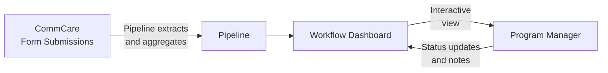

# Workflow Engine

The Workflow Engine lets program managers view configurable dashboards that pull live data directly from CommCare. Each workflow displays field worker performance metrics and supports drill-down into individual records, status tracking, and filtering.

---

## How Data Flows

```mermaid
flowchart LR
    CC[CommCare\nForm Submissions] -->|Pipeline extracts\nand aggregates| P[Pipeline]
    P --> W[Workflow Dashboard]
    W -->|Interactive\nview| PM[Program Manager]
    PM -->|Status updates\nand notes| W
```

**Pipelines** define what data to pull from CommCare and how to aggregate it — counts, sums, most recent values, percentages, and more. **Workflows** define what to display and how users interact with it.

---

## Finding Your Workflows

Click **Workflows** in the top navigation. You'll see a list of all workflows configured for your program.

Each row shows:

- Workflow name and type
- Last run time and data freshness
- Current status
- A schedule badge (for example, **⏱ Weekly**) if the workflow is running on an automatic schedule

Click any workflow to open its dashboard.

### The PERIOD column

The **PERIOD** column in the workflow list shows the date window that was actually audited for each run. Once a run has fired and audited data, this reflects the real window that was processed — which may differ from the date range that was set when the run was first created (for example, when you used the generic **Create Run** button).

When the audited window differs from the original creation-time range, the column shows an **ⓘ info icon** next to the date. Hovering over or tapping the icon shows the original creation-time range for reference. If the two windows are the same, no icon appears.

This means the PERIOD column is the authoritative record of what was actually covered by a run, not just what was intended when it was set up.

### Data freshness on scheduled reports

Scheduled reports can display when their data was actually last synced — and every reader sees the same figure regardless of which device they are on or when they last refreshed their browser.

Previously, the only freshness signal a report could show came from the reader's own browser, so it described when *that browser* last pulled data rather than when the underlying data was refreshed. On a report like the Ward Progress Tracker, this meant a reader on a second device — or one who simply had not refreshed in a while — might see "18h 36m ago" even though the data had in fact been refreshed at 04:21 that morning.

Scheduled reports that display a "last synced" or "last refreshed" time now draw that figure from the schedule itself, so it reflects the real sync time and is consistent across all readers.

### Run failure reasons

If a scheduled or unattended run fails, the run now records the reason for the failure alongside the failed status. Previously, a failure was logged with no error message, making it impossible to diagnose the problem without accessing production logs. You can now see what went wrong directly on the run record, which makes it easier to decide whether to retry, adjust settings, or contact support.

### Deep-linking to a specific workflow card

If someone shares a direct link to a specific workflow card — for example, a URL ending in `#workflow-5110` — the page will smoothly scroll to that card and briefly highlight it so you can spot it immediately, even on a long list. This works the same way in both the program view and the opportunity view.

### Program-level vs. opportunity-level workflows

Workflows in Connect Labs are owned by either a **program** or a specific **opportunity**:

- **Program-owned workflows** are scoped directly to the program — they have no owning opportunity at all. They appear in the program view only, cover the program as a whole — for example, the Program Audit Creator and Program Audit Report — and do not appear under any individual opportunity. All operations on these workflows (opening them, creating a run, viewing a run page) work entirely within the program context; no opportunity is needed. When you open a program-owned workflow, it verifies your access at the program level and loads its pipeline data across all the opportunities the workflow spans — you do not need to select an individual opportunity first.
- **Opportunity-owned workflows** appear under their specific opportunity only. They will not appear in the program-level workflow list.

This means each workflow appears in exactly one place. If you cannot find a workflow you expect to see, check whether you are viewing the program level or the relevant opportunity level.

!!! note "The opp: badge is not shown in the program view"
    When you are browsing the program-level workflow list, opportunity identifiers are not displayed next to workflow names. Only workflows that are explicitly owned by the program appear there, so the badge carries no useful information at that level and is hidden to keep the list uncluttered.

!!! note "Creating a run from the program view"
    Clicking **Create Run** on a program-owned workflow works the same as creating a run from any other context. Because these workflows are genuinely scoped to the program rather than to any opportunity, Create Run resolves correctly from the program view with no extra steps required.

    If you have recently opened a per-opportunity run in another tab (for example, by clicking an "open run ↗" link"), that should no longer affect Create Run on program-owned workflows. The program view keeps the program context in place, so Create Run on a program-owned workflow will always create the run under the program — not under whichever opportunity you last visited. If you do see a "Workflow not found" error, try refreshing the program workflow list page and clicking Create Run again.

!!! note "Drilling into worker visits from a program-level report"
    When you open a worker's case in the worker review from a programme report created at program level, their visits now load correctly. Previously, this could show a "pipeline not found" error; this has been fixed and visit data loads as expected.

---

## Pipeline Data Sources

Pipelines can pull data from CommCare form submissions or from external files such as Google Drive exports. The two source types work differently and have different access rules.

### Supply data as a pipeline source

Workflows can now use **supply data** as a first-class data source, alongside CommCare form submissions and Drive files. This means stock views — covering what field workers hold, what the stores contain, orders, tenders, and more — can be built into workflows and updated per programme or opportunity without a software deployment.

Supply pipelines read data with the same access rules as the Supply pages elsewhere in Connect Labs. A workflow reading supply data across several opportunities (or even across programmes) works the same way programme-level reports already do — it spans the opportunities you configure it for and shows only what you have permission to see.

The Supply Stock page links directly to any supply workflow that has been set up for your programme or opportunity.

### Multiple summaries from a single pipeline

A summary pipeline can now produce several different breakdowns in one pass rather than requiring a separate pipeline for each breakdown. For example, instead of one pipeline for totals by questionnaire, another for totals by question, another for totals by state, and so on, a single pipeline can declare all of those as named **groupings** and compute them all together from one read of the data.

Each grouping can also break down by several fields at once — for example, question × answer type × state — without needing a separate pipeline per combination.

When a dashboard reads a pipeline that uses this feature, it receives all the summaries together as a single list of rows. Each row identifies which grouping it belongs to, so the dashboard can separate them and display each breakdown in the right place.

**What this means in practice:**

- Dashboards that previously required many pipelines to cover different breakdowns can now be powered by far fewer.
- Figures are computed consistently because all breakdowns come from the same single read of the underlying data.
- Existing pipelines are unaffected — this is an optional capability available to new and updated pipeline configurations.

### Google Drive pipelines scoped to a whole program

A pipeline can be configured to read a Google Drive file that covers an **entire program** rather than one opportunity. The Connect Interviews dashboard — whose interview exports span every cohort — is the first dashboard to use this.

**How access works**

Only staff in the organisation that **manages the program** can see data from a program-scoped Drive pipeline. Staff whose organisation runs one of the program's opportunities (partner network organisations) cannot. This means one cohort's partner never sees another cohort's raw interview answers, even though the underlying file contains data for all cohorts.

**How data is read**

The Drive file is read **once for the whole program**. Before this change, a program dashboard spanning many opportunities would have counted every row in the file once per opportunity — potentially inflating every figure by the number of opportunities. With a program-scoped pipeline the file is processed a single time, so counts and aggregations are correct regardless of how many opportunities the program contains.

**How caching works**

Once a Drive file has been read, Connect Labs keeps the processed data in cache and reuses it until the underlying file in Drive changes — or for up to a week, whichever comes first. Previously, the cache expired every hour regardless of whether the file had changed, so the first person to open the dashboard after an idle hour would wait for a full rebuild. On the interview-classification dashboard that rebuild took around 16 minutes. Now, a cold load only happens when it needs to — when the file genuinely has new content — and subsequent opens are fast for everyone.

**Limiting which columns are read**

A Google Drive pipeline can now declare a list of the specific columns it actually uses. When a column list is present, Connect Labs keeps only those cells from each row and discards the rest before caching. This means a wide export file where the dashboard only reads a handful of columns loads and caches a fraction of the data compared to reading the whole file.

- **If you omit the column list**, every column in the file is kept — exactly as before. Existing pipelines are unaffected.
- **If a column list is present but a field in the pipeline tries to read a column that is not on the list**, the pipeline cannot be saved. The error message names every missing column and the field that tries to read it, so you know exactly what to add to the list (or correct in the pipeline). This prevents dashboards from silently showing empty values because a column was accidentally left off the list.

If you are setting up or editing a Google Drive pipeline and you want to use this feature, ask your program administrator or the person who configured the pipeline to add the relevant column names to the pipeline's data source settings.

**Setting one up**

Program-scoped Drive pipelines are built through the labs MCP. The steps are:

1. Create the pipeline at the **program** level (not under an individual opportunity).
2. Preview the pipeline to confirm the data looks correct.
3. Create a program-owned dashboard and attach the pipeline.
4. Enable **load on demand** if you want the data to refresh only when a user opens the dashboard, rather than on a fixed schedule.

!!! note "Program-scoped Drive pipelines are separate from opportunity-level Drive pipelines"
    If your program already has Drive pipelines attached to individual opportunities, those are unaffected. A program-scoped pipeline is a distinct configuration that sits at the program level and is subject to the managing-organisation access restriction described above.

---

## Built-in Workflow Templates

### Supply Stock Review

The **Supply Stock Review** is a ready-made workflow template for monitoring field worker stock. You can enable it for the opportunities you choose without any software deployment. It reads supply data using the same access rules as the Supply pages, and can span several opportunities — or several programmes — the same way a programme-level report does. The Supply Stock page links to it directly once it is set up.

The dashboard is organised into the following views:

**Headline figures**
A summary of what is currently with field workers, expressed in sachets and in children's courses; how much has been given out (with the share that sits on visits not yet approved broken out separately); and the daily rate at which stock is going out.

**Runway**
One bar per worker, sorted so the worker who will run out soonest appears first. Each bar shows the worker's projected run-out date based on their own pace over the last 14 days, and their most recent count against the ledger.

**Does it add up?**
A reconciliation table showing, for each worker: stock issued, stock given out, what the ledger says they hold, what they actually counted, the gap between the ledger and the count, visits that did not record a stock figure, and the share of transactions sitting on unapproved visits.

**A worker's history**
Click any worker to open a day-by-day view of their stock movements and counts.

**The stores behind them**
Stock held in the stores that supply the workers, shown in sachets with cartons alongside.

---

## Indicator Registries

An **indicator registry** is a shared list of named indicators that multiple reports can read from a single place. Rather than defining the same indicator separately in each report, you define it once in a registry and reports refer to it by name.

### Creating a registry

When creating a registry you must say where it lives — an **organisation**, a **programme**, or an **opportunity**. This scope determines who can see and use the registry, and it is how the system knows where to find it when a report loads.

A registry created without a scope cannot be opened, edited, or deleted, so the system now requires a scope before saving. If you are asked to set up a registry and are unsure which scope to use, check with your program administrator.

### Deleting a registry

You can delete a registry you no longer need from the same organisation, programme, or opportunity page where it lives.

Before deleting, the system checks whether any reports are still bound to the registry. If they are, the deletion is blocked and you will see a list of the affected report IDs. You must either rebind those reports to a different registry or remove the registry from them before the deletion can go ahead. This prevents reports from silently losing their indicator definitions.

Once no reports are bound to it, the registry can be deleted without further steps.

### How workers and cases are named in indicator reports

Indicator reports previously showed raw system identifiers in place of readable names. Worker tables displayed internal usernames (such as a short code on test programmes or a long string of characters on live ones), and case tables were headed by a truncated system ID. Reports now display human-readable names instead.

**Workers are shown by name.** The worker table and the worker review page both show each field worker's name. This applies to the generic indicator report family and the KMC reports, which share the same builder. If a worker's name is not available, the report falls back to their username.

**Cases can be shown by name.** A registry can be configured with a field that holds the case's display name — for example, the field where Connect stores a beneficiary's name. When that field is set, the first column of the case table and the heading in the worker review both show the case's name rather than its ID. If a particular case has no name value, the ID is shown as a fallback.

**Test (synthetic) programmes are also covered.** Programmes used for testing already had display names defined for their simulated workers, and those names now appear in reports. Generated test cases previously appeared as "Beneficiary 1", "Beneficiary 2", and so on; they can now be given real names in the programme's configuration, which will appear in reports instead.

If you work with an indicator report and still see raw IDs where you would expect names, check with your program administrator that the registry has the case name field configured.

### What indicator reports look like on new programmes

The generic indicator reports — the programme report, the opportunity/partner report, and the worker review — now start every new programme with a consistent set of display improvements. These were previously applied one at a time to individual programme copies during review sessions; they are now part of the standard template so every new programme gets them from the beginning.

**Readable text throughout.** All text that was previously too light to read comfortably — secondary labels, footnotes, chart axis labels, and sort arrows — now uses sufficient contrast to meet accessibility standards.

**Colour-coded status labels explain themselves.** Hovering over a **Watch** or **Off target** badge in any legend, scorecard, or worker review now shows the rule behind the colour — for example, "Meeting regularity 60%–80% (target ≥ 80%)". You no longer need to remember or look up what each threshold means.

**Columns that repeated one value on every row are removed.** If every worker in a table has the same caseload size, the same visit status, or the same benchmark coverage, that value is stated once in a heading or caption rather than filling an entire column with identical text.

**Worker review improvements.** The visit reading chart fills its card fully, shows a date label under each visit, starts from zero, and shades each gap between visits individually — including the gap's length. Status flags appear as clearly labelled pills with an explanation. When peer medians across indicators are identical, they are merged into a single column. The review also distinguishes clearly between "no target set", "no eligible cases", and "no data available" — previously these could appear identical.

**Programme report drill-down improvements.** When you drill into a single partner or opportunity, a caption names it, shows its size, and identifies which indicator it is flagged on. That indicator's trend chart displays at full width with its data points labelled. Headline tiles for indicators that have no target say "no target" explicitly rather than leaving the tile blank or ambiguous.

**Opportunity report — Benchmarks tab improvements.** Bar charts are drawn on a true zero-based scale with a clearly labelled dashed line at the target value. Your own organisation is shown in a distinct colour with its status as a pill. A **See workers →** shortcut link opens the worker list sorted worst-first. Indicators that have no better-or-worse direction (for example
