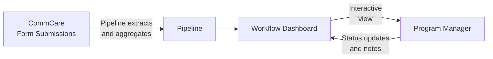

# Workflow Engine

The Workflow Engine lets program managers view configurable dashboards that pull live data directly from CommCare. Each workflow displays field worker performance metrics and supports drill-down into individual records, status tracking, and filtering.

---

## How Data Flows

```mermaid
flowchart LR
    CC[CommCare\nForm Submissions] -->|Pipeline extracts\nand aggregates| P[Pipeline]
    P --> W[Workflow Dashboard]
    W -->|Interactive\nview| PM[Program Manager]
    PM -->|Status updates\nand notes| W
```

**Pipelines** define what data to pull from CommCare and how to aggregate it — counts, sums, most recent values, percentages, and more. **Workflows** define what to display and how users interact with it.

---

## Finding Your Workflows

Click **Workflows** in the top navigation. You'll see a list of all workflows configured for your program.

Each row shows:

- Workflow name and type
- Last run time and data freshness
- Current status
- A schedule badge (for example, **⏱ Weekly**) if the workflow is running on an automatic schedule

Click any workflow to open its dashboard.

### The PERIOD column

The **PERIOD** column in the workflow list shows the date window that was actually audited for each run. Once a run has fired and audited data, this reflects the real window that was processed — which may differ from the date range that was set when the run was first created (for example, when you used the generic **Create Run** button).

When the audited window differs from the original creation-time range, the column shows an **ⓘ info icon** next to the date. Hovering over or tapping the icon shows the original creation-time range for reference. If the two windows are the same, no icon appears.

This means the PERIOD column is the authoritative record of what was actually covered by a run, not just what was intended when it was set up.

### Data freshness on scheduled reports

Scheduled reports can display when their data was actually last synced — and every reader sees the same figure regardless of which device they are on or when they last refreshed their browser.

Previously, the only freshness signal a report could show came from the reader's own browser, so it described when *that browser* last pulled data rather than when the underlying data was refreshed. On a report like the Ward Progress Tracker, this meant a reader on a second device — or one who simply had not refreshed in a while — might see "18h 36m ago" even though the data had in fact been refreshed at 04:21 that morning.

Scheduled reports that display a "last synced" or "last refreshed" time now draw that figure from the schedule itself, so it reflects the real sync time and is consistent across all readers.

### Run failure reasons

If a scheduled or unattended run fails, the run now records the reason for the failure alongside the failed status. Previously, a failure was logged with no error message, making it impossible to diagnose the problem without accessing production logs. You can now see what went wrong directly on the run record, which makes it easier to decide whether to retry, adjust settings, or contact support.

### Deep-linking to a specific workflow card

If someone shares a direct link to a specific workflow card — for example, a URL ending in `#workflow-5110` — the page will smoothly scroll to that card and briefly highlight it so you can spot it immediately, even on a long list. This works the same way in both the program view and the opportunity view.

### Program-level vs. opportunity-level workflows

Workflows in Connect Labs are owned by either a **program** or a specific **opportunity**:

- **Program-owned workflows** are scoped directly to the program — they have no owning opportunity at all. They appear in the program view only, cover the program as a whole — for example, the Program Audit Creator and Program Audit Report — and do not appear under any individual opportunity. All operations on these workflows (opening them, creating a run, viewing a run page) work entirely within the program context; no opportunity is needed. When you open a program-owned workflow, it verifies your access at the program level and loads its pipeline data across all the opportunities the workflow spans — you do not need to select an individual opportunity first.
- **Opportunity-owned workflows** appear under their specific opportunity only. They will not appear in the program-level workflow list.

This means each workflow appears in exactly one place. If you cannot find a workflow you expect to see, check whether you are viewing the program level or the relevant opportunity level.

!!! note "The opp: badge is not shown in the program view"
    When you are browsing the program-level workflow list, opportunity identifiers are not displayed next to workflow names. Only workflows that are explicitly owned by the program appear there, so the badge carries no useful information at that level and is hidden to keep the list uncluttered.

!!! note "Creating a run from the program view"
    Clicking **Create Run** on a program-owned workflow works the same as creating a run from any other context. Because these workflows are genuinely scoped to the program rather than to any opportunity, Create Run resolves correctly from the program view with no extra steps required.

    If you have recently opened a per-opportunity run in another tab (for example, by clicking an "open run ↗" link"), that should no longer affect Create Run on program-owned workflows. The program view keeps the program context in place, so Create Run on a program-owned workflow will always create the run under the program — not under whichever opportunity you last visited. If you do see a "Workflow not found" error, try refreshing the program workflow list page and clicking Create Run again.

!!! note "Drilling into worker visits from a program-level report"
    When you open a worker's case in the worker review from a programme report created at program level, their visits now load correctly. Previously, this could show a "pipeline not found" error; this has been fixed and visit data loads as expected.

---

## Pipeline Data Sources

Pipelines can pull data from CommCare form submissions or from external files such as Google Drive exports. The two source types work differently and have different access rules.

### Supply data as a pipeline source

Workflows can now use **supply data** as a first-class data source, alongside CommCare form submissions and Drive files. This means stock views — covering what field workers hold, what the stores contain, orders, tenders, and more — can be built into workflows and updated per programme or opportunity without a software deployment.

Supply pipelines read data with the same access rules as the Supply pages elsewhere in Connect Labs. A workflow reading supply data across several opportunities (or even across programmes) works the same way programme-level reports already do — it spans the opportunities you configure it for and shows only what you have permission to see.

The Supply Stock page links directly to any supply workflow that has been set up for your programme or opportunity.

### Multiple summaries from a single pipeline

A summary pipeline can now produce several different breakdowns in one pass rather than requiring a separate pipeline for each breakdown. For example, instead of one pipeline for totals by questionnaire, another for totals by question, another for totals by state, and so on, a single pipeline can declare all of those as named **groupings** and compute them all together from one read of the data.

Each grouping can also break down by several fields at once — for example, question × answer type × state — without needing a separate pipeline per combination.

When a dashboard reads a pipeline that uses this feature, it receives all the summaries together as a single list of rows. Each row identifies which grouping it belongs to, so the dashboard can separate them and display each breakdown in the right place.

**What this means in practice:**

- Dashboards that previously required many pipelines to cover different breakdowns can now be powered by far fewer.
- Figures are computed consistently because all breakdowns come from the same single read of the underlying data.
- Existing pipelines are unaffected — this is an optional capability available to new and updated pipeline configurations.

### Google Drive pipelines scoped to a whole program

A pipeline can be configured to read a Google Drive file that covers an **entire program** rather than one opportunity. The Connect Interviews dashboard — whose interview exports span every cohort — is the first dashboard to use this.

**How access works**

Only staff in the organisation that **manages the program** can see data from a program-scoped Drive pipeline. Staff whose organisation runs one of the program's opportunities (partner network organisations) cannot. This means one cohort's partner never sees another cohort's raw interview answers, even though the underlying file contains data for all cohorts.

**How data is read**

The Drive file is read **once for the whole program**. Before this change, a program dashboard spanning many opportunities would have counted every row in the file once per opportunity — potentially inflating every figure by the number of opportunities. With a program-scoped pipeline the file is processed a single time, so counts and aggregations are correct regardless of how many opportunities the program contains.

**How caching works**

Once a Drive file has been read, Connect Labs keeps the processed data in cache and reuses it until the underlying file in Drive changes — or for up to a week, whichever comes first. Previously, the cache expired every hour regardless of whether the file had changed, so the first person to open the dashboard after an idle hour would wait for a full rebuild. On the interview-classification dashboard that rebuild took around 16 minutes. Now, a cold load only happens when it needs to — when the file genuinely has new content — and subsequent opens are fast for everyone.

**Limiting which columns are read**

A Google Drive pipeline can now declare a list of the specific columns it actually uses. When a column list is present, Connect Labs keeps only those cells from each row and discards the rest before caching. This means a wide export file where the dashboard only reads a handful of columns loads and caches a fraction of the data compared to reading the whole file.

- **If you omit the column list**, every column in the file is kept — exactly as before. Existing pipelines are unaffected.
- **If a column list is present but a field in the pipeline tries to read a column that is not on the list**, the pipeline cannot be saved. The error message names every missing column and the field that tries to read it, so you know exactly what to add to the list (or correct in the pipeline). This prevents dashboards from silently showing empty values because a column was accidentally left off the list.

If you are setting up or editing a Google Drive pipeline and you want to use this feature, ask your program administrator or the person who configured the pipeline to add the relevant column names to the pipeline's data source settings.

**Setting one up**

Program-scoped Drive pipelines are built through the labs MCP. The steps are:

1. Create the pipeline at the **program** level (not under an individual opportunity).
2. Preview the pipeline to confirm the data looks correct.
3. Create a program-owned dashboard and attach the pipeline.
4. Enable **load on demand** if you want the data to refresh only when a user opens the dashboard, rather than on a fixed schedule.

!!! note "Program-scoped Drive pipelines are separate from opportunity-level Drive pipelines"
    If your program already has Drive pipelines attached to individual opportunities, those are unaffected. A program-scoped pipeline is a distinct configuration that sits at the program level and is subject to the managing-organisation access restriction described above.

---

## Built-in Workflow Templates

### Supply Stock Review

The **Supply Stock Review** is a ready-made workflow template for monitoring field worker stock. You can enable it for the opportunities you choose without any software deployment. It reads supply data using the same access rules as the Supply pages, and can span several opportunities — or several programmes — the same way a programme-level report does. The Supply Stock page links to it directly once it is set up.

The dashboard is organised into the following views:

**Headline figures**
A summary of what is currently with field workers, expressed in sachets and in children's courses; how much has been given out (with the share that sits on visits not yet approved broken out separately); and the daily rate at which stock is going out.

**Runway**
One bar per worker, sorted so the worker who will run out soonest appears first. Each bar shows the worker's projected run-out date based on their own pace over the last 14 days, and their most recent count against the ledger.

**Does it add up?**
A reconciliation table showing, for each worker: stock issued, stock given out, what the ledger says they hold, what they actually counted, the gap between the ledger and the count, visits that did not record a stock figure, and the share of transactions sitting on unapproved visits.

**A worker's history**
Click any worker to open a day-by-day view of their stock movements and counts.

**The stores behind them**
Stock held in the stores that supply the workers, shown in sachets with cartons alongside.

### IPTsc School Delivery Dashboard

The **IPTsc School Delivery Dashboard** includes an **Authenticity** tab and a **Duplicates** tab for identifying possible duplicate child registrations.

#### Duplicate checks on the Authenticity tab

Three checks run automatically against the registrations in the dashboard:

| Check | What is matched | Raises a flag on the field worker? |
|---|---|---|
| Same name, same school | Name only | No — shown for information only, because common names make this check loose |
| Same name, same age, same school | Name and age | Yes |
| Same name, same age, same caregiver phone, same school | Name, age, and caregiver phone | Yes |

Each check shows a count of flagged registrations, with the number of **unique** suspected children in brackets — for example, **6 (3 unique)**. Children who are missing a matched attribute (age, or caregiver phone for the third check) are not compared on that check. Caregiver phone numbers are matched with or without the +234 country prefix.

Clicking any check on the Authenticity tab takes you straight to that check's review in the Duplicates tab.

#### The Duplicates tab

Select which check to review using the picker at the top of the tab. Each suspected child appears as one row. Every registration that matches that child is shown side by side, with:

- The consent photo (click to open full size)
- Name, school, age and sex, and caregiver phone
- Who registered the child and when
- An **Open visit in Connect** link to the registration visit
- The child's visit timeline

Rows where more than one field worker submitted a matching registration are clearly marked.

### MUAC/Age Plausibility Report

The **MUAC/Age Plausibility** report is available for CHC programmes (currently built for Program 217, CHC - NG - RCT). It shows what share of approved MUAC readings are implausible for the child's age, broken down by LLO, ward, and field worker (FLW). Every percentage shows its numerator and denominator so you always know the basis for each figure.

The report refreshes on a schedule (daily is recommended) rather than on page load.

#### What counts as implausible

A reading is flagged as implausible — and counted in the headline percentage — if it is below 9 cm, or above an age-banded ceiling. The ceilings range from 17.5 cm to 21 cm, with a higher ceiling for girls aged 48–59 months. These readings are near-certain data entry errors.

The following are tracked separately and are never added to the implausible headline:

- Readings below the WHO −2SD threshold (possible genuine malnutrition rather than an error)
- Apparent millimetre/centimetre mix-ups — for example, 145 entered where 14.5 was meant
- Records with no age recorded or no MUAC recorded

#### Colour coding

Colours are driven by the same one-sided 95% statistical test used by the audit indicators, so a field worker with only a handful of readings is not flagged red simply by chance. Units with fewer than 20 readings are shown in grey. A fixed-percentage colour scheme is also available as a toggle if you prefer a simpler threshold view. The page always states which colour scheme is active.

#### Filters and drill-down

- Filter by week range, LLO, ward, or age band.
- Switch between the age-banded ceiling and a flat 9–20 cm ceiling.
- Click an LLO to drill down to its wards; click a ward to drill down to its FLWs.
- A weekly trend chart shows whether a problem is a one-off batch or a recurring pattern.

### GPS Map and UAT Comparison: location filters

Dashboards that include a **GPS Map** tab or a **UAT Comparison** tab now have controls for filtering visits by the location type the field worker recorded on the form — **Home**, **Health facility**, or **Other**.

#### GPS Map tab

Hovering over any visit point on the map now shows the location type the field worker selected for that visit, alongside the other visit details already displayed.

A **Hide visits not at mother's home** checkbox sits above the map. It is **off by default**, so the map shows all visit points exactly as before. Ticking it removes non-home visit points from the map — health facility and other visits disappear — while keeping each mother's registration point and all home visits in view. This makes it easier to focus on the pattern of home visits without other location types cluttering the map.

#### UAT Comparison tab

An **Exclude visits not at mother's home** checkbox sits above the comparison metrics. It is **on by default**. When checked, visits the field worker marked as taking place at a health facility or another non-home location are removed from both GPS metrics — **Revisit Dist** and **Metres/Visit** — on both the UAT and pre-UAT sides of the comparison.

The reason for this default: a health
