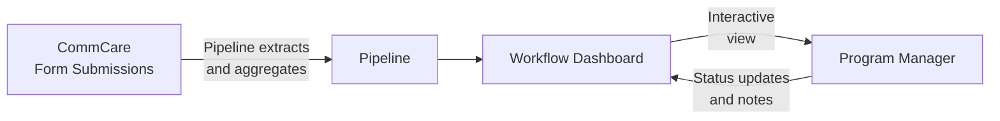

# Workflow Engine

The Workflow Engine lets program managers view configurable dashboards that pull live data directly from CommCare. Each workflow displays field worker performance metrics and supports drill-down into individual records, status tracking, and filtering.

---

## How Data Flows

```mermaid
flowchart LR
    CC[CommCare\nForm Submissions] -->|Pipeline extracts\nand aggregates| P[Pipeline]
    P --> W[Workflow Dashboard]
    W -->|Interactive\nview| PM[Program Manager]
    PM -->|Status updates\nand notes| W
```

**Pipelines** define what data to pull from CommCare and how to aggregate it — counts, sums, most recent values, percentages, and more. **Workflows** define what to display and how users interact with it.

---

## Finding Your Workflows

Click **Workflows** in the top navigation. You'll see a list of all workflows configured for your program.

Each row shows:

- Workflow name and type
- Last run time and data freshness
- Current status
- A schedule badge (for example, **⏱ Weekly**) if the workflow is running on an automatic schedule

Click any workflow to open its dashboard.

On the Workflows list, **pages** (see [Pages](#pages)) appear alongside regular workflows but show an **Open page** button instead of **Start run**. Pages do not appear in the workflow run list.

### The PERIOD column

The **PERIOD** column in the workflow list shows the date window that was actually audited for each run. Once a run has fired and audited data, this reflects the real window that was processed — which may differ from the date range that was set when the run was first created (for example, when you used the generic **Create Run** button).

When the audited window differs from the original creation-time range, the column shows an **ⓘ info icon** next to the date. Hovering over or tapping the icon shows the original creation-time range for reference. If the two windows are the same, no icon appears.

This means the PERIOD column is the authoritative record of what was actually covered by a run, not just what was intended when it was set up.

### Data freshness on scheduled reports

Scheduled reports can display when their data was actually last synced — and every reader sees the same figure regardless of which device they are on or when they last refreshed their browser.

Previously, the only freshness signal a report could show came from the reader's own browser, so it described when *that browser* last pulled data rather than when the underlying data was refreshed. On a report like the Ward Progress Tracker, this meant a reader on a second device — or one who simply had not refreshed in a while — might see "18h 36m ago" even though the data had in fact been refreshed at 04:21 that morning.

Scheduled reports that display a "last synced" or "last refreshed" time now draw that figure from the schedule itself, so it reflects the real sync time and is consistent across all readers.

### Run failure reasons

If a scheduled or unattended run fails, the run now records the reason for the failure alongside the failed status. Previously, a failure was logged with no error message, making it impossible to diagnose the problem without accessing production logs. You can now see what went wrong directly on the run record, which makes it easier to decide whether to retry, adjust settings, or contact support.

### Deep-linking to a specific workflow card

If someone shares a direct link to a specific workflow card — for example, a URL ending in `#workflow-5110` — the page will smoothly scroll to that card and briefly highlight it so you can spot it immediately, even on a long list. This works the same way in both the program view and the opportunity view.

### Program-level vs. opportunity-level workflows

Workflows in Connect Labs are owned by either a **program** or a specific **opportunity**:

- **Program-owned workflows** are scoped directly to the program — they have no owning opportunity at all. They appear in the program view only, cover the program as a whole — for example, the Program Audit Creator and Program Audit Report — and do not appear under any individual opportunity. All operations on these workflows (opening them, creating a run, viewing a run page) work entirely within the program context; no opportunity is needed. When you open a program-owned workflow, it verifies your access at the program level and loads its pipeline data across all the opportunities the workflow spans — you do not need to select an individual opportunity first.
- **Opportunity-owned workflows** appear under their specific opportunity only. They will not appear in the program-level workflow list.

This means each workflow appears in exactly one place. If you cannot find a workflow you expect to see, check whether you are viewing the program level or the relevant opportunity level.

!!! note "The opp: badge is not shown in the program view"
    When you are browsing the program-level workflow list, opportunity identifiers are not displayed next to workflow names. Only workflows that are explicitly owned by the program appear there, so the badge carries no useful information at that level and is hidden to keep the list uncluttered.

!!! note "Creating a run from the program view"
    Clicking **Create Run** on a program-owned workflow works the same as creating a run from any other context. Because these workflows are genuinely scoped to the program rather than to any opportunity, Create Run resolves correctly from the program view with no extra steps required.

    If you have recently opened a per-opportunity run in another tab (for example, by clicking an "open run ↗" link"), that should no longer affect Create Run on program-owned workflows. The program view keeps the program context in place, so Create Run on a program-owned workflow will always create the run under the program — not under whichever opportunity you last visited. If you do see a "Workflow not found" error, try refreshing the program workflow list page and clicking Create Run again.

!!! note "Drilling into worker visits from a program-level report"
    When you open a worker's case in the worker review from a programme report created at program level, their visits now load correctly. Previously, this could show a "pipeline not found" error; this has been fixed and visit data loads as expected.

---

## Pages

A **page** is a screen built with the same workflow tools as a regular workflow, but it has no runs. Instead of collecting data over a date range and producing a run to review, a page simply displays what an organisation, programme, or opportunity holds — with links into each — and can show the latest run of any workflow you are able to open.

Pages are useful for landing screens and summary views that you want to keep permanently visible without starting a new run each time.

### How pages are different from workflows

| | Regular workflow | Page |
|---|---|---|
| Has runs | Yes | No |
| Workflows list button | **Start run** | **Open page** |
| Built with workflow tools | Yes | Yes |

### Access to workflows shown on a page

A page can display the latest run of other workflows. You will only see a workflow's run on a page if you have access to open that workflow directly — the same check that applies when you open it from the Workflows list. This applies to all workflows, including synthetic (labs-only) ones.

### Addresses for pages

Each level of Labs has its own address for its page:

| Level | Address |
|---|---|
| Organisation | `/labs/p/org/<organisation>/` |
| Programme | `/labs/p/programme/<id>/` |
| Opportunity | `/labs/p/opportunity/<id>/` |

!!! note "Old page links"
    The previous page addresses at `/labs/p/<name>/` no longer exist. If you follow an old link, Labs will take you to the new page at the correct address when your organisation, programme, or opportunity has one. If no matching page is found, you will see a message explaining that pages have moved rather than an error. Update any bookmarks or shared links to use the new addresses shown in the table above.

### Setting an organisation's home page

An organisation can have one page designated as its **home page**. When someone picks that organisation in Labs — or follows a link to `/labs/overview/?organization_id=<organisation>` — they land on the home page instead of the default overview.

To set the home page, go to the organisation's **Settings** and choose the page you want visitors to land on. You must have access to the programme or opportunity behind the page in order to set it as the home page, and visitors will only be taken to the home page if they have that same access.

### Pages in the Supply tab

A page can also be set to fill a **Supply tab**. When configured this way, the page opens inside the Supply header without starting a run. This lets you show stock summaries, links to supply workflows, or other supply-related content directly from the Supply tab.

The Supply tab opens only for people who have access to the programme or opportunity it is linked to. Setting up a Supply tab also requires access to that programme or opportunity. A programme can hide or rename a Supply tab that its organisation added — use the **Hide** button in Settings to do this.

### Building a page

Pages are built with the standard workflow tools. To create one, start from the **Page** template in the workflow builder. Once published, the page appears in the Workflows list with an **Open page** button in place of **Start run**.

!!! note "Pages cannot be started as runs"
    A page cannot be started as a run. If you need to collect data over a date range and review it, use a regular workflow instead.

---

## Settings

### Synthetic organisations

A synthetic organisation groups every synthetic programme that shares the same organisation name, regardless of who created them. Members of a synthetic organisation can read its Settings, but only **Dimagi staff** can make changes to a synthetic organisation's Settings. Each individual synthetic programme can still set its own Settings independently.

!!! note "Settings forms"
    If you enter a value that is not a valid number in a Settings form, you will see a clear error message rather than a crash. Correct the value and save again.

---

## Coaching Workers from a Run Page

When you ask the canopy agent to coach a field worker from a Labs run page, the agent can show a **coaching card** directly in the chat. The card displays:

- The worker's name
- The topics the coach will raise
- The first message the worker will receive
- A picture of the worker's figures

### Case coaching — talking to a worker about one baby

In addition to coaching on indicator scores, the agent can now coach a field worker about a **specific baby**. Labs reviews each baby's recent visits and identifies one of four stories that best describes their situation. Every figure in the coaching comes from that baby's own visits.

#### The four stories

| Story | What it means |
|---|---|
| **Danger sign recorded — not referred** | A danger sign was recorded for the baby but the baby was not referred for follow-up care |
| **Weighing to check** | A recorded weight is hard to believe and should be verified |
| **Weight has stalled** | The baby's weight has stopped growing while skin-to-skin time is also falling |
| **Growing well** | The baby is growing healthily — an opportunity to recognise the worker's good practice |

Each baby gets one story, and Labs only surfaces babies whose story happened recently — within 30 days of the baby's latest visit.

#### How the briefing is built

When the agent prepares a case coaching conversation, the briefing it shows you comes directly from the **case state** recorded in the registry for that baby. Each case state carries its own coaching guidance, which appears in the briefing immediately after the topic name:

- **What it means** — a plain-language description of the baby's situation
- **How to talk about it** — suggested language and tone for the conversation
- **The step to agree** — the specific action the worker and coach should agree on
- **What it does not tell you** — important caveats to keep in mind

This means the briefing reflects whatever guidance has been configured for that case state in the registry, rather than fixed text. If the guidance for a state is updated in the registry, future briefings will pick up the change automatically.

The picture the worker receives is drawn using the picture type that the case state names — so different states can produce different picture styles without any further configuration in Labs.

#### How the agent suggests a case coaching conversation

For each worker on an opportunity, Labs lists — per story — the babies that are currently eligible. The canopy agent panel uses this list to suggest one conversation per worker. You review the suggestion and approve it before anything is sent.

!!! note "Saved run weeks record eligible cases"
    Each saved week of the KMC Opportunity Report records which babies were eligible for which story. This means the agent can see what earlier weeks offered, so suggestions take previous opportunities into account.

#### Starting a test case coaching conversation from the worker review

The KMC Worker Review's case panel includes a **Coach about this baby** button. This lets you start a test coaching conversation about one specific baby directly from the baby's case panel, without going through the canopy agent.

The button appears when two things are true:

- The workflow has a coaching action set up.
- The baby's case is in a recognised case state in the registry.

Clicking the button opens the coaching dialog, which shows:

- The picture the coach will send
- The baby's story with its supporting facts
- The first message the worker would receive
- The exact briefing

**Test sends only.** The only option available from this button is **Send to me (QA test)** — the conversation goes to your own phone. There is no option to send to the worker from this button. Labs remembers your PersonalID username in your browser, so after your first test send, subsequent sends need just one click.

#### Case coaching pictures

Each story has its own picture designed to be read on a phone. The picture type is determined by the case state recorded in the registry for that baby:

| Story | Picture |
|---|---|
| **Growing well** | The baby's weight line climbing above the healthy-growth band, with a "Great work!" badge |
| **Weighing to check** | The doubtful weighing circled on the growth line, with a four-step weighing checklist |
| **Weight has stalled** | A flat growth line, with skin-to-skin hours per visit shown as bars |
| **Danger sign** | A card listing the signs recorded, "Not referred", and what to do next |

!!! note "Sending case coaching on synthetic KMC opportunities"
    On synthetic KMC opportunities used for testing, the coaching card offers only **Send to me (QA test)** — messages cannot be sent to real workers from these opportunities.

### Connecting Open Chat Studio before the card loads

Every coaching send — including test sends — runs on your own Open Chat Studio (OCS) connection. Because of this, the card checks your OCS connection before showing anything else. If you are not yet connected, the card shows only:

> **Connect Open Chat Studio first**

with a **Connect Open Chat Studio** button and an **I've connected — continue** link that rechecks the connection. The rest of the card appears once your connection is confirmed.

### Sending from the card

The card has one primary action and a quiet secondary link:

| Action | What it does |
|---|---|
| **Send to \<worker\>** | Sends the coaching message to the field worker |
| **Send a test to me instead** | Switches the card to test mode — enter your PersonalID username, then click **Send test** to preview and send in one step (Dimagi staff only) |

Leaving the card without clicking **Send to \<worker\>** simply means you are not ready yet — there is no separate "Not yet" button.

!!! note "You decide when coaching is sent — the agent never sends it automatically"
    Sending a coaching message is always your action, triggered by clicking **Send to \<worker\>** on the card. The agent will show you the briefing and tell you where to click — either **Send to \<worker\>** on the card in canopy, or **Start coaching** on the Labs run page itself — but it will never send on your behalf. If you prefer to act from the run page rather than the chat, the **Start coaching** button there works exactly as it always has.

!!! note "Sending the same coaching twice"
    If you need to send the same coaching to the same worker again within a short window, this now works. Previously, a repeat send within 15 minutes was refused and the card would loop on "That preview went stale". You can now resend deliberately without hitting that block.

!!! note "If a test send can't go through"
    If **Send test** cannot complete, the card now tells you why underneath the button instead of leaving the button stuck on "Sending…" indefinitely. The most common reason is that your Labs account is not connected to Open Chat Studio. In that case the card shows "Connect Open Chat Studio in Labs first, then Send test again" with a **Connect it** link. Follow that link, connect your account, then return to the card and try **Send test** again.

!!! note "If Open Chat Studio refuses a coaching send"
    When Open Chat Studio refuses to start a coaching conversation, the run now records the specific reason that Open Chat Studio returned, rather than a generic refusal message. The card and the agent will show you that reason directly — for example: "Open Chat Studio refused the request: Failed to create channel: Participant not found in CommCare Connect". This makes it much easier to understand what went wrong and whether you need to take action (such as checking that the worker is registered in CommCare Connect) or contact support.

### Choosing what the worker's picture shows

When preparing coaching — either through the canopy agent card or via **Start coaching** on the run page — you can now choose what chart the worker receives in their picture. The options are:

| Picture option | What the worker sees |
|---|---|
| **Their own figures** | The
