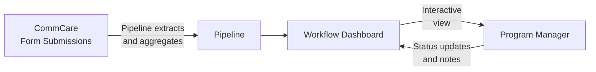

# Workflow Engine

The Workflow Engine lets program managers view configurable dashboards that pull live data directly from CommCare. Each workflow displays field worker performance metrics and supports drill-down into individual records, status tracking, and filtering.

---

## How Data Flows

```mermaid
flowchart LR
    CC[CommCare\nForm Submissions] -->|Pipeline extracts\nand aggregates| P[Pipeline]
    P --> W[Workflow Dashboard]
    W -->|Interactive\nview| PM[Program Manager]
    PM -->|Status updates\nand notes| W
```

**Pipelines** define what data to pull from CommCare and how to aggregate it — counts, sums, most recent values, percentages, and more. **Workflows** define what to display and how users interact with it.

---

## Finding Your Workflows

Click **Workflows** in the top navigation. You'll see a list of all workflows configured for your program.

Each row shows:

- Workflow name and type
- Last run time and data freshness
- Current status
- A schedule badge (for example, **⏱ Weekly**) if the workflow is running on an automatic schedule

Click any workflow to open its dashboard.

### The PERIOD column

The **PERIOD** column in the workflow list shows the date window that was actually audited for each run. Once a run has fired and audited data, this reflects the real window that was processed — which may differ from the date range that was set when the run was first created (for example, when you used the generic **Create Run** button).

When the audited window differs from the original creation-time range, the column shows an **ⓘ info icon** next to the date. Hovering over or tapping the icon shows the original creation-time range for reference. If the two windows are the same, no icon appears.

This means the PERIOD column is the authoritative record of what was actually covered by a run, not just what was intended when it was set up.

### Data freshness on scheduled reports

Scheduled reports can display when their data was actually last synced — and every reader sees the same figure regardless of which device they are on or when they last refreshed their browser.

Previously, the only freshness signal a report could show came from the reader's own browser, so it described when *that browser* last pulled data rather than when the underlying data was refreshed. On a report like the Ward Progress Tracker, this meant a reader on a second device — or one who simply had not refreshed in a while — might see "18h 36m ago" even though the data had in fact been refreshed at 04:21 that morning.

Scheduled reports that display a "last synced" or "last refreshed" time now draw that figure from the schedule itself, so it reflects the real sync time and is consistent across all readers.

### Run failure reasons

If a scheduled or unattended run fails, the run now records the reason for the failure alongside the failed status. Previously, a failure was logged with no error message, making it impossible to diagnose the problem without accessing production logs. You can now see what went wrong directly on the run record, which makes it easier to decide whether to retry, adjust settings, or contact support.

### Deep-linking to a specific workflow card

If someone shares a direct link to a specific workflow card — for example, a URL ending in `#workflow-5110` — the page will smoothly scroll to that card and briefly highlight it so you can spot it immediately, even on a long list. This works the same way in both the program view and the opportunity view.

### Program-level vs. opportunity-level workflows

Workflows in Connect Labs are owned by either a **program** or a specific **opportunity**:

- **Program-owned workflows** are scoped directly to the program — they have no owning opportunity at all. They appear in the program view only, cover the program as a whole — for example, the Program Audit Creator and Program Audit Report — and do not appear under any individual opportunity. All operations on these workflows (opening them, creating a run, viewing a run page) work entirely within the program context; no opportunity is needed. When you open a program-owned workflow, it verifies your access at the program level and loads its pipeline data across all the opportunities the workflow spans — you do not need to select an individual opportunity first.
- **Opportunity-owned workflows** appear under their specific opportunity only. They will not appear in the program-level workflow list.

This means each workflow appears in exactly one place. If you cannot find a workflow you expect to see, check whether you are viewing the program level or the relevant opportunity level.

!!! note "The opp: badge is not shown in the program view"
    When you are browsing the program-level workflow list, opportunity identifiers are not displayed next to workflow names. Only workflows that are explicitly owned by the program appear there, so the badge carries no useful information at that level and is hidden to keep the list uncluttered.

!!! note "Creating a run from the program view"
    Clicking **Create Run** on a program-owned workflow works the same as creating a run from any other context. Because these workflows are genuinely scoped to the program rather than to any opportunity, Create Run resolves correctly from the program view with no extra steps required.

    If you have recently opened a per-opportunity run in another tab (for example, by clicking an "open run ↗" link"), that should no longer affect Create Run on program-owned workflows. The program view keeps the program context in place, so Create Run on a program-owned workflow will always create the run under the program — not under whichever opportunity you last visited. If you do see a "Workflow not found" error, try refreshing the program workflow list page and clicking Create Run again.

!!! note "Drilling into worker visits from a program-level report"
    When you open a worker's case in the worker review from a programme report created at program level, their visits now load correctly. Previously, this could show a "pipeline not found" error; this has been fixed and visit data loads as expected.

---

## Taking Actions from a Report

Some reports can offer **action buttons** — for example, **"Initiate AI coach"** or **"Create follow-up task"** — that let you act on the data you are looking at without leaving the page. The same actions can also be run by an AI assistant. Both features are off by default and must be switched on for each report individually; at present they are enabled for the **Spark facilitator program report** only.

### Running an action from a button

Clicking an action button opens a confirmation screen before anything happens. The confirmation shows:

- Exactly which workers the action will reach
- What the coaching bot will be told
- Which bot will be used (you can choose if more than one is available)

Nothing is sent until you press **Confirm**. Once you confirm, the page shows each worker's result as it completes, so you can see in real time which actions succeeded.

### Running an action from an AI assistant

An AI assistant — either the agent panel on the report itself or your own assistant connected to Connect Labs — can run the same actions. The assistant must show you the same confirmation preview before acting, and it acts as you, using your access and permissions. It cannot bypass the confirmation step.

### The agent panel on a report

When the agent panel is switched on for a report, an AI assistant appears alongside the report. The assistant:

- Sees what you are currently looking at on the report
- Follows you as you drill into an organisation or an individual worker
- Can read the report's indicators, what "red" means for each one, and how each is calculated

This means you can give the assistant instructions like **"start AI coaching for everyone with a red metric"** and it will identify the right workers from the live report data and walk you through the confirmation before sending anything.

### Keeping Chat Studio connected

If your program uses Open Chat Studio for its coaching bots, connecting it once is enough. After that, actions can start conversations on your behalf even when the report page is not open in your browser.

### What an AI assistant can see in Open Chat Studio

When an AI assistant reads Open Chat Studio chat sessions through Connect Labs, it sees only what your own OCS account can see — not every bot's sessions across the whole team. This means the assistant's view of conversations is scoped to your connection, the same as if you logged into OCS directly.

If you have not yet connected your OCS account, the assistant will prompt you to do so at **Settings → Open Chat Studio** (or follow the link it provides). Web dashboards are unaffected by this change — they continue to work as before.

!!! note "These features are off unless switched on for your report"
    Action buttons and the agent panel are not available on every report. If you do not see an action button or an agent panel on a report you work with, the feature has not yet been enabled for that report. Contact your program administrator if you believe it should be turned on.

---

## Creating a Workflow from a Template

You can create new workflows from ready-made templates rather than building them from scratch. The template picker is available from the program's own Workflows page (the URL includes `?program_id=…`) via the **Create Workflow** button. Using the program-level page means you can create whole-program reports — such as the KMC Programme Metrics report — without having to start from an individual opportunity.

### Choosing a template

Clicking **Create Workflow** opens the **Choose a template** modal. The modal is designed to fit a standard desktop screen without scrolling. Templates are presented one per row, grouped by what they produce:

| Group | Examples |
|---|---|
| Programme reports | KMC Programme Metrics, Photo Audit Report, Indicator Programme Report, RUTF CIFF Program KPIs |
| Automatic reports | Scheduled summary reports |
| Worker reviews | KMC Worker Review, Indicator Worker Review |
| Audits | Weekly Dual-Track Image Audit, Muac Picture Audit |
| Beneficiary tracking | Beneficiary-level dashboards |
| Outreach & demos | Outreach and demonstration reports |
| Visit verification | MBW Visit Verification |
| Opportunity reports | Indicator Opportunity Report |

A **filter box** at the top of the modal lets you type to narrow the list. Each row shows the template's full name — names are never cut short — alongside a coloured icon and a short description on the line below. If a template is always created together with another template, both rows say so, so you know what you will get before you confirm.

!!! note "Template icons and names"
    Every template displays a coloured icon. Previously, some icons appeared in the wrong colour or did not appear at all (for example, Verified Monitoring showed no icon). This has been corrected — all icons now draw in their intended colour, and every template has one.

### Templates that create linked workflows together

Some templates produce more than one workflow in a single action. The **KMC Programme Metrics** template is the main example: selecting it creates both the **KMC Programme Metrics** report and the **KMC Worker Review** page at the same time, over the same set of opportunities, with a run ready on each and the two pages already linked to each other. Worker rows on the programme metrics report open directly into the worker review — no manual linking step is needed.

The **Indicator Programme Report** template works the same way: selecting it creates both the **Indicator Programme Report** and the **Indicator Worker Review** together, already linked, so that clicking a worker row on the programme report opens directly into their individual review.

Before this change, creating the KMC Programme Metrics report by hand left worker rows that were plain text rather than links; a separate API step was required to connect the two workflows. That step is no longer needed.

!!! note "The opportunity picker spans all programmes you can access"
    When you create a workflow from the programme-level Workflows page, the opportunity picker shows **every opportunity you have access to**, not only those belonging to the current programme. The current programme's own opportunities appear at the top of the list and are pre-ticked, so the default selection is correct for most reports. If your KMC report needs to span opportunities from several programmes — which is common for whole-programme KMC metrics — you can tick the additional opportunities from the same picker without navigating away.

### Indicator Programme Report

The **Indicator Programme Report** gives any programme the same report cascade that KMC uses — a programme-level headline report, a per-worker review, and a per-opportunity report with benchmarks — without any custom page-building required. Create it from **Workflows → Create Workflow → "Indicator Programme Report"** (listed under *Programme reports*).

Selecting this template creates two workflows at once:

- **Indicator Programme Report** — the programme-wide view described below.
- **Indicator Worker Review** — created automatically and already linked, so worker rows on the programme report open directly into the worker's individual page.

#### What the programme report shows

The report is built from your programme's indicator definitions (its semantic registry), which determine which figures appear as headlines, what their targets are, what a "case" is called in your programme (for example, baby, community, or beneficiary), and what columns appear in the case table. This means the same template produces a report that looks and reads correctly for your programme's context — you do not need to configure it by hand.

The programme report includes:

- **Headline figures** with their targets and the change since the last saved week.
- **Scorecard by organisation**, grouped by indicator category.
- **Workers table**, with two peer-group filters — "started the same month" and "similar caseload" — so you can compare workers fairly.
- **Activity by week** — a breakdown of activity over time.
- **Trends across saved reports** — how figures have moved across the weeks for which a report has been saved.
- **Definitions tab** — a plain-English explanation of every number on the report.

#### Opportunity names in the report

Opportunities in the programme report — including the opportunity table, the breadcrumb and title when you drill into a partner, and facilitator rows — display their real names rather than their internal ID numbers. For example, you will see **"[Synthetic] Spark facilitator - Partner A"** instead of **"Opportunity 10082"**.

If your programme uses custom labels for its opportunities, those labels appear automatically throughout the report wherever an opportunity name is shown.

#### Drilling down

The report supports a full drill-down cascade:

1. Click an **organisation** to narrow to that organisation's workers and data. The header count updates to reflect only that organisation's cases, visits, communities, facilitators, and opportunity count — not the whole programme's totals.
2. Click an **opportunity** to narrow further to that opportunity. The header updates again to reflect only that opportunity's data.
3. Click a **worker** to open the **Indicator Worker Review** for that individual.

#### Saving a weekly run

When you save a week on the Indicator Programme Report, the report uses your programme's own indicator definitions to record the snapshot. If you see an error when trying to save, check that your programme has its indicator definitions set up — a report that has not yet been linked to any indicator definitions cannot save a weekly snapshot.

#### Small-cell suppression

Cells that contain too few cases to report reliably are suppressed and show a minimum-cases label — for example, **n<20** — rather than a number. The threshold shown always reflects your programme's own minimum, not a default or an unrelated programme's setting.

#### Indicator Worker Review

The **Indicator Worker Review** (created automatically alongside the programme report) shows one worker's indicators compared to their peers, their full caseload, and each case's visits. Where the programme's indicator definitions include a reading series (for example, weight), a chart of that series is shown for each case at a readable size. Where visits carry photos, those photos are shown alongside the visit record.

#### Failed Verification Analysis tab

The **Failed Verification Analysis** tab includes a **Mother question fail rate** chart that shows which form questions are most frequently failed during verification checks. Question names on the chart are short, readable labels — for example, **"Baby's father's name"** — chosen for readability rather than taken directly from the form.

To see the exact wording of a question as it appears on the field worker's form, hover over the question name on the left-hand axis of the chart. A tooltip appears showing the full question text from the form. This is useful when the short label is ambiguous or when you need to locate the question in the form for follow-up.

#### Indicator Opportunity Report

The **Indicator Opportunity Report** template creates a standalone report for a single opportunity, intended for use by that opportunity's network manager. It includes the same indicator view as the programme report but scoped to one opportunity, and the opportunity's real name appears in the report title and in facilitator rows rather than its ID number or a plain partner label. For example, you will see **"[Synthetic] Spark facilitator - Partner A"** instead of **"Partner A · opportunity 10082"**. This applies to all weeks shown in the report, including weeks that were saved before this change was made.

Where a facilitator row would otherwise repeat the partner name because the opportunity's name already contains it — for example, showing "… Partner A · Partner A" — the duplicate is suppressed so the name appears only once.

The report also includes a **Benchmarks tab** that shows how that opportunity compares to others. Each time the programme report saves a weekly run, the opportunity report receives the same data automatically — no separate run is needed.

Create it from **Workflows → Create Workflow → "Indicator Opportunity Report"** (listed under *Opportunity reports*).

!!! note "The KMC reports are unchanged"
    The Indicator report templates are a new set of templates for programmes that do not already have a custom report cascade. The existing KMC Programme Metrics, KMC Worker Review, and related reports are unaffected and continue to work exactly as before.

#### What indicator registries can now measure

Indicator definitions (the semantic
